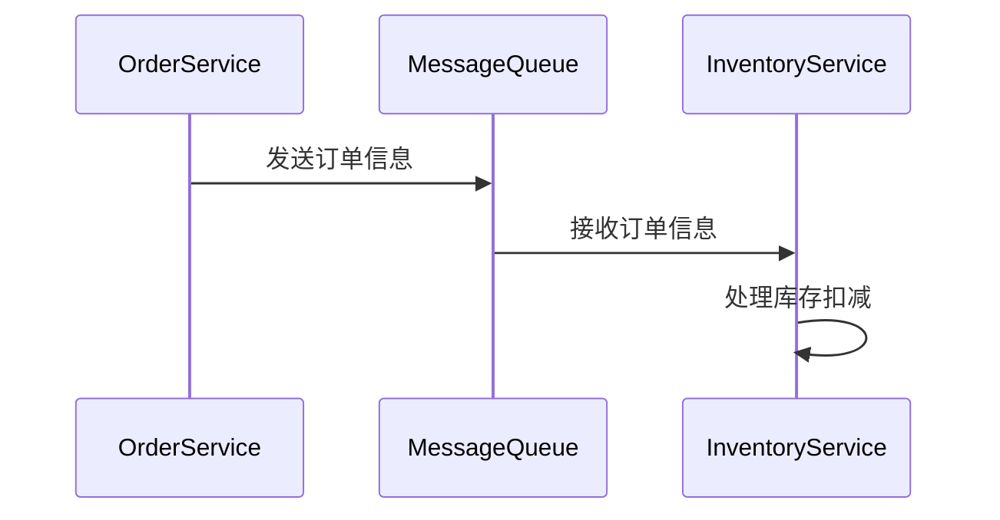

# Nacos 与Spring Cloud Stream集成

在现代微服务架构中，消息驱动通信是一种常见的模式，它允许服务之间通过消息队列进行解耦和异步通信。Spring Cloud Stream 是一个用于构建消息驱动微服务的框架，而 Nacos 是一个动态服务发现、配置管理和服务管理平台。本文将介绍如何将 Nacos 与 Spring Cloud Stream 集成，以实现高效的消息驱动通信。

## 什么是Nacos与Spring Cloud Stream？

**Nacos** 是一个开源的动态服务发现、配置管理和服务管理平台，支持多种服务注册与发现机制，并提供了配置管理的功能。它可以帮助开发者轻松管理微服务架构中的服务实例和配置。

**Spring Cloud Stream** 是 Spring Cloud 生态系统中的一个框架，用于构建消息驱动微服务。它抽象了消息中间件的细节，使得开发者可以专注于业务逻辑，而不必关心底层消息队列的实现。

通过将 Nacos 与 Spring Cloud Stream 集成，开发者可以在微服务架构中实现动态的服务发现和配置管理，同时利用消息队列进行异步通信。

## 集成步骤

### 1. 添加依赖

首先，在你的 Spring Boot 项目中添加 Nacos 和 Spring Cloud Stream 的依赖。你可以在 `pom.xml` 文件中添加以下依赖：

```xml
<dependencies>
    <!-- Spring Cloud Stream -->
    <dependency>
        <groupId>org.springframework.cloud</groupId>
        <artifactId>spring-cloud-starter-stream-rabbit</artifactId>
    </dependency>

    <!-- Nacos Discovery -->
    <dependency>
        <groupId>com.alibaba.cloud</groupId>
        <artifactId>spring-cloud-starter-alibaba-nacos-discovery</artifactId>
    </dependency>

    <!-- Nacos Config -->
    <dependency>
        <groupId>com.alibaba.cloud</groupId>
        <artifactId>spring-cloud-starter-alibaba-nacos-config</artifactId>
    </dependency>
</dependencies>
```

### 2. 配置Nacos和Spring Cloud Stream

接下来，你需要在 `application.yml` 文件中配置 Nacos 和 Spring Cloud Stream 的相关属性：

```yaml
spring:
  application:
    name: message-service
  cloud:
    nacos:
      discovery:
        server-addr: localhost:8848
      config:
        server-addr: localhost:8848
    stream:
      bindings:
        input:
          destination: my-topic
        output:
          destination: my-topic
```

在这个配置中，`spring.cloud.nacos.discovery.server-addr` 指定了 Nacos 服务器的地址，`spring.cloud.stream.bindings` 配置了消息的输入和输出通道。

### 3. 创建消息生产者

在 Spring Cloud Stream 中，消息生产者通过 `Source` 接口发送消息。以下是一个简单的消息生产者示例：

```java
import org.springframework.cloud.stream.annotation.EnableBinding;
import org.springframework.cloud.stream.messaging.Source;
import org.springframework.messaging.support.MessageBuilder;
import org.springframework.stereotype.Service;

@Service
@EnableBinding(Source.class)
public class MessageProducer {

    private final Source source;

    public MessageProducer(Source source) {
        this.source = source;
    }

    public void sendMessage(String message) {
        source.output().send(MessageBuilder.withPayload(message).build());
    }
}
```

在这个示例中，`MessageProducer` 类通过 `Source` 接口发送消息到 `my-topic` 主题。

### 4. 创建消息消费者

消息消费者通过 `Sink` 接口接收消息。以下是一个简单的消息消费者示例：

```java
import org.springframework.cloud.stream.annotation.EnableBinding;
import org.springframework.cloud.stream.annotation.StreamListener;
import org.springframework.cloud.stream.messaging.Sink;
import org.springframework.stereotype.Service;

@Service
@EnableBinding(Sink.class)
public class MessageConsumer {

    @StreamListener(Sink.INPUT)
    public void receiveMessage(String message) {
        System.out.println("Received message: " + message);
    }
}
```

在这个示例中，`MessageConsumer` 类通过 `Sink` 接口接收来自 `my-topic` 主题的消息，并将其打印到控制台。

### 5. 运行应用程序

完成上述步骤后，你可以运行你的 Spring Boot 应用程序。Nacos 将负责服务的注册与发现，而 Spring Cloud Stream 将处理消息的发送和接收。

## 实际应用场景

假设你正在开发一个电商平台，其中订单服务和库存服务需要解耦。订单服务在创建订单后，需要通知库存服务进行库存扣减。通过 Nacos 与 Spring Cloud Stream 的集成，订单服务可以将订单信息发送到消息队列，库存服务则从消息队列中接收订单信息并进行处理。



## 总结

通过将 Nacos 与 Spring Cloud Stream 集成，你可以轻松实现微服务架构中的动态服务发现和消息驱动通信。Nacos 提供了强大的服务注册与配置管理功能，而 Spring Cloud Stream 则简化了消息队列的使用。这种组合使得开发者可以更加专注于业务逻辑，而不必关心底层的实现细节。

## 附加资源与练习

- **官方文档**: 阅读 [Nacos 官方文档](https://nacos.io/) 和 [Spring Cloud Stream 官方文档](https://spring.io/projects/spring-cloud-stream) 以获取更多信息。
- **练习**: 尝试在你的项目中实现一个简单的消息驱动微服务，使用 Nacos 进行服务发现和配置管理，并通过 Spring Cloud Stream 进行消息通信。

希望本文能帮助你理解如何将 Nacos 与 Spring Cloud Stream 集成，并在你的微服务架构中实现高效的消息驱动通信。如果你有任何问题或需要进一步的帮助，请随时查阅相关文档或社区资源。