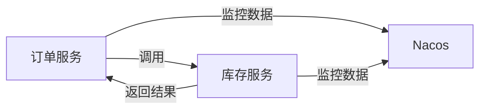

# Nacos 与Dubbo监控集成

在现代微服务架构中，服务治理和性能监控是确保系统稳定性和可维护性的关键。Nacos作为一款动态服务发现、配置管理和服务管理平台，与Dubbo这一高性能的RPC框架结合，可以为开发者提供强大的服务治理能力。本文将详细介绍如何将Nacos与Dubbo的监控功能集成，帮助初学者理解并实现这一过程。

## 什么是Nacos与Dubbo监控集成？

Nacos与Dubbo监控集成是指通过Nacos的服务发现和配置管理功能，结合Dubbo的RPC调用能力，实现对微服务的实时监控和管理。通过这种集成，开发者可以轻松地监控服务的健康状况、调用链路、性能指标等，从而快速定位和解决问题。

## 为什么需要Nacos与Dubbo监控集成？

在微服务架构中，服务之间的调用关系复杂，服务的健康状况和性能直接影响整个系统的稳定性。通过Nacos与Dubbo的监控集成，可以实现以下目标：

- **服务发现与注册**：Nacos作为服务注册中心，Dubbo服务可以自动注册到Nacos，并从中获取其他服务的信息。
- **配置管理**：Nacos提供动态配置管理，Dubbo服务可以根据配置的变化动态调整行为。
- **监控与治理**：通过集成监控功能，可以实时监控服务的调用情况、性能指标等，及时发现和解决问题。

## 如何实现Nacos与Dubbo监控集成？

### 1. 环境准备

在开始之前，确保你已经安装了以下工具和组件：

- JDK 1.8或更高版本
- Maven 3.x
- Nacos Server
- Dubbo 2.7.x或更高版本

### 2. 配置Nacos

首先，启动Nacos Server。你可以通过以下命令启动Nacos：

```bash
sh startup.sh -m standalone
```

启动后，访问 `http://localhost:8848/nacos`，使用默认用户名 `nacos` 和密码 `nacos` 登录。

### 3. 配置Dubbo

在Dubbo项目中，添加Nacos作为注册中心的配置。在 `application.properties` 或 `dubbo.properties` 中添加以下配置：

```properties
dubbo.registry.address=nacos://localhost:8848
dubbo.monitor.protocol=dubbo
dubbo.monitor.address=nacos://localhost:8848
```

### 4. 实现监控集成

Dubbo提供了多种监控方式，包括日志监控、Metrics监控等。以下是一个简单的Metrics监控示例：

```java
import com.alibaba.dubbo.config.annotation.Reference;
import com.alibaba.dubbo.monitor.MonitorService;
import org.springframework.stereotype.Service;

@Service
public class MyService {

    @Reference
    private MonitorService monitorService;

    public void doSomething() {
        // 业务逻辑
        monitorService.collect(/* 监控数据 */);
    }
}
```

### 5. 查看监控数据

启动Dubbo服务后，你可以通过Nacos控制台查看服务的注册情况和监控数据。在Nacos控制台中，选择“服务管理” -> “服务列表”，可以看到已注册的Dubbo服务及其健康状况。

## 实际案例

假设我们有一个电商系统，其中包含订单服务和库存服务。订单服务需要调用库存服务来检查库存情况。通过Nacos与Dubbo的监控集成，我们可以实时监控订单服务调用库存服务的性能指标，如响应时间、调用次数等。



在这个案例中，Nacos作为监控中心，收集并展示订单服务和库存服务的调用数据，帮助开发者快速定位性能瓶颈。

## 总结

通过Nacos与Dubbo的监控集成，开发者可以轻松实现微服务的监控和治理。本文介绍了如何配置Nacos和Dubbo，并提供了一个简单的监控示例。希望这些内容能帮助初学者更好地理解和使用Nacos与Dubbo的监控功能。

## 附加资源

- [Nacos官方文档](https://nacos.io/zh-cn/docs/what-is-nacos.html)
- [Dubbo官方文档](https://dubbo.apache.org/zh/docs/)
- [微服务监控与治理实践](https://www.example.com/microservices-monitoring)

## 练习

1. 尝试在你的Dubbo项目中集成Nacos，并配置监控功能。
2. 使用Nacos控制台查看服务的监控数据，并分析服务的性能指标。
3. 扩展监控功能，实现自定义的监控指标收集和展示。
