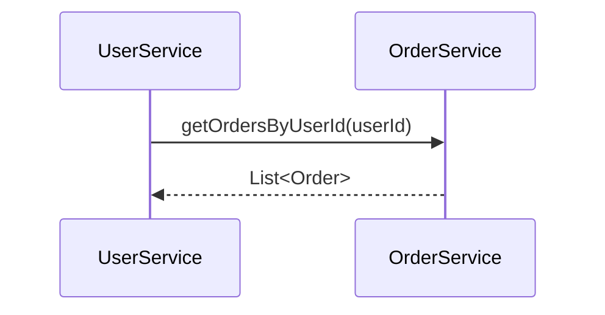

# Nacos 与Dubbo最佳实践

## 介绍

在现代微服务架构中，服务注册与发现是一个至关重要的组件。Nacos 是一个动态服务发现、配置和服务管理平台，而 Dubbo 是一个高性能的 Java RPC 框架。将 Nacos 与 Dubbo 集成，可以有效地管理微服务之间的通信，并实现服务的动态发现与负载均衡。

本文将逐步讲解如何将 Nacos 与 Dubbo 集成，并提供一些最佳实践和实际案例，帮助初学者快速掌握这一技术。

## 1. 环境准备

在开始之前，确保你已经安装了以下工具：

- JDK 1.8 或更高版本
- Maven 3.x
- Nacos Server
- Dubbo 2.7.x 或更高版本

## 2. 配置 Nacos 作为 Dubbo 的注册中心

首先，我们需要在 Dubbo 中配置 Nacos 作为注册中心。在 `application.properties` 或 `dubbo.properties` 中添加以下配置：

```properties
dubbo.registry.address=nacos://127.0.0.1:8848
```

这里，`127.0.0.1:8848` 是 Nacos 服务器的地址和端口。

## 3. 服务提供者配置

接下来，我们需要配置服务提供者。假设我们有一个简单的服务接口 `HelloService`：

```java
public interface HelloService {
    String sayHello(String name);
}
```

然后，我们实现这个接口：

```java
public class HelloServiceImpl implements HelloService {
    @Override
    public String sayHello(String name) {
        return "Hello, " + name;
    }
}
```

在服务提供者的配置文件中，我们需要将服务注册到 Nacos：

```xml
<dubbo:service interface="com.example.HelloService" ref="helloService" />
<bean id="helloService" class="com.example.HelloServiceImpl" />
```

## 4. 服务消费者配置

在服务消费者端，我们需要引用服务提供者提供的服务。在消费者的配置文件中，添加以下配置：

```xml
<dubbo:reference id="helloService" interface="com.example.HelloService" />
```

然后，在代码中调用服务：

```java
public class Consumer {
    public static void main(String[] args) {
        ClassPathXmlApplicationContext context = new ClassPathXmlApplicationContext("consumer.xml");
        context.start();
        HelloService helloService = (HelloService) context.getBean("helloService");
        String result = helloService.sayHello("World");
        System.out.println(result);
    }
}
```

## 5. 实际案例

假设我们有一个电商系统，其中包含用户服务和订单服务。用户服务需要调用订单服务来获取用户的订单信息。我们可以使用 Nacos 和 Dubbo 来实现这一功能。

### 5.1 用户服务

用户服务需要引用订单服务：

```xml
<dubbo:reference id="orderService" interface="com.example.OrderService" />
```

### 5.2 订单服务

订单服务提供获取订单信息的功能：

```java
public interface OrderService {
    List<Order> getOrdersByUserId(int userId);
}
```

### 5.3 调用流程

用户服务调用订单服务的流程如下：



## 6. 最佳实践

### 6.1 使用 Nacos 的命名空间

在复杂的微服务环境中，建议使用 Nacos 的命名空间来隔离不同的环境（如开发、测试、生产）。可以通过以下配置来指定命名空间：

```properties
dubbo.registry.address=nacos://127.0.0.1:8848?namespace=dev
```

### 6.2 配置服务权重

在 Dubbo 中，可以通过配置服务的权重来实现负载均衡。例如：

```xml
<dubbo:service interface="com.example.HelloService" ref="helloService" weight="100" />
```

### 6.3 监控与治理

使用 Nacos 和 Dubbo 的监控功能，可以实时监控服务的健康状况和性能。可以通过 Nacos 控制台查看服务的注册信息和健康状态。

## 7. 总结

通过本文的学习，你应该已经掌握了如何将 Nacos 与 Dubbo 集成，并了解了一些最佳实践。Nacos 作为 Dubbo 的注册中心，能够有效地管理微服务之间的通信，并实现服务的动态发现与负载均衡。

## 8. 附加资源与练习

- [Nacos 官方文档](https://nacos.io/zh-cn/docs/what-is-nacos.html)
- [Dubbo 官方文档](https://dubbo.apache.org/zh/docs/)
- 练习：尝试在你的本地环境中搭建一个简单的微服务系统，使用 Nacos 和 Dubbo 实现服务注册与发现。

:::tip
如果你在实践过程中遇到问题，可以参考官方文档或在社区中寻求帮助。
:::