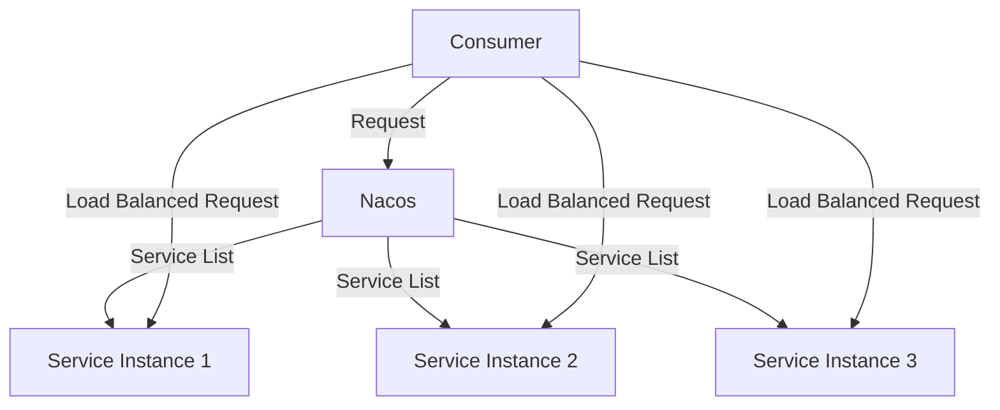

# Nacos 与Dubbo负载均衡

在现代分布式系统中，负载均衡是确保服务高可用性和性能优化的关键技术之一。Nacos作为服务发现和配置管理的工具，与Dubbo这一高性能RPC框架的集成，能够为开发者提供强大的负载均衡能力。本文将详细介绍如何在Nacos与Dubbo集成中实现负载均衡，并通过实际案例展示其应用场景。

## 什么是负载均衡？

负载均衡是一种将请求分发到多个服务器上的技术，以确保每个服务器的负载相对均衡，从而提高系统的整体性能和可靠性。在微服务架构中，负载均衡尤为重要，因为它能够有效地管理服务实例之间的流量分配。

## Nacos 与Dubbo集成中的负载均衡

在Nacos与Dubbo的集成中，Nacos作为服务注册中心，负责管理服务实例的注册与发现。Dubbo则通过Nacos获取可用的服务实例，并根据配置的负载均衡策略将请求分发到不同的服务实例上。

### 负载均衡策略

Dubbo支持多种负载均衡策略，包括：

- **Random LoadBalance**：随机选择一个服务实例。
- **RoundRobin LoadBalance**：按顺序轮流选择服务实例。
- **LeastActive LoadBalance**：选择当前活跃请求数最少的服务实例。
- **ConsistentHash LoadBalance**：根据请求的哈希值选择服务实例。

### 配置负载均衡策略

在Dubbo中，可以通过在服务提供者或消费者端配置`loadbalance`属性来指定负载均衡策略。以下是一个示例配置：

```xml
<dubbo:reference id="userService" interface="com.example.UserService" loadbalance="roundrobin" />
```

在这个示例中，`userService`服务将使用轮询（RoundRobin）负载均衡策略。

### 实际案例

假设我们有一个用户服务（UserService），该服务有多个实例注册到Nacos中。我们希望在使用Dubbo调用该服务时，能够自动进行负载均衡。

1. **服务注册**：首先，确保所有UserService实例都注册到Nacos中。

2. **服务调用**：在消费者端配置Dubbo引用，并指定负载均衡策略。

```java
@Reference(loadbalance = "roundrobin")
private UserService userService;
```

3. **请求分发**：当消费者调用`userService`时，Dubbo会根据配置的负载均衡策略，将请求分发到不同的UserService实例上。

### 负载均衡效果

通过Nacos与Dubbo的集成，我们可以轻松实现服务的负载均衡。以下是一个简单的Mermaid图表，展示了负载均衡的工作原理：



在这个图表中，Consumer通过Nacos获取服务实例列表，并根据负载均衡策略将请求分发到不同的服务实例上。

## 总结

Nacos与Dubbo的集成为开发者提供了强大的负载均衡能力，能够有效提升系统的性能和可靠性。通过配置不同的负载均衡策略，开发者可以根据实际需求优化服务的流量分配。希望本文能够帮助你理解并应用Nacos与Dubbo中的负载均衡技术。

## 附加资源与练习

- **练习**：尝试在你的项目中配置不同的负载均衡策略，并观察其对系统性能的影响。
- **资源**：阅读Dubbo官方文档，了解更多关于负载均衡的详细配置和高级用法。

:::tip
在实际生产环境中，建议根据业务需求选择合适的负载均衡策略，并进行性能测试以确保系统的最佳表现。
:::