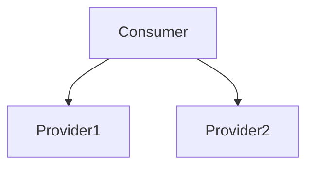

## 介绍

在现代微服务架构中，服务治理是一个至关重要的环节。它涵盖了服务注册、发现、配置管理、负载均衡、故障恢复等多个方面。Nacos 和 Dubbo 是两个非常流行的开源工具，分别用于服务发现和分布式服务框架。通过将 Nacos 与 Dubbo 集成，我们可以实现高效的服务治理。

### 什么是Nacos？

Nacos 是一个动态服务发现、配置管理和服务管理平台。它支持多种服务发现方式，包括 DNS 和 HTTP，并且可以与多种微服务框架集成，如 Dubbo、Spring Cloud 等。

### 什么是Dubbo？

Dubbo 是一个高性能的 Java RPC 框架，主要用于构建分布式服务。它提供了服务注册、发现、负载均衡、容错等功能，是构建微服务架构的理想选择。

## Nacos 与Dubbo集成

### 1. 服务注册与发现

在微服务架构中，服务注册与发现是基础功能。Nacos 作为服务注册中心，Dubbo 作为服务提供者和消费者，两者结合可以实现高效的服务注册与发现。

#### 1.1 配置Nacos

首先，我们需要在项目中引入 Nacos 的依赖。假设我们使用的是 Maven 项目，可以在 `pom.xml` 中添加以下依赖：

```xml
<dependency>
    <groupId>com.alibaba.nacos</groupId>
    <artifactId>nacos-client</artifactId>
    <version>1.4.1</version>
</dependency>
```

#### 1.2 配置Dubbo

接下来，我们需要在 Dubbo 的配置文件中指定 Nacos 作为注册中心。在 `dubbo.properties` 中添加以下配置：

```properties
dubbo.registry.address=nacos://127.0.0.1:8848
```

#### 1.3 服务注册

在服务提供者中，我们需要将服务注册到 Nacos。以下是一个简单的服务提供者示例：

```java
@Service
public class HelloServiceImpl implements HelloService {
    @Override
    public String sayHello(String name) {
        return "Hello, " + name;
    }
}
```

#### 1.4 服务发现

在服务消费者中，我们可以通过 Dubbo 从 Nacos 中发现服务并调用：

```java
@Reference
private HelloService helloService;

public void callService() {
    String result = helloService.sayHello("World");
    System.out.println(result);
}
```

### 2. 配置管理

Nacos 不仅可以作为服务注册中心，还可以作为配置中心。我们可以将服务的配置信息存储在 Nacos 中，并在运行时动态更新。

#### 2.1 配置发布

在 Nacos 控制台中，我们可以创建一个新的配置项，例如：

```properties
dubbo.application.name=demo-provider
dubbo.registry.address=nacos://127.0.0.1:8848
```

#### 2.2 配置获取

在 Dubbo 服务中，我们可以通过以下代码获取配置：

```java
ConfigService configService = NacosFactory.createConfigService("127.0.0.1:8848");
String config = configService.getConfig("dubbo.properties", "DEFAULT_GROUP", 5000);
System.out.println(config);
```

### 3. 负载均衡

Dubbo 提供了多种负载均衡策略，如随机、轮询、最少活跃调用等。我们可以通过配置 Nacos 和 Dubbo 来实现负载均衡。

#### 3.1 配置负载均衡策略

在 `dubbo.properties` 中，我们可以指定负载均衡策略：

```properties
dubbo.provider.loadbalance=roundrobin
```

#### 3.2 实际应用

假设我们有两个服务提供者，Nacos 会自动将请求分发到这两个提供者上，实现负载均衡。



### 4. 实际案例

假设我们有一个电商系统，其中包含用户服务、订单服务和商品服务。我们可以使用 Nacos 和 Dubbo 来实现这些服务的注册、发现和负载均衡。

#### 4.1 服务注册

- 用户服务注册到 Nacos
- 订单服务注册到 Nacos
- 商品服务注册到 Nacos

#### 4.2 服务调用

- 订单服务调用用户服务获取用户信息
- 订单服务调用商品服务获取商品信息

#### 4.3 配置管理

- 将订单服务的配置存储在 Nacos 中，并在运行时动态更新

### 总结

通过将 Nacos 与 Dubbo 集成，我们可以实现高效的服务治理，包括服务注册、发现、配置管理和负载均衡等功能。Nacos 作为服务注册中心和配置中心，Dubbo 作为服务框架，两者结合可以大大简化微服务架构的开发和维护。

### 附加资源

- [Nacos 官方文档](https://nacos.io/zh-cn/docs/what-is-nacos.html)
- [Dubbo 官方文档](https://dubbo.apache.org/zh/docs/)

### 练习

1. 尝试在本地搭建一个 Nacos 服务器，并将一个简单的 Dubbo 服务注册到 Nacos 中。
2. 修改 Dubbo 的负载均衡策略，观察请求的分发情况。
3. 使用 Nacos 的配置管理功能，动态更新 Dubbo 服务的配置。
