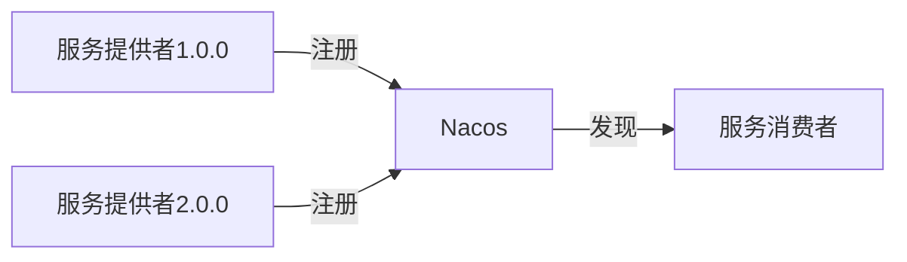

# Nacos 与Dubbo多版本管理

在现代微服务架构中，服务的版本管理是一个关键问题。随着业务的不断迭代，服务可能会频繁更新，而如何在不影响现有服务的情况下平滑升级，成为了开发人员必须面对的挑战。Nacos与Dubbo的集成提供了一种强大的多版本管理机制，能够帮助开发者轻松管理服务的不同版本。

本文将详细介绍如何在Nacos与Dubbo中实现多版本管理，并通过实际案例展示其应用场景。

## 什么是多版本管理？

多版本管理是指在微服务架构中，同时运行多个版本的服务实例，并根据需要将请求路由到特定版本的服务。这种机制可以确保在服务升级过程中，旧版本的服务仍然可用，从而避免因版本不兼容导致的服务中断。

在Dubbo中，多版本管理通过为服务接口指定不同的版本号来实现。Nacos作为服务注册中心，可以帮助Dubbo动态发现和管理这些不同版本的服务实例。

## 如何在Dubbo中配置多版本？

在Dubbo中，服务的版本号可以通过`version`属性来指定。以下是一个简单的示例，展示了如何在服务提供者和消费者中配置多版本。

### 服务提供者配置

```java
@Service(version = "1.0.0")
public class UserServiceImpl implements UserService {
    @Override
    public String getUserInfo(String userId) {
        return "User Info from version 1.0.0";
    }
}
```

```java
@Service(version = "2.0.0")
public class UserServiceImplV2 implements UserService {
    @Override
    public String getUserInfo(String userId) {
        return "User Info from version 2.0.0";
    }
}
```

在上面的代码中，我们定义了两个不同版本的`UserService`实现类，分别指定了`version`为`1.0.0`和`2.0.0`。

### 服务消费者配置

```java
@Reference(version = "1.0.0")
private UserService userService;

public void getUserInfo() {
    String userInfo = userService.getUserInfo("123");
    System.out.println(userInfo);
}
```

在服务消费者中，我们可以通过`@Reference`注解指定要调用的服务版本。例如，上面的代码将调用`version`为`1.0.0`的`UserService`。

:::tip
在实际开发中，建议将版本号作为配置项，以便在不修改代码的情况下动态切换版本。
:::

## Nacos 中的多版本管理

Nacos作为服务注册中心，能够自动发现和管理Dubbo服务的不同版本。当服务提供者注册到Nacos时，Nacos会记录服务的版本信息。服务消费者在调用服务时，可以根据版本号从Nacos中获取对应的服务实例。

### Nacos 中的服务注册

当服务提供者启动时，Dubbo会将服务实例注册到Nacos。Nacos会记录服务的元数据，包括版本号、IP地址、端口等信息。以下是一个Nacos中服务注册的示例：



### 服务消费者从Nacos获取服务实例

服务消费者在调用服务时，Dubbo会从Nacos中获取符合条件的服务实例。例如，如果消费者指定了`version`为`1.0.0`，Dubbo只会从Nacos中获取`version`为`1.0.0`的服务实例。

## 实际应用场景

假设我们有一个用户服务`UserService`，当前线上运行的是`1.0.0`版本。现在我们需要发布一个`2.0.0`版本，该版本对接口进行了重大修改。为了确保平滑升级，我们可以按照以下步骤操作：

1. **部署新版本服务**：将`2.0.0`版本的服务部署到生产环境，并注册到Nacos。
2. **逐步切换流量**：将部分流量切换到`2.0.0`版本，观察新版本的表现。
3. **完全切换流量**：如果新版本运行稳定，将所有流量切换到`2.0.0`版本。
4. **下线旧版本**：确认所有流量都已切换到新版本后，下线`1.0.0`版本的服务。

通过这种方式，我们可以确保在服务升级过程中，系统的稳定性和可用性。

## 总结

Nacos与Dubbo的多版本管理机制为微服务架构中的服务升级提供了强大的支持。通过合理配置版本号，并结合Nacos的服务发现功能，开发者可以轻松实现服务的平滑升级和流量切换。

:::note
在实际项目中，建议结合灰度发布、蓝绿部署等策略，进一步提升服务升级的安全性和可控性。
:::

## 附加资源与练习

- **练习**：尝试在本地环境中部署两个不同版本的Dubbo服务，并使用Nacos进行服务发现和调用。
- **进一步阅读**：了解Dubbo的其他高级特性，如负载均衡、服务降级等。

通过本文的学习，你应该已经掌握了Nacos与Dubbo多版本管理的基本概念和应用方法。希望这些知识能够帮助你在实际项目中更好地管理和升级服务。