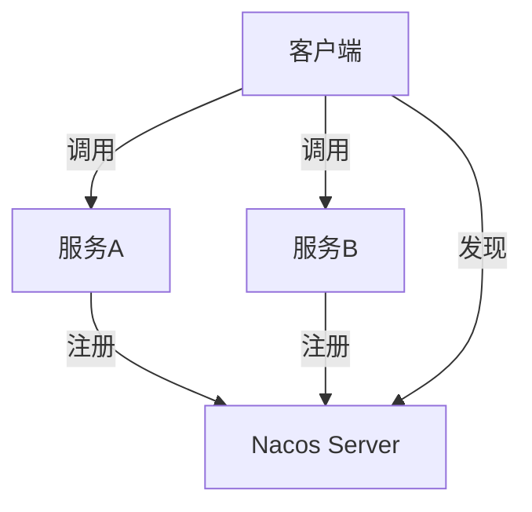
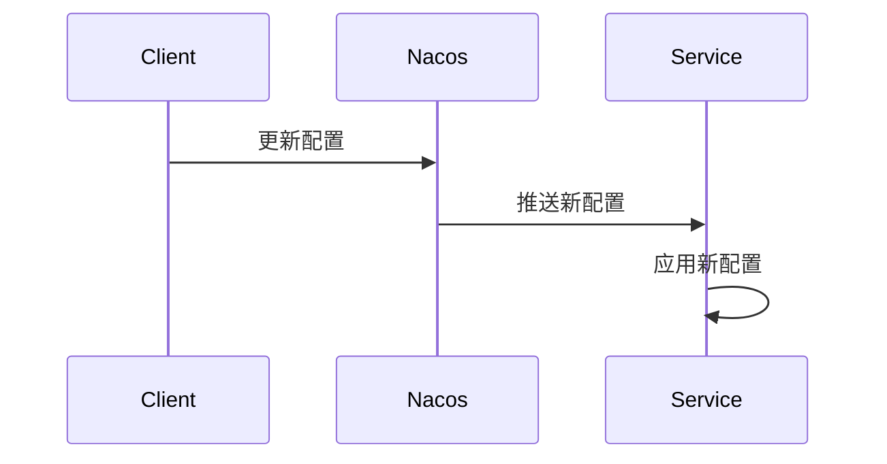

# Nacos REST API 调用

Nacos 是一个动态服务发现、配置管理和服务管理平台。它提供了 REST API，允许开发者通过 HTTP 请求与 Nacos 服务器进行交互。本文将详细介绍如何使用 Nacos REST API 进行服务注册、发现和配置管理。

## 1. 什么是 Nacos REST API？

Nacos REST API 是 Nacos 提供的一组 HTTP 接口，允许开发者通过 HTTP 请求与 Nacos 服务器进行交互。通过这些 API，你可以实现服务注册、服务发现、配置管理等功能。

:::note
Nacos REST API 是基于 HTTP 协议的，因此你可以使用任何支持 HTTP 请求的工具或编程语言来调用这些 API。
:::

## 2. Nacos REST API 的基本使用

### 2.1 服务注册

要将一个服务注册到 Nacos，你可以使用以下 API：

```bash
POST /nacos/v1/ns/instance
```

#### 请求示例

```bash
curl -X POST 'http://localhost:8848/nacos/v1/ns/instance' \
-H 'Content-Type: application/x-www-form-urlencoded' \
-d 'ip=127.0.0.1' \
-d 'port=8080' \
-d 'serviceName=my-service' \
-d 'namespaceId=public' \
-d 'clusterName=DEFAULT' \
-d 'weight=1.0' \
-d 'healthy=true' \
-d 'enabled=true' \
-d 'ephemeral=true'
```

#### 响应示例

```json
{
  "code": 200,
  "message": "success"
}
```

:::tip
`ephemeral=true` 表示这是一个临时实例，Nacos 会定期检查该实例的健康状态。如果实例不可用，Nacos 会自动将其从服务列表中移除。
:::

### 2.2 服务发现

要获取某个服务的实例列表，你可以使用以下 API：

```bash
GET /nacos/v1/ns/instance/list
```

#### 请求示例

```bash
curl -X GET 'http://localhost:8848/nacos/v1/ns/instance/list?serviceName=my-service&namespaceId=public'
```

#### 响应示例

```json
{
  "hosts": [
    {
      "ip": "127.0.0.1",
      "port": 8080,
      "healthy": true,
      "clusterName": "DEFAULT",
      "weight": 1.0,
      "ephemeral": true
    }
  ],
  "dom": "my-service",
  "name": "my-service",
  "cacheMillis": 1000,
  "lastRefTime": 1633072800000,
  "checksum": "abc123",
  "useSpecifiedURL": false,
  "clusters": "DEFAULT"
}
```

### 2.3 配置管理

Nacos 还提供了配置管理的功能。你可以通过 REST API 来发布、获取和删除配置。

#### 发布配置

```bash
POST /nacos/v1/cs/configs
```

##### 请求示例

```bash
curl -X POST 'http://localhost:8848/nacos/v1/cs/configs' \
-H 'Content-Type: application/x-www-form-urlencoded' \
-d 'dataId=my-config' \
-d 'group=DEFAULT_GROUP' \
-d 'content=my-config-content' \
-d 'namespaceId=public'
```

##### 响应示例

```json
{
  "code": 200,
  "message": "success"
}
```

#### 获取配置

```bash
GET /nacos/v1/cs/configs
```

##### 请求示例

```bash
curl -X GET 'http://localhost:8848/nacos/v1/cs/configs?dataId=my-config&group=DEFAULT_GROUP&namespaceId=public'
```

##### 响应示例

```json
{
  "dataId": "my-config",
  "group": "DEFAULT_GROUP",
  "content": "my-config-content",
  "namespaceId": "public"
}
```

## 3. 实际应用场景

### 3.1 微服务架构中的服务注册与发现

在微服务架构中，服务注册与发现是一个核心功能。通过 Nacos REST API，你可以将微服务实例注册到 Nacos 服务器，并在需要时获取其他服务的实例列表。



### 3.2 动态配置更新

在分布式系统中，配置的动态更新是一个常见的需求。通过 Nacos REST API，你可以在运行时更新配置，而无需重启服务。



## 4. 总结

Nacos REST API 提供了一种简单而强大的方式来管理服务注册、发现和配置。通过本文的介绍，你应该已经掌握了如何使用这些 API 进行基本的操作。接下来，你可以尝试在实际项目中应用这些知识，或者进一步探索 Nacos 的其他功能。

## 5. 附加资源与练习

- **官方文档**: [Nacos 官方文档](https://nacos.io/zh-cn/docs/what-is-nacos.html)
- **练习**: 尝试使用 Nacos REST API 实现一个简单的服务注册与发现系统。
- **进阶**: 探索 Nacos 的集群部署和高可用性配置。

:::caution
在实际生产环境中，请确保 Nacos 服务器的安全性和高可用性，避免单点故障。
:::