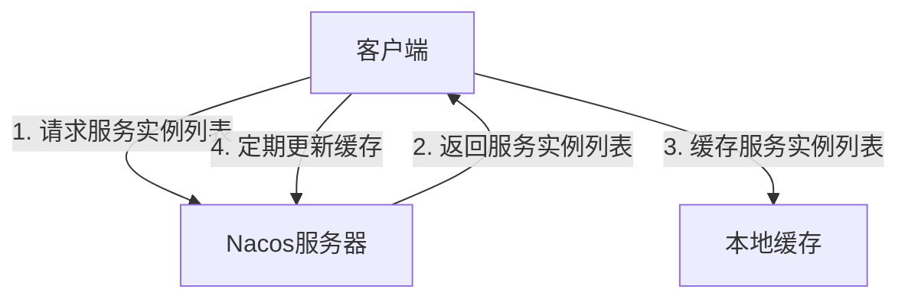

# Nacos 客户端缓存机制

Nacos是一个动态服务发现、配置管理和服务管理平台。在Nacos客户端中，缓存机制是一个非常重要的组成部分，它能够显著提高服务发现和配置管理的效率。本文将详细介绍Nacos客户端的缓存机制，并通过实际案例展示其应用场景。

## 什么是Nacos客户端缓存机制？

Nacos客户端缓存机制是指在客户端本地存储服务实例列表或配置信息，以减少对Nacos服务器的频繁请求。通过缓存，客户端可以在本地快速获取所需的服务实例或配置信息，从而提高系统的响应速度和稳定性。

### 缓存的作用

1. **减少网络请求**：通过缓存，客户端可以减少对Nacos服务器的请求次数，降低网络开销。
2. **提高响应速度**：直接从本地缓存获取数据，避免了网络延迟，提高了系统的响应速度。
3. **增强系统稳定性**：在网络不稳定或Nacos服务器不可用时，客户端仍然可以从缓存中获取数据，保证系统的正常运行。

## Nacos 客户端缓存机制的工作原理

Nacos客户端的缓存机制主要分为两种：服务实例缓存和配置缓存。

### 服务实例缓存

服务实例缓存是指客户端在本地缓存服务实例列表。当客户端需要调用某个服务时，首先会从本地缓存中查找服务实例列表。如果缓存中没有找到，客户端会向Nacos服务器请求最新的服务实例列表，并将其缓存到本地。

```java
// 示例代码：获取服务实例列表
List<Instance> instances = namingService.getAllInstances("serviceName");
```

### 配置缓存

配置缓存是指客户端在本地缓存配置信息。当客户端需要获取某个配置时，首先会从本地缓存中查找配置信息。如果缓存中没有找到，客户端会向Nacos服务器请求最新的配置信息，并将其缓存到本地。

```java
// 示例代码：获取配置信息
String config = configService.getConfig("dataId", "group", 5000);
```

### 缓存更新机制

Nacos客户端会定期从Nacos服务器拉取最新的服务实例列表和配置信息，并更新本地缓存。此外，Nacos还支持通过长轮询或事件通知的方式实时更新缓存。



## 实际案例

假设我们有一个微服务架构的系统，其中包含多个服务实例。为了提高系统的响应速度和稳定性，我们可以使用Nacos客户端的缓存机制。

### 场景描述

- **服务A**需要调用**服务B**。
- **服务B**有多个实例，分布在不同的服务器上。
- **服务A**通过Nacos客户端获取**服务B**的实例列表。

### 实现步骤

1. **服务A**启动时，从Nacos服务器获取**服务B**的实例列表，并缓存到本地。
2. 当**服务A**需要调用**服务B**时，首先从本地缓存中获取**服务B**的实例列表。
3. 如果本地缓存中没有找到**服务B**的实例列表，**服务A**会向Nacos服务器请求最新的实例列表，并更新本地缓存。
4. **服务A**定期从Nacos服务器拉取最新的实例列表，并更新本地缓存。

```java
// 示例代码：服务A调用服务B
List<Instance> instances = namingService.getAllInstances("serviceB");
if (instances.isEmpty()) {
    instances = namingService.getAllInstances("serviceB"); // 从Nacos服务器获取最新实例列表
    // 更新本地缓存
}
// 调用服务B
```

## 总结

Nacos客户端的缓存机制通过减少网络请求、提高响应速度和增强系统稳定性，为微服务架构提供了重要的支持。通过合理使用缓存机制，可以显著提升系统的性能和可靠性。

### 附加资源

- [Nacos官方文档](https://nacos.io/zh-cn/docs/what-is-nacos.html)
- [Nacos客户端配置指南](https://nacos.io/zh-cn/docs/quick-start.html)

### 练习

1. 尝试在本地搭建一个Nacos服务器，并使用Nacos客户端实现服务实例的缓存。
2. 修改Nacos客户端的缓存更新频率，观察系统的响应速度和稳定性变化。
3. 在Nacos客户端中实现配置缓存，并测试其在不同网络条件下的表现。
