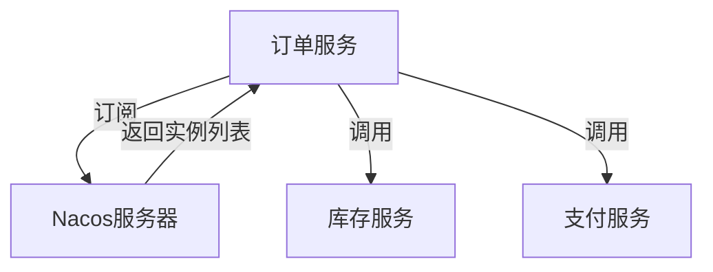

# Nacos 服务订阅开发

在现代微服务架构中，服务发现是一个至关重要的组件。Nacos作为一个动态服务发现、配置和服务管理平台，能够帮助开发者轻松实现服务的注册与发现。本文将详细介绍如何使用Nacos客户端进行服务订阅开发，帮助初学者掌握服务订阅的核心概念和实现方法。

## 什么是Nacos服务订阅？

服务订阅是指客户端从服务注册中心（如Nacos）获取服务实例列表，并在服务实例发生变化时动态更新。通过服务订阅，客户端可以实时获取可用的服务实例，从而实现负载均衡和故障转移。

## Nacos 服务订阅的基本流程

1. **服务注册**：服务提供者将自己的服务实例注册到Nacos服务器。
2. **服务订阅**：客户端从Nacos服务器订阅所需的服务。
3. **服务发现**：Nacos服务器返回当前可用的服务实例列表。
4. **动态更新**：当服务实例发生变化时，Nacos服务器会通知客户端更新服务实例列表。

## 实现Nacos服务订阅

### 1. 引入Nacos客户端依赖

首先，我们需要在项目中引入Nacos客户端的依赖。以Maven项目为例，添加以下依赖：

```xml
<dependency>
    <groupId>com.alibaba.cloud</groupId>
    <artifactId>spring-cloud-starter-alibaba-nacos-discovery</artifactId>
</dependency>
```

### 2. 配置Nacos服务器地址

在`application.yml`或`application.properties`中配置Nacos服务器的地址：

```yaml
spring:
  cloud:
    nacos:
      discovery:
        server-addr: 127.0.0.1:8848
```

### 3. 订阅服务

在Spring Boot应用中，我们可以通过`@NacosInjected`注解来注入Nacos的服务发现客户端，并通过`subscribe`方法订阅服务。

```java
import com.alibaba.nacos.api.annotation.NacosInjected;
import com.alibaba.nacos.api.exception.NacosException;
import com.alibaba.nacos.api.naming.NamingService;
import com.alibaba.nacos.api.naming.pojo.Instance;
import org.springframework.stereotype.Service;

import javax.annotation.PostConstruct;
import java.util.List;

@Service
public class NacosServiceSubscriber {

    @NacosInjected
    private NamingService namingService;

    @PostConstruct
    public void subscribeService() throws NacosException {
        // 订阅服务
        namingService.subscribe("example-service", event -> {
            List<Instance> instances = namingService.getAllInstances("example-service");
            System.out.println("Service instances updated: " + instances);
        });
    }
}
```

### 4. 处理服务实例更新

在上面的代码中，我们通过`subscribe`方法订阅了名为`example-service`的服务。当服务实例发生变化时，Nacos会触发回调函数，我们可以在这里处理服务实例的更新逻辑。

## 实际应用场景

假设我们有一个电商系统，其中包含订单服务、库存服务和支付服务。订单服务需要调用库存服务和支付服务来完成订单的创建和支付流程。通过Nacos服务订阅，订单服务可以动态获取库存服务和支付服务的实例列表，并在服务实例发生变化时自动更新。



## 总结

通过本文的学习，我们了解了Nacos服务订阅的基本概念和实现方法。Nacos服务订阅能够帮助我们在微服务架构中实现服务的动态发现和更新，从而提高系统的灵活性和可靠性。

## 附加资源

- [Nacos官方文档](https://nacos.io/zh-cn/docs/what-is-nacos.html)
- [Spring Cloud Alibaba Nacos Discovery](https://github.com/alibaba/spring-cloud-alibaba/wiki/Nacos-discovery)

## 练习

1. 尝试在自己的Spring Boot项目中集成Nacos，并实现一个简单的服务订阅功能。
2. 修改服务实例的数量，观察客户端是否能够动态更新服务实例列表。
