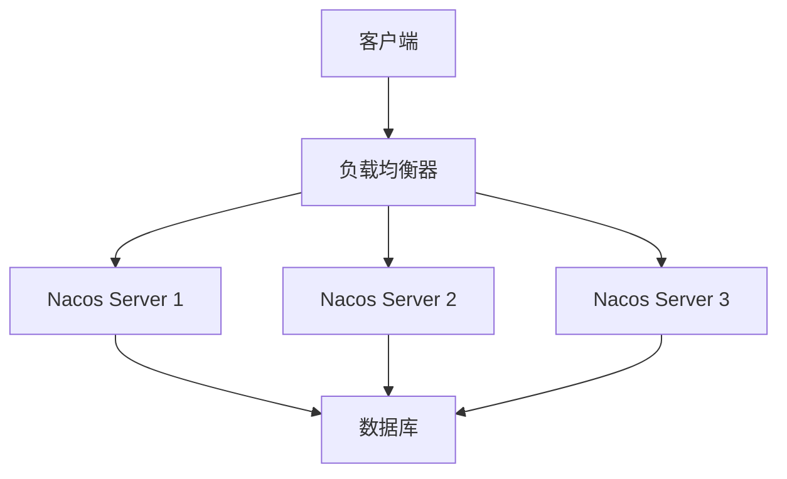

# Nacos 集群架构设计

Nacos（Naming and Configuration Service）是一个动态服务发现、配置管理和服务管理平台。它支持多种部署模式，其中集群模式是生产环境中常用的高可用部署方式。本文将详细介绍Nacos集群架构设计，帮助你理解其核心组件、工作原理以及如何在实际项目中应用。

## 什么是Nacos集群？

Nacos集群是指将多个Nacos服务实例部署在不同的服务器上，并通过某种机制实现数据同步和负载均衡，从而提高系统的可用性和扩展性。集群模式能够有效避免单点故障，确保服务的高可用性。

## Nacos 集群的核心组件

Nacos集群的核心组件包括以下几个部分：

1. **Nacos Server**：Nacos服务实例，负责处理服务注册、配置管理等功能。
2. **Nacos Client**：客户端，用于与服务端进行通信，注册服务、获取配置等。
3. **数据库**：用于存储Nacos的配置数据和服务注册信息。Nacos支持多种数据库，如MySQL、PostgreSQL等。
4. **负载均衡器**：用于将客户端请求分发到不同的Nacos Server实例，确保负载均衡。
5. **数据同步机制**：用于在Nacos Server实例之间同步数据，确保数据一致性。

## Nacos 集群架构图

以下是一个典型的Nacos集群架构图：

在这个架构中，客户端通过负载均衡器访问Nacos集群中的任意一个Server实例。每个Nacos Server实例都会将数据存储到共享的数据库中，并通过数据同步机制确保数据一致性。

## Nacos 集群的工作原理

### 1. 服务注册与发现

当客户端启动时，它会向Nacos集群中的某个Server实例注册自己的服务信息。Nacos Server会将服务信息存储到数据库中，并通过数据同步机制将信息同步到其他Server实例。当其他客户端需要发现服务时，它们可以从任意一个Server实例获取服务信息。

### 2. 配置管理

Nacos集群支持集中式的配置管理。客户端可以从Nacos Server获取配置信息，并在配置发生变化时实时更新。Nacos Server会将配置信息存储到数据库中，并通过数据同步机制确保所有Server实例的配置一致。

### 3. 数据同步

Nacos集群通过Raft协议实现数据同步。Raft是一种分布式一致性算法，能够确保在多个Server实例之间达成一致的数据状态。当某个Server实例接收到客户端的请求时，它会将数据变更通过Raft协议同步到其他Server实例。

## 实际应用场景

### 场景1：微服务架构中的服务注册与发现

在微服务架构中，服务之间的通信依赖于服务注册与发现机制。Nacos集群可以作为服务注册中心，帮助微服务实例注册自己的服务信息，并发现其他服务实例。通过Nacos集群，可以确保服务注册与发现的高可用性和数据一致性。

### 场景2：分布式配置管理

在分布式系统中，配置管理是一个重要的挑战。Nacos集群可以作为配置中心，集中管理所有微服务的配置信息。通过Nacos集群，可以实现配置的动态更新和实时同步，确保所有服务实例的配置一致。

## 总结

Nacos集群架构设计是确保Nacos高可用性和扩展性的关键。通过将多个Nacos Server实例部署在不同的服务器上，并使用负载均衡器和数据同步机制，可以有效避免单点故障，确保服务的高可用性。在实际应用中，Nacos集群可以用于微服务架构中的服务注册与发现，以及分布式配置管理。

## 附加资源与练习

- **官方文档**：阅读[Nacos官方文档](https://nacos.io/zh-cn/docs/what-is-nacos.html)，了解更多关于Nacos集群的详细信息。
- **练习**：尝试在本地环境中部署一个Nacos集群，并模拟服务注册与发现的过程。

:::tip
如果你在部署过程中遇到问题，可以参考Nacos官方文档中的[集群部署指南](https://nacos.io/zh-cn/docs/cluster-mode-quick-start.html)。
:::