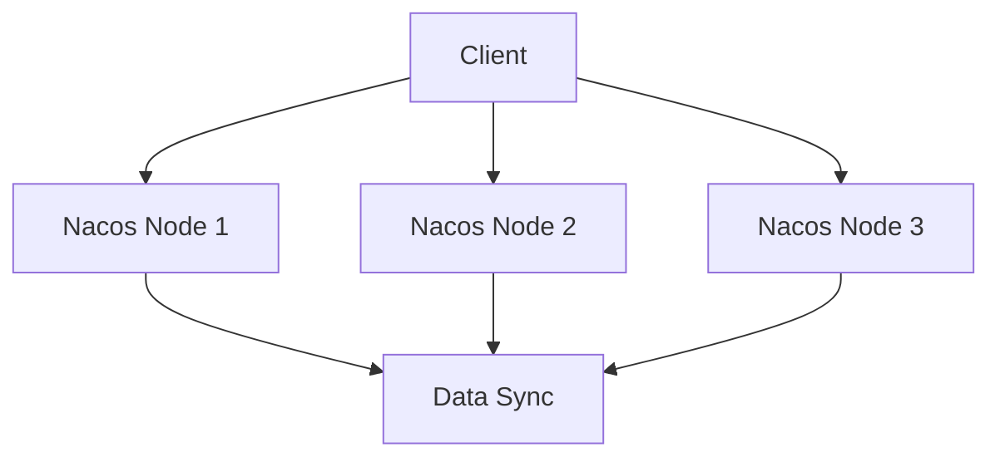

## 介绍

Nacos是一个动态服务发现、配置管理和服务管理平台，广泛应用于微服务架构中。在生产环境中，Nacos通常以集群方式部署，以确保高可用性和容错能力。本文将详细介绍Nacos集群的运维管理，帮助初学者掌握如何有效地管理和维护Nacos集群。

## Nacos 集群架构

Nacos集群通常由多个Nacos节点组成，这些节点通过Raft协议进行数据同步和选举。每个节点都可以处理客户端请求，并且数据会在集群中自动同步。



## 集群部署

在部署Nacos集群时，首先需要配置每个节点的`cluster.conf`文件，指定集群中的所有节点地址。例如：

```plaintext
192.168.1.101:8848
192.168.1.102:8848
192.168.1.103:8848
```

:::note
确保所有节点的`cluster.conf`文件内容一致，并且网络互通。
:::

## 集群运维管理

### 1. 节点健康检查

定期检查Nacos节点的健康状态是运维管理的重要环节。可以通过Nacos提供的HTTP API来检查节点的健康状态：

```bash
curl -X GET 'http://192.168.1.101:8848/nacos/v1/ns/operator/health'
```

如果节点健康，返回的HTTP状态码为`200`，并且返回内容包含`"status": "UP"`。

### 2. 数据同步监控

Nacos集群中的数据同步是通过Raft协议实现的。可以通过以下命令查看集群中的数据同步状态：

```bash
curl -X GET 'http://192.168.1.101:8848/nacos/v1/ns/raft/state'
```

返回的内容将包含当前节点的Raft状态信息，如`leader`、`term`等。

### 3. 日志管理

Nacos的日志文件通常位于`logs`目录下。定期检查日志文件，可以帮助发现潜在的问题。常见的日志文件包括：

- `nacos.log`：Nacos的运行日志。
- `access_log.log`：Nacos的访问日志。

:::caution
确保日志文件不会占用过多磁盘空间，可以通过日志轮转或定期清理来管理日志文件。
:::

### 4. 集群扩容与缩容

在生产环境中，可能需要根据负载情况对Nacos集群进行扩容或缩容。扩容时，只需在新的服务器上部署Nacos，并将其地址添加到`cluster.conf`文件中。缩容时，需要确保被移除的节点不再处理客户端请求，并从`cluster.conf`文件中移除其地址。

### 5. 故障恢复

当某个Nacos节点发生故障时，集群会自动进行故障转移。可以通过以下步骤手动恢复故障节点：

1. 检查故障节点的日志，确定故障原因。
2. 修复故障后，重新启动节点。
3. 确保节点重新加入集群，并检查数据同步状态。

## 实际案例

假设我们有一个三节点的Nacos集群，其中一个节点由于硬件故障导致宕机。运维团队通过以下步骤进行故障恢复：

1. 检查故障节点的日志，发现是磁盘故障。
2. 更换磁盘后，重新启动节点。
3. 使用`curl`命令检查节点的健康状态，确认节点已恢复正常。
4. 检查集群中的数据同步状态，确保数据一致性。

## 总结

Nacos集群的运维管理是确保微服务架构稳定运行的关键。通过定期健康检查、数据同步监控、日志管理、集群扩容与缩容以及故障恢复，可以有效维护Nacos集群的高可用性和稳定性。

## 附加资源

- [Nacos官方文档](https://nacos.io/zh-cn/docs/what-is-nacos.html)
- [Nacos GitHub仓库](https://github.com/alibaba/nacos)

## 练习

1. 部署一个三节点的Nacos集群，并配置`cluster.conf`文件。
2. 使用`curl`命令检查每个节点的健康状态。
3. 模拟一个节点故障，并尝试手动恢复。
