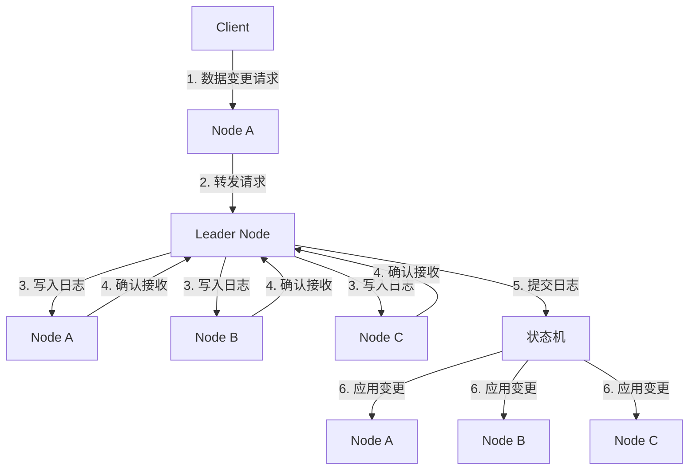

# Nacos 集群间同步机制

Nacos是一个动态服务发现、配置和服务管理平台，广泛应用于微服务架构中。在分布式系统中，Nacos通常以集群形式部署，以确保高可用性和数据一致性。本文将详细介绍Nacos集群间同步机制，帮助初学者理解其工作原理和实际应用。

## 什么是Nacos集群间同步机制？

Nacos集群间同步机制是指Nacos集群中的各个节点之间如何同步数据，以确保所有节点上的数据保持一致。这种机制在分布式系统中至关重要，因为任何节点的数据变更都需要及时传播到其他节点，以避免数据不一致的问题。

## Nacos 集群间同步机制的工作原理

Nacos集群间同步机制主要依赖于Raft协议。Raft是一种分布式一致性算法，用于管理复制日志的一致性。Nacos使用Raft协议来确保集群中所有节点的数据一致性。

### Raft协议简介

Raft协议将集群中的节点分为三种角色：
- **Leader**：负责处理所有客户端请求，并将日志复制到其他节点。
- **Follower**：被动接收Leader的日志，并在Leader失效时参与选举。
- **Candidate**：在选举过程中，Follower可以转变为Candidate，参与Leader选举。

### Nacos 中的Raft实现

在Nacos中，每个节点都维护一个Raft组，Raft组中的节点通过Raft协议进行数据同步。当某个节点接收到数据变更请求时，它会将变更请求转发给Leader节点。Leader节点将变更写入本地日志，并将日志复制到其他Follower节点。一旦大多数节点确认接收到日志，Leader节点就会提交日志，并将变更应用到本地状态机中。

## 实际案例

假设我们有一个Nacos集群，包含三个节点：Node A、Node B和Node C。Node A是Leader节点，Node B和Node C是Follower节点。

1. **客户端发送数据变更请求**：客户端向Node A发送一个数据变更请求。
2. **Leader节点处理请求**：Node A作为Leader节点，将变更请求写入本地日志，并将日志复制到Node B和Node C。
3. **Follower节点确认接收**：Node B和Node C接收到日志后，向Node A发送确认消息。
4. **Leader节点提交日志**：一旦Node A收到大多数节点的确认消息，它就会提交日志，并将变更应用到本地状态机中。
5. **Follower节点应用变更**：Node B和Node C也会将变更应用到它们的状态机中，确保数据一致性。

## 总结

Nacos集群间同步机制通过Raft协议确保集群中所有节点的数据一致性。理解这一机制对于构建高可用、高可靠的分布式系统至关重要。通过本文的介绍，希望您对Nacos集群间同步机制有了更深入的理解。

## 附加资源

- [Nacos官方文档](https://nacos.io/zh-cn/docs/what-is-nacos.html)
- [Raft协议论文](https://raft.github.io/raft.pdf)
- [分布式系统一致性算法](https://en.wikipedia.org/wiki/Consensus_(computer_science))

## 练习

1. 尝试在本地搭建一个Nacos集群，并观察集群间数据同步的过程。
2. 修改Nacos集群中的一个节点的配置，观察其他节点如何同步这一变更。
3. 阅读Raft协议的论文，并尝试实现一个简单的Raft算法。

:::tip
在实际生产环境中，建议使用至少三个节点的Nacos集群，以确保高可用性和数据一致性。
:::