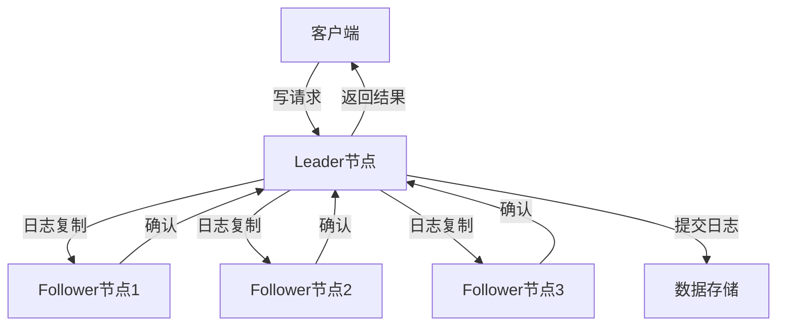

# Nacos 数据一致性保证

在分布式系统中，数据一致性是一个至关重要的概念。Nacos作为一个动态服务发现、配置和服务管理平台，其集群部署中的数据一致性保证机制尤为重要。本文将详细介绍Nacos如何保证数据一致性，并通过实际案例帮助初学者理解这一概念。

## 什么是数据一致性？

数据一致性指的是在分布式系统中，多个节点之间的数据保持同步和一致的状态。在Nacos集群中，数据一致性意味着所有节点上的配置信息和服务注册信息保持一致，确保系统的高可用性和可靠性。

## Nacos 数据一致性机制

Nacos通过Raft协议来实现数据一致性。Raft是一种分布式一致性算法，它将集群中的节点分为Leader、Follower和Candidate三种角色，通过选举和日志复制来保证数据的一致性。

### Raft协议简介

Raft协议的核心思想是将一致性问题分解为三个子问题：
1. **Leader选举**：集群中的节点通过选举产生一个Leader，负责处理所有的写请求。
2. **日志复制**：Leader将写请求记录到日志中，并将日志复制到其他节点。
3. **安全性**：确保日志的一致性，避免数据冲突。

### Nacos 中的Raft实现

在Nacos中，每个节点都会维护一个Raft日志，用于记录所有的写操作。当客户端发起写请求时，请求会被发送到Leader节点，Leader将请求记录到日志中，并将日志复制到其他Follower节点。只有当大多数节点成功复制日志后，Leader才会提交该日志，并将结果返回给客户端。



### 代码示例

以下是一个简单的Nacos配置更新示例，展示了如何通过Nacos客户端更新配置并保证数据一致性。

```java
import com.alibaba.nacos.api.config.ConfigService;
import com.alibaba.nacos.api.exception.NacosException;

public class NacosConfigExample {
    public static void main(String[] args) {
        try {
            // 初始化Nacos配置服务
            ConfigService configService = NacosFactory.createConfigService("127.0.0.1:8848");

            // 发布配置
            String dataId = "example-dataId";
            String group = "example-group";
            String content = "example-content";
            boolean isPublishOk = configService.publishConfig(dataId, group, content);
            System.out.println("发布配置结果: " + isPublishOk);

            // 获取配置
            String config = configService.getConfig(dataId, group, 5000);
            System.out.println("获取配置内容: " + config);
        } catch (NacosException e) {
            e.printStackTrace();
        }
    }
}
```

**输出结果：**
```
发布配置结果: true
获取配置内容: example-content
```

## 实际应用场景

假设我们有一个微服务架构的电商系统，系统中包含多个服务，如用户服务、订单服务和库存服务。这些服务都需要从Nacos中获取配置信息，如数据库连接字符串、缓存配置等。

在系统运行过程中，如果某个服务的配置需要更新，我们可以通过Nacos客户端更新配置，并确保所有服务节点都能及时获取到最新的配置信息。通过Nacos的数据一致性保证机制，我们可以确保所有服务节点的配置信息保持一致，避免因配置不一致导致的系统异常。

## 总结

Nacos通过Raft协议实现了数据一致性，确保了集群中所有节点的数据同步和一致。通过本文的介绍，初学者可以理解Nacos数据一致性的基本原理和实现方式，并通过实际案例掌握其应用场景。

## 附加资源

- [Nacos官方文档](https://nacos.io/zh-cn/docs/what-is-nacos.html)
- [Raft协议详解](https://raft.github.io/)
- [分布式系统一致性模型](https://en.wikipedia.org/wiki/Consistency_model)

## 练习

1. 尝试在本地搭建一个Nacos集群，并测试配置更新的数据一致性。
2. 阅读Raft协议的论文，深入理解其选举和日志复制机制。
3. 编写一个简单的Nacos客户端程序，模拟多个服务节点同时获取配置的场景，观察数据一致性的表现。
