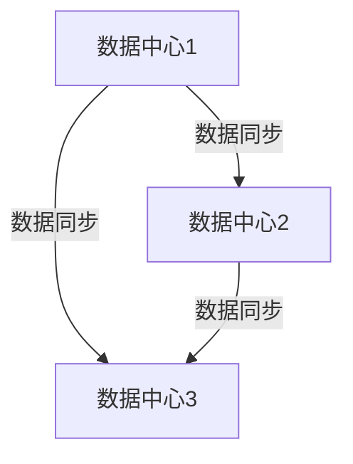
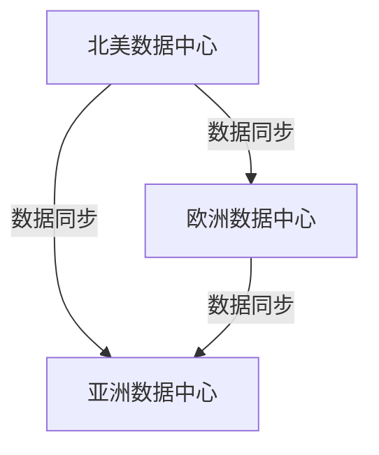

# Nacos 多数据中心部署

在现代分布式系统中，多数据中心部署是确保高可用性和灾难恢复能力的关键策略之一。Nacos作为一个动态服务发现、配置管理和服务管理平台，支持多数据中心部署，以满足企业级应用的需求。本文将详细介绍Nacos多数据中心部署的概念、实现方法以及实际应用场景。

## 什么是Nacos多数据中心部署？

多数据中心部署是指在多个地理位置不同的数据中心中部署相同的服务或应用，以提高系统的可用性和容错能力。Nacos的多数据中心部署允许你在不同的数据中心中运行Nacos集群，并通过配置实现数据同步和一致性。

## 为什么需要多数据中心部署？

1. **高可用性**：当一个数据中心发生故障时，其他数据中心可以继续提供服务。
2. **灾难恢复**：在自然灾害或其他灾难发生时，多数据中心部署可以确保数据和服务的安全。
3. **低延迟**：通过将服务部署在靠近用户的数据中心，可以减少网络延迟，提高用户体验。

## Nacos 多数据中心部署的实现

### 1. 部署Nacos集群

首先，你需要在每个数据中心中部署一个Nacos集群。每个集群由多个Nacos节点组成，确保集群内的高可用性。

```bash
# 示例：启动Nacos节点
sh startup.sh -m standalone
```

### 2. 配置多数据中心同步

Nacos支持通过配置实现多数据中心之间的数据同步。你需要在每个Nacos集群的配置文件中指定其他数据中心的地址。

```properties
# 示例：Nacos集群配置文件
nacos.core.cluster.metadata.dc1=192.168.1.1:8848
nacos.core.cluster.metadata.dc2=192.168.2.1:8848
```

### 3. 数据同步机制

Nacos使用Raft协议来确保数据在多个数据中心之间的一致性。当一个数据中心的数据发生变化时，Nacos会自动将变化同步到其他数据中心。



### 4. 实际案例

假设你有一个全球性的电商平台，用户分布在不同的地区。为了提高服务的可用性和响应速度，你可以在北美、欧洲和亚洲各部署一个Nacos集群。每个集群负责管理本地区的服务发现和配置管理，同时通过Nacos的多数据中心同步机制，确保全球数据的一致性。



## 总结

Nacos的多数据中心部署为分布式系统提供了高可用性、灾难恢复和低延迟的优势。通过在不同数据中心部署Nacos集群，并配置数据同步机制，你可以确保系统在全球范围内的稳定运行。

## 附加资源

- [Nacos官方文档](https://nacos.io/zh-cn/docs/what-is-nacos.html)
- [Raft协议详解](https://raft.github.io/)

## 练习

1. 尝试在本地环境中部署两个Nacos集群，并配置它们之间的数据同步。
2. 模拟一个数据中心故障，观察另一个数据中心如何接管服务。

:::tip
在配置多数据中心同步时，确保网络连接稳定，以避免数据同步延迟或失败。
:::