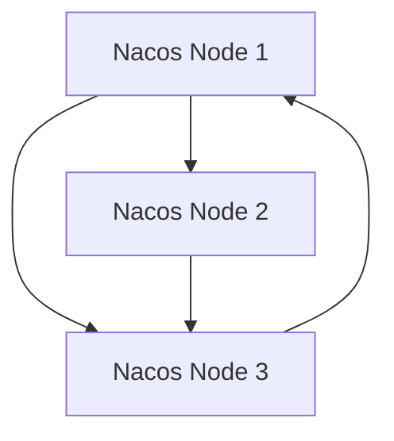

# Nacos 灾备方案

在现代分布式系统中，高可用性和数据安全性是至关重要的。Nacos作为一个动态服务发现、配置管理和服务管理平台，其灾备方案的设计和实施对于确保系统的稳定运行至关重要。本文将详细介绍Nacos的灾备方案，帮助初学者理解并实施这一关键策略。

## 1. 什么是Nacos灾备方案？

Nacos灾备方案是指在Nacos集群部署中，通过一系列策略和技术手段，确保在发生故障或灾难时，系统能够快速恢复并继续提供服务。灾备方案的核心目标是实现高可用性和数据安全性。

## 2. Nacos灾备方案的关键组件

### 2.1 数据备份与恢复

数据备份是灾备方案的基础。Nacos支持将配置数据和服务数据备份到外部存储系统，如MySQL、PostgreSQL等。通过定期备份，可以在数据丢失或损坏时快速恢复。

```sql
-- 示例：备份Nacos配置数据到MySQL
BACKUP DATABASE nacos_config TO DISK = '/path/to/backup/nacos_config.bak';
```

### 2.2 集群高可用

Nacos集群通过多节点部署实现高可用性。当某个节点发生故障时，其他节点可以接管其工作，确保服务不中断。



### 2.3 异地多活

异地多活是指在不同的地理区域部署多个Nacos集群，通过数据同步机制实现跨区域的高可用性。当某个区域发生灾难时，其他区域的集群可以继续提供服务。

## 3. 实施步骤

### 3.1 配置数据备份

1. **选择备份存储**：选择适合的数据库作为备份存储，如MySQL。
2. **配置备份策略**：设置备份频率和存储路径。
3. **定期验证备份**：确保备份数据的完整性和可恢复性。

### 3.2 部署Nacos集群

1. **准备环境**：确保所有节点的环境一致，包括操作系统、Java版本等。
2. **配置集群**：修改Nacos配置文件，指定集群节点信息。
3. **启动集群**：依次启动各个节点，确保集群正常运行。

```properties
# 示例：Nacos集群配置
nacos.cluster.members=192.168.1.1:8848,192.168.1.2:8848,192.168.1.3:8848
```

### 3.3 实现异地多活

1. **选择异地部署区域**：选择不同的地理区域部署Nacos集群。
2. **配置数据同步**：通过Nacos的数据同步机制，确保各区域数据一致。
3. **测试故障切换**：模拟区域故障，验证异地多活的有效性。

## 4. 实际案例

### 4.1 电商平台的Nacos灾备方案

某电商平台使用Nacos作为服务发现和配置中心。为了确保高可用性，他们在三个不同的数据中心部署了Nacos集群，并通过MySQL实现数据备份。在一次数据中心故障中，其他两个数据中心的Nacos集群迅速接管服务，确保了平台的稳定运行。

## 5. 总结

Nacos灾备方案是确保系统高可用性和数据安全性的关键策略。通过数据备份、集群高可用和异地多活等手段，可以有效应对各种故障和灾难。初学者应逐步掌握这些技术，并在实际项目中加以应用。

## 6. 附加资源与练习

- **资源**：
  - [Nacos官方文档](https://nacos.io/zh-cn/docs/what-is-nacos.html)
  - [MySQL备份与恢复指南](https://dev.mysql.com/doc/refman/8.0/en/backup-and-recovery.html)

- **练习**：
  1. 在本地环境中部署一个Nacos集群，并配置数据备份。
  2. 模拟节点故障，验证集群的高可用性。
  3. 研究并实现Nacos的异地多活方案。

通过以上内容，希望您能够全面理解并掌握Nacos的灾备方案，为您的系统提供坚实的保障。