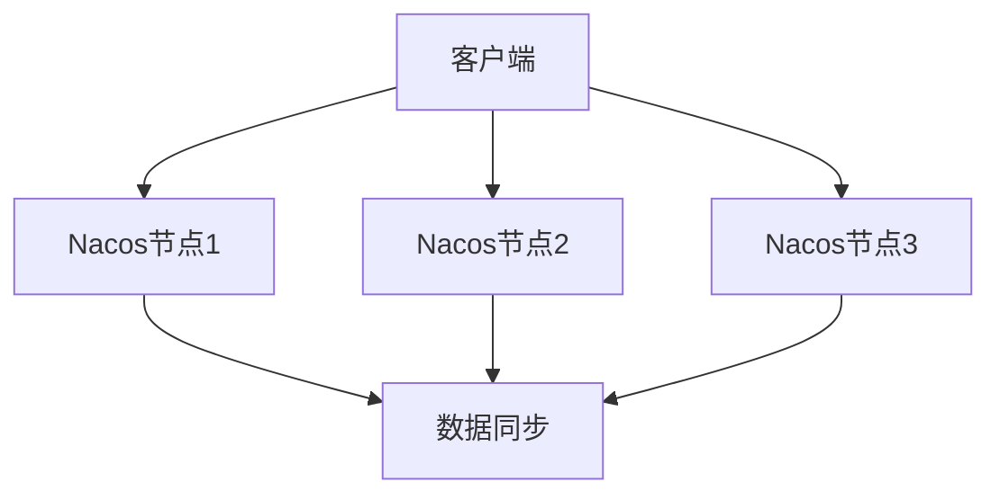

# Nacos 节点故障转移

在分布式系统中，高可用性是一个关键的设计目标。Nacos作为一个动态服务发现、配置管理和服务管理平台，支持集群部署以提高系统的可用性和容错能力。本文将详细介绍Nacos集群中的节点故障转移机制，帮助初学者理解其工作原理和实现方式。

## 什么是Nacos节点故障转移？

Nacos节点故障转移是指在Nacos集群中，当某个节点发生故障时，系统能够自动将流量和任务转移到其他健康的节点上，从而保证服务的连续性和高可用性。这种机制是分布式系统中常见的容错策略之一。

## Nacos 集群架构

在深入探讨故障转移之前，我们先了解一下Nacos集群的基本架构。Nacos集群通常由多个节点组成，这些节点通过Raft协议进行数据同步和选举。每个节点都可以处理客户端的请求，并且彼此之间保持数据的一致性。



## 故障转移的工作原理

当Nacos集群中的某个节点发生故障时，系统会通过以下步骤实现故障转移：

1. **故障检测**：Nacos集群中的节点会定期向其他节点发送心跳包，以检测节点的健康状态。如果某个节点在一定时间内没有响应，其他节点会将其标记为故障节点。

2. **选举新的Leader**：如果故障节点是Leader节点（负责处理写操作的节点），集群会通过Raft协议选举一个新的Leader节点。

3. **流量重定向**：客户端会通过Nacos的负载均衡机制，将请求自动重定向到其他健康的节点上。

4. **数据同步**：新的Leader节点会确保所有数据在集群中同步，以保证数据的一致性。

## 实际案例

假设我们有一个由三个节点组成的Nacos集群：`node1`、`node2`和`node3`。`node1`是当前的Leader节点，负责处理所有的写操作。突然，`node1`由于网络问题无法响应其他节点的心跳包。

1. **故障检测**：`node2`和`node3`检测到`node1`没有响应，将其标记为故障节点。

2. **选举新的Leader**：`node2`和`node3`通过Raft协议进行选举，假设`node2`被选为新的Leader。

3. **流量重定向**：客户端通过Nacos的负载均衡机制，将请求自动重定向到`node2`和`node3`。

4. **数据同步**：`node2`作为新的Leader，确保所有数据在`node2`和`node3`之间同步。

## 代码示例

以下是一个简单的Nacos客户端配置示例，展示了如何配置Nacos集群的地址：

```java
Properties properties = new Properties();
properties.put("serverAddr", "node1:8848,node2:8848,node3:8848");
NamingService naming = NamingFactory.createNamingService(properties);
```

在这个配置中，客户端会尝试连接`node1`、`node2`和`node3`。如果`node1`发生故障，客户端会自动将请求重定向到`node2`或`node3`。

## 总结

Nacos节点故障转移是确保Nacos集群高可用性的重要机制。通过故障检测、Leader选举、流量重定向和数据同步，Nacos能够在节点发生故障时自动恢复，保证服务的连续性。对于初学者来说，理解这一机制有助于更好地设计和维护分布式系统。

## 附加资源

- [Nacos官方文档](https://nacos.io/zh-cn/docs/what-is-nacos.html)
- [Raft协议详解](https://raft.github.io/)
- [分布式系统设计模式](https://www.oreilly.com/library/view/designing-distributed-systems/9781491983638/)

## 练习

1. 尝试在一个三节点的Nacos集群中模拟节点故障，观察故障转移的过程。
2. 修改Nacos客户端的配置，测试在不同节点故障情况下的行为。
3. 阅读Raft协议的相关资料，理解其在Nacos集群中的作用。

通过以上内容，你应该对Nacos节点故障转移有了初步的了解。继续深入学习，你将能够更好地应用这一机制来提升系统的可用性。