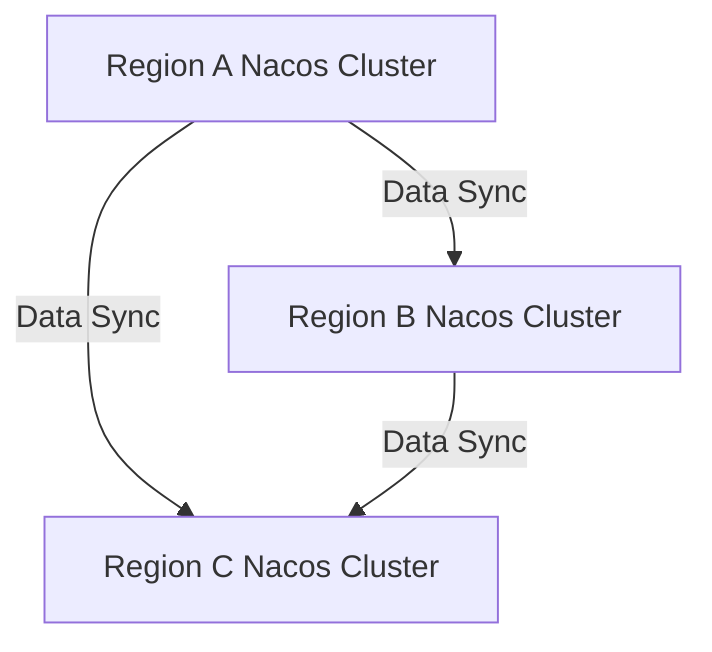

# Nacos 异地多活部署

## 介绍

Nacos（Naming and Configuration Service）是一个动态服务发现、配置管理和服务管理平台。在分布式系统中，高可用性和容灾能力是至关重要的。Nacos的**异地多活部署**（Multi-Active Deployment）是一种通过在不同地域部署多个Nacos集群，实现高可用性和容灾能力的解决方案。这种部署方式可以确保即使某个地域的集群发生故障，其他地域的集群仍然可以继续提供服务。

:::note
**异地多活**：指在不同地理位置部署多个数据中心，每个数据中心都可以独立提供服务，并且在发生故障时能够快速切换。
:::

## 为什么需要异地多活部署？

在分布式系统中，单点故障是一个常见的问题。如果某个地域的Nacos集群发生故障，可能会导致整个系统的服务发现和配置管理功能失效。通过异地多活部署，可以确保系统在某个地域发生故障时，其他地域的集群仍然可以继续提供服务，从而提高系统的可用性和容灾能力。

## Nacos 异地多活部署的实现

### 1. 多集群部署

Nacos的异地多活部署通常涉及在不同地域部署多个Nacos集群。每个集群都可以独立运行，并且通过某种机制进行数据同步。



### 2. 数据同步

为了实现异地多活，Nacos集群之间需要进行数据同步。Nacos支持通过**Raft协议**或**MySQL**等方式进行数据同步。

- **Raft协议**：Nacos默认使用Raft协议进行集群内部的数据同步。对于异地多活部署，可以通过配置多个Raft集群来实现跨地域的数据同步。
- **MySQL**：Nacos也支持将数据存储在MySQL中，通过MySQL的主从复制功能实现跨地域的数据同步。

### 3. 客户端配置

在客户端配置中，需要指定多个Nacos集群的地址。客户端可以通过负载均衡策略选择最近的Nacos集群进行服务发现和配置管理。

```yaml
spring:
  cloud:
    nacos:
      discovery:
        server-addr: 192.168.1.1:8848,192.168.2.1:8848,192.168.3.1:8848
```

:::tip
**负载均衡策略**：客户端可以通过轮询、随机或权重等方式选择Nacos集群，以实现负载均衡。
:::

## 实际案例

### 案例：跨地域电商系统

假设有一个跨地域的电商系统，用户分布在不同的地域（如北京、上海、广州）。为了提高系统的可用性和容灾能力，可以在每个地域部署一个Nacos集群，并通过数据同步机制确保各个集群的数据一致性。

- **北京集群**：负责北京地区的服务发现和配置管理。
- **上海集群**：负责上海地区的服务发现和配置管理。
- **广州集群**：负责广州地区的服务发现和配置管理。

当某个地域的集群发生故障时，其他地域的集群可以继续提供服务，确保系统的正常运行。

## 总结

Nacos的异地多活部署是一种提高系统可用性和容灾能力的有效方式。通过在不同地域部署多个Nacos集群，并实现数据同步，可以确保系统在某个地域发生故障时，其他地域的集群仍然可以继续提供服务。

:::caution
**注意事项**：在实施异地多活部署时，需要考虑网络延迟、数据一致性等问题，确保系统的稳定性和性能。
:::

## 附加资源

- [Nacos官方文档](https://nacos.io/zh-cn/docs/what-is-nacos.html)
- [Raft协议详解](https://raft.github.io/)
- [MySQL主从复制配置](https://dev.mysql.com/doc/refman/8.0/en/replication.html)

## 练习

1. 尝试在本地搭建两个Nacos集群，并配置它们之间的数据同步。
2. 编写一个简单的Spring Cloud应用，配置多个Nacos集群地址，并测试负载均衡策略。

通过以上练习，你将更深入地理解Nacos异地多活部署的实现和应用。