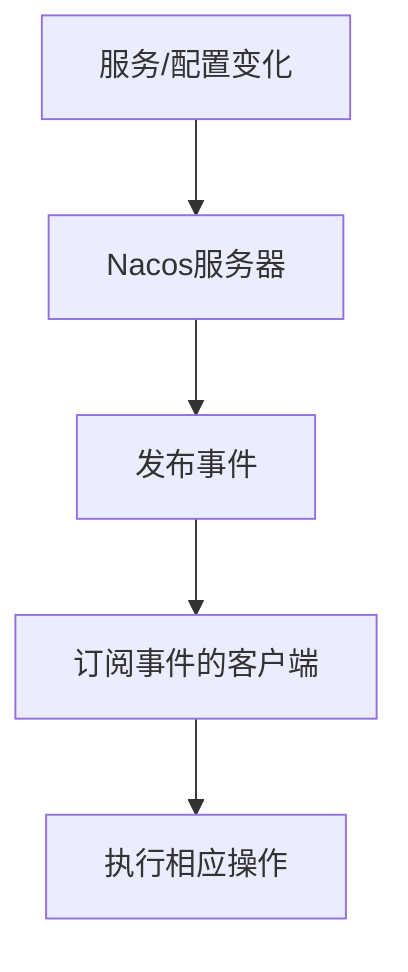

# Nacos 事件通知机制

Nacos是一个动态服务发现、配置和服务管理平台，广泛应用于微服务架构中。Nacos的事件通知机制是其核心功能之一，它允许系统在特定事件发生时自动通知相关组件，从而实现高效的服务管理和配置更新。

## 什么是Nacos事件通知机制？

Nacos事件通知机制是一种基于事件驱动的通信模式，它允许Nacos客户端在服务或配置发生变化时接收通知。这种机制确保了服务实例和配置的动态更新，无需手动干预。

## 工作原理

Nacos事件通知机制的核心是事件发布与订阅模型。当Nacos服务器检测到服务或配置的变化时，它会发布一个事件。订阅了该事件的客户端会立即收到通知，并执行相应的操作。



## 使用场景

Nacos事件通知机制在以下场景中非常有用：

1. **服务发现**：当服务实例上线或下线时，通知所有相关客户端。
2. **配置管理**：当配置发生变化时，通知所有使用该配置的客户端。
3. **健康检查**：当服务实例的健康状态发生变化时，通知相关客户端。

## 代码示例

以下是一个简单的Java示例，展示了如何使用Nacos的事件通知机制来监听配置变化。

```java
import com.alibaba.nacos.api.config.ConfigService;
import com.alibaba.nacos.api.config.listener.Listener;
import com.alibaba.nacos.api.exception.NacosException;

public class NacosConfigListener {
    public static void main(String[] args) throws NacosException {
        String serverAddr = "localhost:8848";
        String dataId = "example-dataId";
        String group = "DEFAULT_GROUP";

        ConfigService configService = NacosFactory.createConfigService(serverAddr);

        configService.addListener(dataId, group, new Listener() {
            @Override
            public void receiveConfigInfo(String configInfo) {
                System.out.println("配置已更新: " + configInfo);
            }

            @Override
            public Executor getExecutor() {
                return null;
            }
        });

        // 保持主线程运行，以便监听事件
        while (true) {
            try {
                Thread.sleep(1000);
            } catch (InterruptedException e) {
                e.printStackTrace();
            }
        }
    }
}
```

### 输入
- `serverAddr`: Nacos服务器的地址。
- `dataId`: 配置的ID。
- `group`: 配置的分组。

### 输出
当配置发生变化时，控制台会输出类似以下内容：
```
配置已更新: {"key":"value"}
```

## 实际案例

假设你正在开发一个微服务应用，其中包含多个服务实例。你希望在这些服务实例的配置发生变化时，能够自动更新所有实例的配置。通过使用Nacos的事件通知机制，你可以轻松实现这一需求。

1. **配置管理**：在Nacos控制台中创建一个配置项。
2. **监听配置**：在每个服务实例中，使用Nacos客户端监听该配置项的变化。
3. **自动更新**：当配置发生变化时，所有服务实例会自动接收通知并更新配置。

## 总结

Nacos事件通知机制是一种强大的工具，能够帮助你在微服务架构中实现动态服务发现和配置管理。通过事件驱动的方式，Nacos确保了系统的高效性和实时性。

## 附加资源

- [Nacos官方文档](https://nacos.io/zh-cn/docs/what-is-nacos.html)
- [Nacos GitHub仓库](https://github.com/alibaba/nacos)

## 练习

1. 尝试在本地搭建一个Nacos服务器，并创建一个配置项。
2. 编写一个Java程序，监听该配置项的变化，并在控制台输出更新后的配置内容。
3. 修改Nacos控制台中的配置项，观察Java程序的输出变化。

通过以上练习，你将更深入地理解Nacos事件通知机制的工作原理和应用场景。