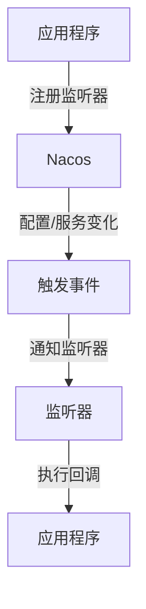

# Nacos 监听器模式

Nacos 是一个动态服务发现、配置管理和服务管理平台。在 Nacos 中，监听器模式（Listener Pattern）是一种重要的机制，用于在配置或服务状态发生变化时，及时通知应用程序。本文将详细介绍 Nacos 监听器模式的工作原理、使用场景以及如何在实际项目中应用。

## 什么是监听器模式？

监听器模式是一种设计模式，它允许对象在特定事件发生时自动执行某些操作。在 Nacos 中，监听器模式主要用于监听配置变化或服务实例的变化。当这些变化发生时，Nacos 会通知所有注册的监听器，从而触发相应的回调函数。

### 监听器模式的核心概念

- **事件源（Event Source）**：产生事件的对象。在 Nacos 中，事件源可以是配置中心或服务注册中心。
- **监听器（Listener）**：监听事件的对象。当事件发生时，监听器会执行相应的操作。
- **事件（Event）**：事件源产生的具体事件，例如配置更新或服务实例变化。

## Nacos 监听器模式的工作原理

在 Nacos 中，监听器模式的工作流程如下：

1. **注册监听器**：应用程序向 Nacos 注册一个监听器，用于监听特定的配置或服务。
2. **事件触发**：当配置或服务状态发生变化时，Nacos 会触发相应的事件。
3. **通知监听器**：Nacos 会将事件通知给所有注册的监听器。
4. **执行回调**：监听器接收到事件后，执行预先定义的回调函数。



## 代码示例

以下是一个简单的代码示例，展示了如何在 Nacos 中使用监听器模式来监听配置变化。

```java
import com.alibaba.nacos.api.config.ConfigService;
import com.alibaba.nacos.api.config.listener.Listener;
import com.alibaba.nacos.api.exception.NacosException;

public class NacosConfigListenerExample {

    public static void main(String[] args) throws NacosException {
        // 初始化配置服务
        ConfigService configService = NacosFactory.createConfigService("127.0.0.1:8848");

        // 监听配置变化
        configService.addListener("example-config", "DEFAULT_GROUP", new Listener() {
            @Override
            public void receiveConfigInfo(String configInfo) {
                System.out.println("配置已更新，新配置为：" + configInfo);
            }

            @Override
            public Executor getExecutor() {
                return null;
            }
        });

        // 模拟配置更新
        configService.publishConfig("example-config", "DEFAULT_GROUP", "new-config-content");
    }
}
```

### 输入与输出

- **输入**：Nacos 中的配置发生变化。
- **输出**：控制台打印出新的配置内容。

## 实际应用场景

### 动态配置更新

在微服务架构中，配置通常需要动态更新。通过 Nacos 监听器模式，应用程序可以在配置发生变化时立即获取最新的配置，而无需重启服务。

### 服务发现

在服务发现场景中，服务实例的状态可能会频繁变化。通过监听器模式，应用程序可以实时获取服务实例的最新状态，从而做出相应的调整。

## 总结

Nacos 监听器模式是一种强大的机制，能够帮助应用程序在配置或服务状态发生变化时及时做出响应。通过本文的介绍，你应该已经掌握了监听器模式的基本概念、工作原理以及如何在实际项目中使用它。

## 附加资源与练习

- **练习**：尝试在本地搭建一个 Nacos 环境，并使用监听器模式实现一个简单的配置更新通知功能。
- **资源**：阅读 [Nacos 官方文档](https://nacos.io/zh-cn/docs/what-is-nacos.html) 以获取更多关于 Nacos 的详细信息。

:::tip
在实际项目中，监听器模式可以帮助你构建更加灵活和动态的系统。确保在设计和实现时考虑到性能和可扩展性。
:::