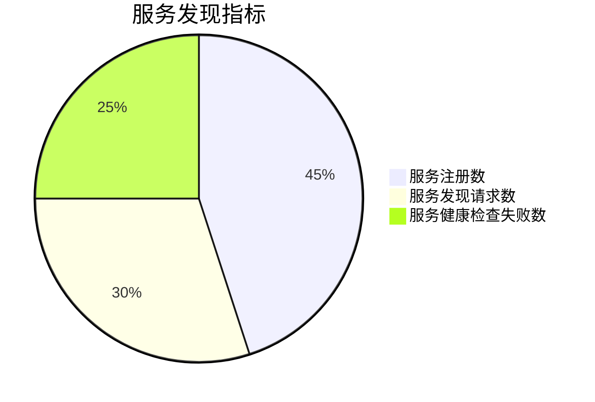

## 介绍

Nacos是一个动态服务发现、配置管理和服务管理平台，广泛应用于微服务架构中。为了确保Nacos的稳定性和高性能，监控其运行状态至关重要。Nacos提供了一套丰富的监控指标体系，帮助开发者实时了解系统的健康状况、性能瓶颈以及潜在问题。

本文将详细介绍Nacos的监控指标体系，包括关键指标的定义、如何收集这些指标以及如何利用它们进行系统优化。

## Nacos 监控指标体系概述

Nacos的监控指标体系主要分为以下几类：

1. **系统指标**：包括CPU、内存、磁盘、网络等系统资源的使用情况。
2. **服务发现指标**：包括服务注册、服务发现、服务健康检查等相关的指标。
3. **配置管理指标**：包括配置发布、配置获取、配置监听等相关的指标。
4. **集群指标**：包括集群节点状态、集群通信、集群选举等相关的指标。

### 系统指标

系统指标是监控Nacos运行环境的基础，主要包括：

- **CPU使用率**：反映Nacos进程的CPU占用情况。
- **内存使用率**：反映Nacos进程的内存占用情况。
- **磁盘使用率**：反映Nacos存储数据的磁盘空间使用情况。
- **网络IO**：反映Nacos的网络通信情况。

:::tip
系统指标可以通过操作系统自带的监控工具（如`top`、`htop`、`vmstat`等）或第三方监控系统（如Prometheus）来收集。
:::

### 服务发现指标

服务发现指标是监控Nacos核心功能的关键，主要包括：

- **服务注册数**：当前注册到Nacos的服务实例数量。
- **服务发现请求数**：客户端从Nacos获取服务实例的请求次数。
- **服务健康检查失败数**：服务实例健康检查失败的次数。

### 配置管理指标

配置管理指标是监控Nacos配置中心功能的关键，主要包括：

- **配置发布数**：Nacos中发布的配置项数量。
- **配置获取请求数**：客户端从Nacos获取配置的请求次数。
- **配置监听数**：客户端监听配置变化的次数。

:::note
配置管理指标可以帮助开发者了解配置中心的使用情况，及时发现配置发布或获取的异常。
:::

### 集群指标

集群指标是监控Nacos集群状态的关键，主要包括：

- **集群节点数**：当前Nacos集群中的节点数量。
- **集群通信延迟**：集群节点之间的通信延迟。
- **集群选举状态**：集群选举的状态（如Leader、Follower）。

## 实际案例

假设我们有一个微服务架构的应用，使用Nacos作为服务发现和配置中心。为了确保系统的稳定性，我们需要监控以下关键指标：

1. **服务注册数**：确保所有服务实例都成功注册到Nacos。
2. **配置获取请求数**：确保客户端能够正常获取配置。
3. **集群通信延迟**：确保集群节点之间的通信延迟在可接受范围内。

通过监控这些指标，我们可以及时发现并解决潜在问题，例如服务注册失败、配置获取超时或集群通信延迟过高。

## 总结

Nacos的监控指标体系是确保系统稳定性和高性能的重要工具。通过监控系统指标、服务发现指标、配置管理指标和集群指标，开发者可以全面了解Nacos的运行状态，及时发现并解决问题。

## 附加资源

- [Nacos官方文档](https://nacos.io/zh-cn/docs/what-is-nacos.html)
- [Prometheus监控Nacos](https://prometheus.io/docs/guides/nacos/)
- [Grafana监控面板配置](https://grafana.com/docs/grafana/latest/datasources/prometheus/)

## 练习

1. 使用Prometheus和Grafana搭建Nacos的监控系统，并配置相关监控指标。
2. 分析Nacos的监控数据，找出系统中的性能瓶颈，并提出优化建议。
