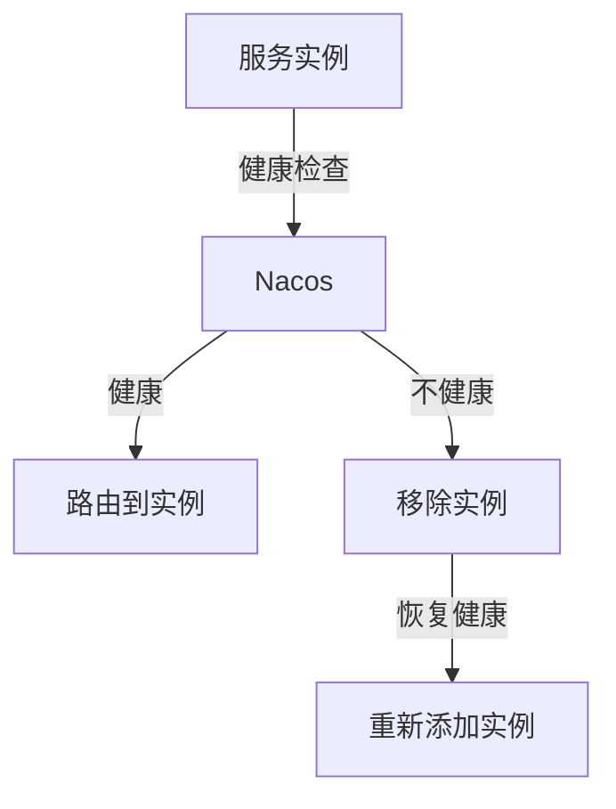

# Nacos 运维最佳实践

Nacos（Naming and Configuration Service）是一个动态服务发现、配置管理和服务管理平台。它广泛应用于微服务架构中，帮助开发者实现服务的注册、发现和配置管理。为了确保Nacos在生产环境中的稳定运行，运维工作至关重要。本文将介绍Nacos运维的最佳实践，帮助初学者掌握如何高效地监控和维护Nacos。

## 1. Nacos运维的核心概念

在深入探讨最佳实践之前，我们需要了解一些Nacos运维的核心概念：

- **服务注册与发现**：Nacos允许服务实例在启动时注册自己，并在需要时发现其他服务实例。
- **配置管理**：Nacos提供了一个集中化的配置管理平台，允许动态更新配置。
- **健康检查**：Nacos通过健康检查机制监控服务实例的状态，确保只有健康的实例被路由到。
- **集群管理**：Nacos支持集群部署，以提高可用性和扩展性。

## 2. Nacos运维最佳实践

### 2.1 监控Nacos集群

监控是Nacos运维的基础。通过监控，我们可以及时发现潜在问题并采取相应措施。以下是一些关键的监控指标：

- **CPU和内存使用率**：确保Nacos节点的资源使用在合理范围内。
- **网络流量**：监控网络流量，确保没有异常的网络请求。
- **服务注册和发现的成功率**：确保服务注册和发现的成功率在正常范围内。
- **配置更新的延迟**：监控配置更新的延迟，确保配置能够及时生效。

:::tip
可以使用Prometheus和Grafana等工具来监控Nacos集群。Nacos提供了Prometheus的监控指标接口，可以轻松集成。
:::

### 2.2 配置管理的最佳实践

Nacos的配置管理功能非常强大，但也需要谨慎使用。以下是一些配置管理的最佳实践：

- **版本控制**：为配置项添加版本号，确保在更新配置时能够回滚到之前的版本。
- **环境隔离**：为不同的环境（如开发、测试、生产）创建不同的命名空间，避免配置冲突。
- **配置加密**：对于敏感配置项，使用加密存储，确保数据安全。

```yaml
# 示例：配置项版本控制
config:
  version: 1.0
  database:
    url: jdbc:mysql://localhost:3306/mydb
    username: root
    password: securepassword
```

### 2.3 健康检查与故障恢复

Nacos通过健康检查机制确保只有健康的服务实例被路由到。以下是一些健康检查与故障恢复的最佳实践：

- **定期健康检查**：确保Nacos定期对服务实例进行健康检查，及时发现不健康的实例。
- **自动故障恢复**：配置Nacos在检测到不健康的实例时，自动将其从服务列表中移除，并在实例恢复健康后重新添加。



### 2.4 集群管理与高可用

Nacos支持集群部署，以提高可用性和扩展性。以下是一些集群管理的最佳实践：

- **多节点部署**：在生产环境中，建议至少部署3个Nacos节点，以确保高可用性。
- **负载均衡**：使用负载均衡器（如Nginx）将请求分发到不同的Nacos节点，避免单点故障。
- **数据备份**：定期备份Nacos的配置数据，防止数据丢失。

:::caution
在集群部署时，确保所有节点的时钟同步，以避免因时间不一致导致的问题。
:::

## 3. 实际案例

### 案例1：配置更新延迟问题

某公司在使用Nacos进行配置管理时，发现配置更新的延迟较高，导致服务无法及时获取最新的配置。经过分析，发现是由于Nacos集群的网络带宽不足。通过增加网络带宽和优化Nacos集群的部署架构，成功降低了配置更新的延迟。

### 案例2：服务注册失败问题

另一家公司在使用Nacos进行服务注册时，发现部分服务实例无法成功注册。经过排查，发现是由于Nacos的健康检查机制过于严格，导致部分实例被误判为不健康。通过调整健康检查的阈值，解决了服务注册失败的问题。

## 4. 总结

Nacos运维是确保微服务架构稳定运行的关键环节。通过监控、配置管理、健康检查与故障恢复、集群管理等最佳实践，可以有效提升Nacos的稳定性和可用性。希望本文的内容能够帮助初学者更好地理解和应用Nacos运维的最佳实践。

## 5. 附加资源与练习

- **资源**：
  - [Nacos官方文档](https://nacos.io/zh-cn/docs/what-is-nacos.html)
  - [Prometheus监控Nacos](https://prometheus.io/docs/introduction/overview/)
  - [Grafana监控面板配置](https://grafana.com/docs/grafana/latest/getting-started/)

- **练习**：
  - 部署一个Nacos集群，并配置Prometheus和Grafana进行监控。
  - 尝试在Nacos中管理不同环境的配置，并测试配置的动态更新。
  - 模拟服务实例的健康检查失败，观察Nacos如何处理不健康的实例。

通过实践这些练习，您将更深入地理解Nacos运维的核心概念和最佳实践。