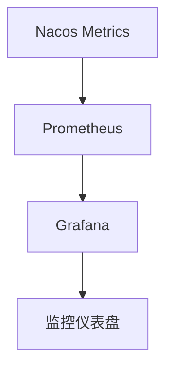

# Nacos 运维工具链

Nacos（Naming and Configuration Service）是一个动态服务发现、配置管理和服务管理平台。为了确保Nacos在生产环境中的稳定运行，运维人员需要借助一系列工具来监控、管理和优化Nacos服务。本文将详细介绍Nacos运维工具链，帮助初学者理解如何通过这些工具提升Nacos的运维效率。

## 什么是Nacos运维工具链？

Nacos运维工具链是指一系列用于监控、管理和优化Nacos服务的工具集合。这些工具可以帮助运维人员实时监控Nacos的运行状态、诊断问题、优化性能，并确保服务的高可用性。

## Nacos 运维工具链的核心组件

### 1. Nacos控制台

Nacos控制台是Nacos提供的Web管理界面，运维人员可以通过控制台查看服务列表、配置管理、集群状态等信息。控制台还提供了简单的操作界面，方便运维人员进行服务注册、配置发布等操作。

### 2. Nacos Metrics

Nacos Metrics是Nacos内置的监控指标系统，它提供了丰富的监控数据，包括服务注册数、配置变更次数、集群健康状态等。运维人员可以通过这些指标实时监控Nacos的运行状态。

```bash
# 查看Nacos Metrics
curl http://localhost:8848/nacos/v1/console/metrics
```

### 3. Prometheus + Grafana

Prometheus是一个开源的监控系统，Grafana是一个可视化工具。通过将Nacos Metrics与Prometheus和Grafana集成，运维人员可以创建丰富的监控仪表盘，实时监控Nacos的各项指标。

```yaml
# Prometheus配置示例
scrape_configs:
  - job_name: 'nacos'
    static_configs:
      - targets: ['localhost:8848']
```

### 4. Nacos日志

Nacos日志是诊断问题的重要工具。Nacos提供了详细的日志输出，包括服务注册、配置变更、集群通信等操作的日志。运维人员可以通过分析日志快速定位问题。

```bash
# 查看Nacos日志
tail -f /path/to/nacos/logs/nacos.log
```

### 5. Nacos CLI

Nacos CLI是Nacos提供的命令行工具，运维人员可以通过CLI进行服务注册、配置管理、集群管理等操作。CLI工具适合在自动化脚本中使用。

```bash
# 使用Nacos CLI注册服务
nacos-cli register -s localhost:8848 -n my-service -i 192.168.1.1 -p 8080
```

## 实际案例：使用Prometheus和Grafana监控Nacos

假设我们有一个Nacos集群，需要实时监控其运行状态。我们可以通过以下步骤实现：

1. **配置Prometheus**：在Prometheus配置文件中添加Nacos Metrics的监控目标。
2. **配置Grafana**：在Grafana中创建仪表盘，导入Nacos Metrics数据。
3. **查看监控数据**：通过Grafana仪表盘实时查看Nacos的运行状态。



## 总结

Nacos运维工具链是确保Nacos服务稳定运行的关键。通过Nacos控制台、Metrics、Prometheus、Grafana、日志和CLI等工具，运维人员可以高效地监控、管理和优化Nacos服务。掌握这些工具的使用方法，将大大提升Nacos的运维效率。

## 附加资源

- [Nacos官方文档](https://nacos.io/zh-cn/docs/what-is-nacos.html)
- [Prometheus官方文档](https://prometheus.io/docs/)
- [Grafana官方文档](https://grafana.com/docs/)

## 练习

1. 使用Nacos CLI注册一个服务，并通过Nacos控制台查看注册结果。
2. 配置Prometheus和Grafana，监控Nacos的Metrics数据，并创建一个简单的仪表盘。
3. 分析Nacos日志，找出最近一次配置变更的详细信息。

:::tip
提示：在配置Prometheus和Grafana时，可以参考Nacos官方文档中的集成指南。
:::