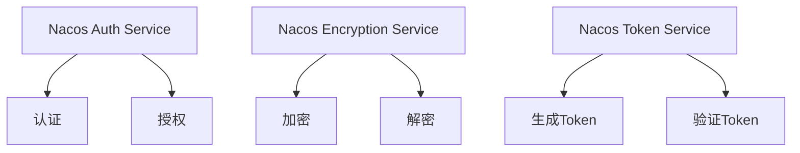

# Nacos 安全架构

Nacos是一个动态服务发现、配置和服务管理平台，广泛应用于微服务架构中。随着微服务架构的普及，安全性成为了一个不可忽视的重要问题。Nacos提供了多种安全机制来保护服务发现和配置管理的安全性。本文将详细介绍Nacos的安全架构，帮助初学者理解并应用这些安全特性。

## 1. Nacos安全架构概述

Nacos的安全架构主要包括以下几个方面：

- **认证（Authentication）**：确保只有经过身份验证的用户或服务可以访问Nacos。
- **授权（Authorization）**：控制用户或服务对Nacos资源的访问权限。
- **加密（Encryption）**：保护数据在传输和存储过程中的安全性。

### 1.1 认证机制

Nacos支持基于Token的认证机制。用户或服务在访问Nacos之前，需要先获取一个有效的Token，然后在每次请求中携带该Token进行身份验证。

```java
// 获取Token的示例代码
String token = NacosAuthService.getToken("username", "password");
```

### 1.2 授权策略

Nacos的授权策略基于角色和权限。每个用户或服务可以被分配一个或多个角色，每个角色拥有特定的权限。Nacos通过这种方式来控制对资源的访问。

```java
// 检查用户权限的示例代码
boolean hasPermission = NacosAuthService.checkPermission("username", "resource", "action");
```

### 1.3 加密机制

Nacos支持对配置数据进行加密存储，以防止敏感信息泄露。Nacos使用AES加密算法对配置数据进行加密和解密。

```java
// 加密配置数据的示例代码
String encryptedData = NacosEncryptionService.encrypt("sensitiveData", "encryptionKey");
```

## 2. Nacos安全架构的核心组件

Nacos的安全架构主要由以下几个核心组件组成：

- **Nacos Auth Service**：负责处理认证和授权请求。
- **Nacos Encryption Service**：负责数据的加密和解密。
- **Nacos Token Service**：负责生成和管理Token。



## 3. 实际应用场景

### 3.1 微服务架构中的安全配置

在一个典型的微服务架构中，多个服务需要访问Nacos来获取配置信息。为了确保安全性，每个服务在访问Nacos之前都需要进行身份验证，并且只能访问其被授权的配置。

```java
// 微服务访问Nacos的示例代码
String token = NacosAuthService.getToken("serviceA", "password");
String config = NacosConfigService.getConfig("serviceA-config", token);
```

### 3.2 敏感数据的加密存储

在某些场景下，配置数据可能包含敏感信息，如数据库密码、API密钥等。为了确保这些数据的安全性，可以使用Nacos的加密功能对数据进行加密存储。

```java
// 加密存储敏感数据的示例代码
String encryptedPassword = NacosEncryptionService.encrypt("dbPassword", "encryptionKey");
NacosConfigService.publishConfig("db-config", encryptedPassword, token);
```

## 4. 总结

Nacos的安全架构为微服务架构中的服务发现和配置管理提供了全面的安全保障。通过认证、授权和加密机制，Nacos确保了只有经过身份验证的用户或服务可以访问其资源，并且保护了敏感数据的安全性。

## 5. 附加资源与练习

- **官方文档**：[Nacos安全配置指南](https://nacos.io/zh-cn/docs/security.html)
- **练习**：尝试在你的微服务项目中集成Nacos的安全机制，并测试其认证和授权功能。

:::tip
在实际项目中，建议定期更新Token和加密密钥，以增强系统的安全性。
:::

:::caution
确保在配置文件中不要明文存储敏感信息，如密码和密钥。
:::