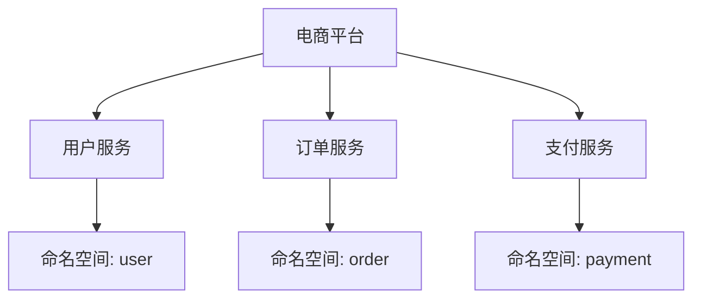

## 介绍

Nacos 是一个动态服务发现、配置管理和服务管理平台，广泛应用于微服务架构中。随着微服务架构的普及，数据安全保护变得尤为重要。Nacos 提供了多种机制来保护数据的安全性，包括访问控制、加密传输和数据隔离等。本文将详细介绍如何在 Nacos 中实现数据安全保护，并通过实际案例展示其应用。

## 访问控制

Nacos 提供了基于角色的访问控制（RBAC）机制，允许管理员为不同的用户分配不同的权限。通过这种方式，可以确保只有授权的用户才能访问或修改特定的配置或服务信息。

### 配置访问控制

首先，需要在 Nacos 中创建用户并分配角色。以下是一个示例，展示如何通过 Nacos 的 API 创建一个用户并为其分配角色：

```bash
# 创建用户
curl -X POST 'http://localhost:8848/nacos/v1/auth/users?username=admin&password=admin'

# 分配角色
curl -X POST 'http://localhost:8848/nacos/v1/auth/roles?username=admin&role=ROLE_ADMIN'
```

### 验证访问控制

创建用户并分配角色后，可以尝试访问受保护的资源。如果用户没有相应的权限，Nacos 将返回 `403 Forbidden` 错误。

```bash
# 尝试访问受保护的资源
curl -X GET 'http://localhost:8848/nacos/v1/cs/configs?dataId=example&group=DEFAULT_GROUP'
```

如果用户没有权限，将返回：

```json
{
  "code": 403,
  "message": "Forbidden"
}
```

## 加密传输

为了保护数据在传输过程中的安全性，Nacos 支持通过 HTTPS 进行加密传输。启用 HTTPS 可以防止数据在传输过程中被窃听或篡改。

### 配置 HTTPS

要启用 HTTPS，首先需要生成或获取 SSL 证书，然后在 Nacos 的配置文件中进行配置。以下是一个示例配置：

```properties
# application.properties
server.ssl.enabled=true
server.ssl.key-store=classpath:keystore.jks
server.ssl.key-store-password=changeit
server.ssl.key-password=changeit
```

### 验证 HTTPS

配置完成后，可以通过 HTTPS 访问 Nacos 服务：

```bash
curl -X GET 'https://localhost:8848/nacos/v1/cs/configs?dataId=example&group=DEFAULT_GROUP'
```

如果配置正确，Nacos 将返回加密的响应。

## 数据隔离

在多租户环境中，数据隔离是确保不同租户之间数据安全的重要手段。Nacos 通过命名空间（Namespace）机制实现数据隔离。

### 创建命名空间

可以通过 Nacos 的控制台或 API 创建命名空间。以下是一个通过 API 创建命名空间的示例：

```bash
curl -X POST 'http://localhost:8848/nacos/v1/console/namespaces' -d 'customNamespaceId=namespace1&namespaceName=Namespace1&namespaceDesc=This is namespace 1'
```

### 使用命名空间

创建命名空间后，可以在配置或服务注册时指定命名空间，以确保数据隔离。以下是一个示例：

```bash
# 注册服务到指定命名空间
curl -X POST 'http://localhost:8848/nacos/v1/ns/instance' -d 'serviceName=exampleService&ip=127.0.0.1&port=8080&namespaceId=namespace1'
```

## 实际案例

假设我们有一个电商平台，其中包含多个微服务，如用户服务、订单服务和支付服务。为了确保数据安全，我们可以为每个服务创建独立的命名空间，并为不同的团队分配不同的访问权限。



通过这种方式，可以确保每个服务的数据在逻辑上隔离，并且只有授权的团队才能访问或修改相关数据。

## 总结

Nacos 提供了多种机制来保护数据的安全性，包括访问控制、加密传输和数据隔离。通过合理配置这些机制，可以确保 Nacos 中的配置和服务信息在存储和传输过程中的安全性。对于初学者来说，理解并掌握这些安全保护措施是构建安全微服务架构的重要一步。

## 附加资源

- [Nacos 官方文档](https://nacos.io/zh-cn/docs/what-is-nacos.html)
- [微服务安全最佳实践](https://microservices.io/patterns/security/)
- [HTTPS 配置指南](https://docs.spring.io/spring-boot/docs/current/reference/html/howto.html#howto-configure-ssl)

## 练习

1. 在 Nacos 中创建一个新的命名空间，并尝试在不同的命名空间中注册服务。
2. 配置 Nacos 的 HTTPS，并通过 HTTPS 访问 Nacos 服务。
3. 创建一个新的用户并为其分配角色，验证该用户是否可以访问受保护的资源。
