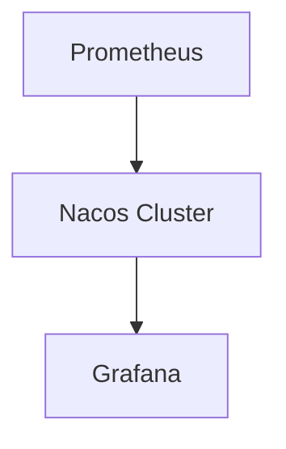

## 介绍

Nacos（Naming and Configuration Service）是一个动态服务发现、配置管理和服务管理平台。随着微服务架构的普及，Nacos在企业中的应用越来越广泛。然而，随着应用的扩展，安全问题也变得至关重要。本文将介绍Nacos的安全最佳实践，帮助您保护配置和服务发现数据。

## 1. 启用身份验证

Nacos默认情况下不启用身份验证，这意味着任何人都可以访问和修改配置。为了增强安全性，建议启用身份验证。

### 1.1 配置身份验证

在Nacos的配置文件 `application.properties` 中，添加以下配置以启用身份验证：

```properties
nacos.core.auth.enabled=true
nacos.core.auth.system.type=nacos
nacos.core.auth.plugin.nacos.token.secret.key=YourSecretKey
```

### 1.2 创建用户

启用身份验证后，您需要创建用户并分配角色。可以通过Nacos控制台或API创建用户。

```bash
curl -X POST 'http://localhost:8848/nacos/v1/auth/users?username=admin&password=admin'
```

### 1.3 使用Token进行身份验证

在请求Nacos API时，需要在请求头中添加Token：

```bash
curl -X GET 'http://localhost:8848/nacos/v1/cs/configs?dataId=example&group=DEFAULT_GROUP' -H 'Authorization: Bearer YourToken'
```

## 2. 配置访问控制

Nacos支持基于角色的访问控制（RBAC），您可以为不同的用户分配不同的权限。

### 2.1 创建角色

在Nacos控制台中，您可以创建角色并为其分配权限。

### 2.2 分配权限

将角色分配给用户，以控制他们对Nacos资源的访问权限。

```bash
curl -X POST 'http://localhost:8848/nacos/v1/auth/roles?role=admin&username=admin'
```

## 3. 加密敏感数据

在Nacos中存储的配置可能包含敏感信息，如数据库密码、API密钥等。建议对这些数据进行加密。

### 3.1 使用加密插件

Nacos支持通过插件对配置进行加密。您可以使用AES加密算法对敏感数据进行加密。

```java
import com.alibaba.nacos.api.config.annotation.NacosValue;
import org.springframework.stereotype.Component;

@Component
public class ConfigService {

    @NacosValue(value = "${db.password:}", autoRefreshed = true)
    private String dbPassword;

    public String getDbPassword() {
        return decrypt(dbPassword);
    }

    private String decrypt(String encryptedText) {
        // 实现解密逻辑
        return encryptedText; // 示例代码，实际应用中需要实现解密逻辑
    }
}
```

## 4. 监控和日志记录

监控和日志记录是安全实践的重要组成部分。通过监控和日志记录，您可以及时发现和响应潜在的安全威胁。

### 4.1 启用审计日志

在Nacos的配置文件中，启用审计日志以记录所有操作。

```properties
nacos.core.auth.audit.enabled=true
```

### 4.2 监控Nacos集群

使用Prometheus和Grafana等工具监控Nacos集群的健康状态和性能指标。



## 5. 实际案例

假设您有一个微服务架构的应用，使用Nacos进行服务发现和配置管理。为了保护敏感配置数据，您启用了身份验证和访问控制，并对数据库密码进行了加密。

### 5.1 场景描述

- **服务发现**：多个微服务通过Nacos进行服务发现。
- **配置管理**：微服务的配置存储在Nacos中，包含数据库连接信息。
- **安全措施**：启用身份验证、访问控制，并对数据库密码进行加密。

### 5.2 实施步骤

1. 在Nacos中启用身份验证。
2. 创建用户并分配角色。
3. 对数据库密码进行加密。
4. 启用审计日志并监控Nacos集群。

## 总结

通过实施Nacos安全最佳实践，您可以有效保护配置和服务发现数据，防止未经授权的访问和潜在的安全威胁。建议定期审查和更新安全策略，以应对不断变化的安全环境。

## 附加资源

- [Nacos官方文档](https://nacos.io/zh-cn/docs/what-is-nacos.html)
- [微服务安全最佳实践](https://microservices.io/patterns/security/)
- [Prometheus和Grafana监控指南](https://prometheus.io/docs/introduction/overview/)
