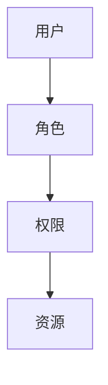

# Nacos 授权管理

Nacos是一个动态服务发现、配置和服务管理平台。在实际生产环境中，确保Nacos资源的安全性至关重要。Nacos提供了授权管理功能，允许管理员通过角色和权限来控制用户对资源的访问。本文将详细介绍Nacos的授权管理机制，并通过实际案例帮助初学者理解其应用。

## 什么是Nacos授权管理？

Nacos授权管理是指通过定义角色和权限，控制用户对Nacos资源的访问权限。Nacos支持基于角色的访问控制（RBAC），管理员可以为用户分配角色，并为角色分配相应的权限。通过这种方式，可以确保只有授权的用户才能访问或修改特定的资源。

## Nacos 授权管理的基本概念

在Nacos中，授权管理涉及以下几个核心概念：

1. **用户（User）**：Nacos中的用户是指可以登录并访问Nacos平台的个体或系统。
2. **角色（Role）**：角色是一组权限的集合。用户可以被分配一个或多个角色。
3. **权限（Permission）**：权限定义了用户可以对资源执行的操作，例如读取、写入或删除。

## 如何配置Nacos授权管理

### 1. 创建角色

首先，管理员需要创建角色并为角色分配权限。可以通过Nacos控制台或API来创建角色。

```bash
# 使用Nacos API创建角色
curl -X POST 'http://localhost:8848/nacos/v1/auth/roles' \
-H 'Content-Type: application/x-www-form-urlencoded' \
-d 'role=admin&description=系统管理员'
```

### 2. 分配角色给用户

创建角色后，管理员可以将角色分配给用户。

```bash
# 使用Nacos API将角色分配给用户
curl -X POST 'http://localhost:8848/nacos/v1/auth/users' \
-H 'Content-Type: application/x-www-form-urlencoded' \
-d 'username=user1&password=password123&role=admin'
```

### 3. 定义权限

权限定义了角色可以对资源执行的操作。Nacos支持对命名空间、配置、服务等资源的权限控制。

```bash
# 使用Nacos API为角色分配权限
curl -X POST 'http://localhost:8848/nacos/v1/auth/permissions' \
-H 'Content-Type: application/x-www-form-urlencoded' \
-d 'role=admin&resource=*&action=rw'
```

## 实际案例：配置Nacos授权管理

假设我们有一个Nacos实例，需要为开发团队和运维团队配置不同的访问权限。

1. **创建角色**：
   - 创建 `dev` 角色，允许开发团队读取和写入配置。
   - 创建 `ops` 角色，允许运维团队管理服务发现和配置。

2. **分配角色**：
   - 将 `dev` 角色分配给开发团队成员。
   - 将 `ops` 角色分配给运维团队成员。

3. **定义权限**：
   - 为 `dev` 角色分配 `config:rw` 权限，允许读取和写入配置。
   - 为 `ops` 角色分配 `service:*` 和 `config:*` 权限，允许管理服务和配置。



## 总结

Nacos授权管理是确保Nacos资源安全的重要机制。通过角色和权限的配置，管理员可以精确控制用户对资源的访问权限。本文介绍了Nacos授权管理的基本概念、配置步骤以及实际应用案例，帮助初学者理解并掌握这一功能。

## 附加资源

- [Nacos官方文档](https://nacos.io/zh-cn/docs/what-is-nacos.html)
- [Nacos授权管理API参考](https://nacos.io/zh-cn/docs/auth.html)

## 练习

1. 创建一个新的角色 `test`，并为其分配读取配置的权限。
2. 将 `test` 角色分配给一个新用户，并验证该用户是否可以读取配置。

通过以上练习，您将更深入地理解Nacos授权管理的实际应用。