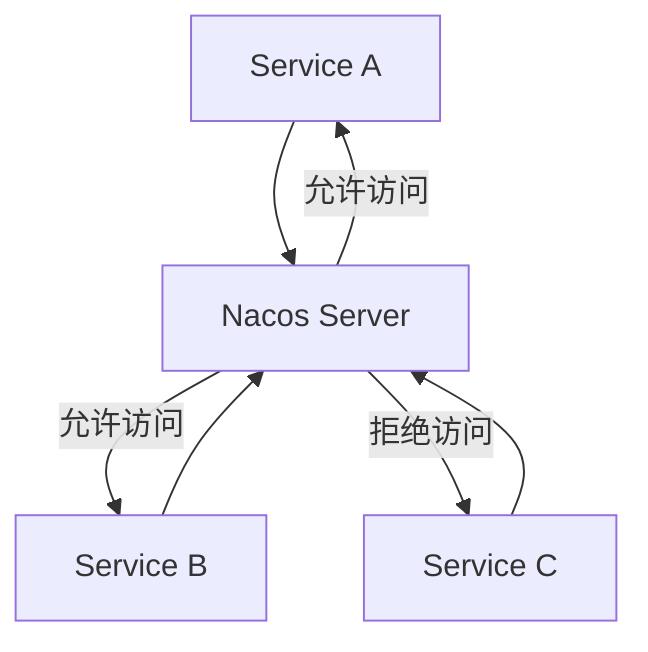

# Nacos 白名单机制

在微服务架构中，服务注册与发现是核心组件之一。Nacos作为一款流行的服务注册与发现工具，提供了丰富的功能来管理微服务。其中，**白名单机制**是Nacos安全管理的重要组成部分，用于限制哪些客户端可以访问Nacos服务器，从而确保系统的安全性。

## 什么是白名单机制？

白名单机制是一种访问控制策略，允许你指定一组受信任的IP地址或域名，只有这些被列入白名单的客户端才能访问Nacos服务器。通过这种方式，你可以有效防止未经授权的客户端访问Nacos，从而降低潜在的安全风险。

:::note
白名单机制通常用于生产环境中，以确保只有受信任的服务或客户端能够与Nacos进行交互。
:::

## 如何配置Nacos白名单？

Nacos的白名单配置非常简单，主要通过修改Nacos的配置文件来实现。以下是配置步骤：

1. **找到Nacos配置文件**：Nacos的配置文件通常位于 `conf/application.properties` 或 `conf/nacos.properties` 中。

2. **添加白名单配置**：在配置文件中添加以下配置项：

   ```properties
   nacos.core.auth.enabled=true
   nacos.core.auth.system.type=nacos
   nacos.core.auth.server.ips=192.168.1.1,192.168.1.2
   ```

   其中，`nacos.core.auth.server.ips` 是白名单的IP列表，多个IP地址之间用逗号分隔。

3. **重启Nacos服务器**：修改配置文件后，需要重启Nacos服务器以使配置生效。

:::caution
确保在配置白名单时，不要遗漏任何需要访问Nacos的合法客户端IP地址，否则这些客户端将无法访问Nacos。
:::

## 实际应用场景

假设你有一个微服务架构，其中包含三个服务：`Service A`、`Service B` 和 `Service C`。你希望只有 `Service A` 和 `Service B` 能够访问Nacos服务器，而 `Service C` 则被禁止访问。

在这种情况下，你可以将 `Service A` 和 `Service B` 的IP地址添加到Nacos的白名单中，而 `Service C` 的IP地址则不在白名单中。这样，`Service C` 将无法与Nacos进行交互，从而确保了系统的安全性。



## 总结

Nacos的白名单机制是一种简单而有效的安全策略，通过限制访问Nacos服务器的客户端IP地址，可以有效防止未经授权的访问。在实际应用中，合理配置白名单可以大大提高系统的安全性。

:::tip
如果你希望进一步学习Nacos的其他安全机制，可以参考Nacos官方文档，了解更多关于认证、授权和加密的内容。
:::

## 附加资源

- [Nacos官方文档](https://nacos.io/zh-cn/docs/what-is-nacos.html)
- [微服务安全最佳实践](https://microservices.io/patterns/security/)

## 练习

1. 在你的本地环境中配置Nacos白名单，并尝试访问Nacos服务器，验证白名单是否生效。
2. 思考在什么情况下需要使用白名单机制，并列举出至少三种实际应用场景。