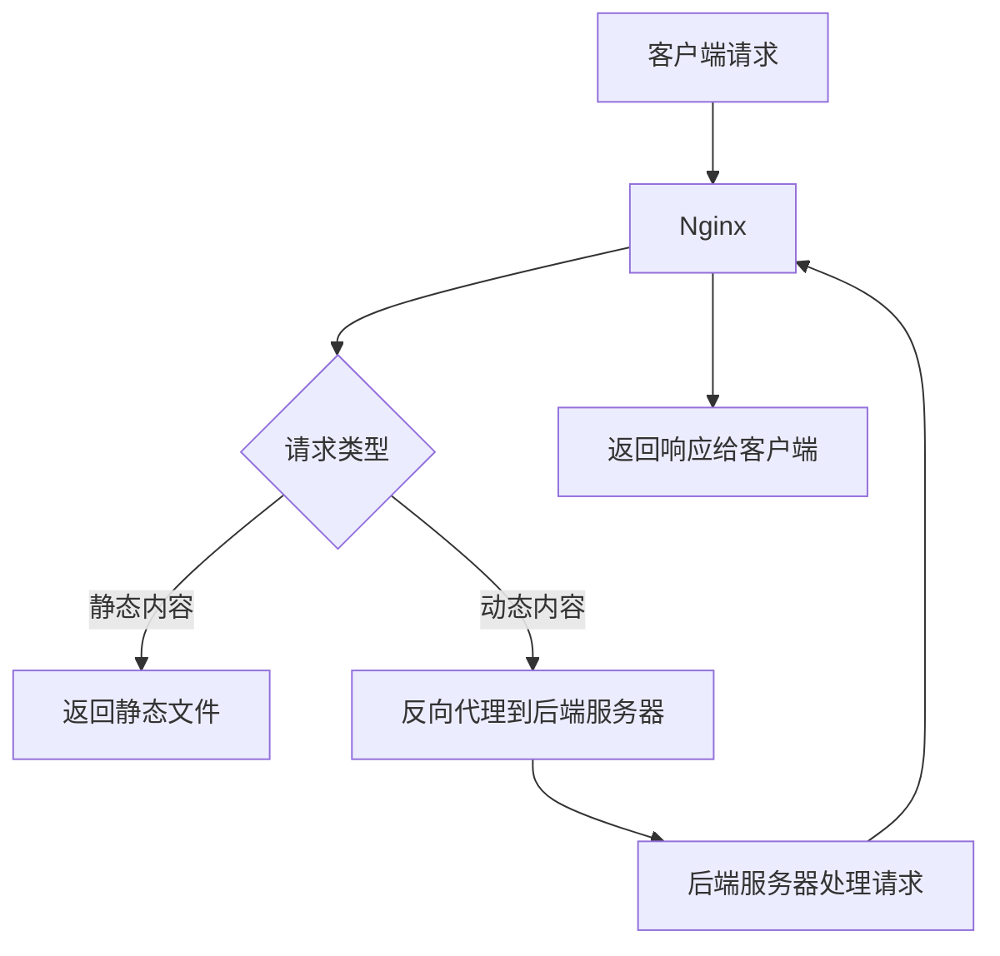

## 什么是Nginx？

Nginx（发音为“engine-x”）是一个高性能的HTTP和反向代理服务器，也是一个IMAP/POP3/SMTP代理服务器。它由俄罗斯程序员Igor Sysoev开发，并于2004年首次公开发布。Nginx以其高并发处理能力、低内存占用和模块化架构而闻名，广泛用于Web服务器、负载均衡器和反向代理。

:::tip
Nginx的设计目标是解决C10K问题，即如何高效地处理10,000个并发连接。
:::

## Nginx 的主要功能

Nginx的核心功能包括：

1. **HTTP服务器**：Nginx可以作为静态内容的Web服务器，快速响应客户端请求。
2. **反向代理**：Nginx可以将客户端请求转发到后端服务器，并将响应返回给客户端。
3. **负载均衡**：Nginx可以在多个后端服务器之间分配流量，提高系统的可用性和性能。
4. **缓存**：Nginx可以缓存静态内容，减少后端服务器的负载。
5. **SSL/TLS终止**：Nginx可以处理HTTPS请求，减轻后端服务器的加密解密负担。

## Nginx 的架构

Nginx采用事件驱动的异步架构，能够高效处理大量并发连接。它的工作进程是单线程的，但通过非阻塞I/O操作，可以同时处理多个请求。



## Nginx 的配置文件

Nginx的配置文件通常位于 `/etc/nginx/nginx.conf` 或 `/usr/local/nginx/conf/nginx.conf`。配置文件采用模块化结构，主要由以下几个部分组成：

- **全局块**：配置影响Nginx全局的指令，如工作进程数、错误日志等。
- **events块**：配置影响Nginx服务器与客户端网络连接的指令。
- **http块**：配置HTTP服务器的相关指令。
- **server块**：配置虚拟主机的相关指令。
- **location块**：配置请求的路由和处理规则。

以下是一个简单的Nginx配置文件示例：

```nginx
# 全局块
worker_processes 1;

# events块
events {
    worker_connections 1024;
}

# http块
http {
    # server块
    server {
        listen 80;
        server_name example.com;

        # location块
        location / {
            root /var/www/html;
            index index.html;
        }
    }
}
```

## 实际应用场景

### 1. 静态文件服务器

Nginx非常适合作为静态文件服务器。以下是一个简单的配置示例，用于提供静态HTML文件：

```nginx
server {
    listen 80;
    server_name example.com;

    location / {
        root /var/www/html;
        index index.html;
    }
}
```

### 2. 反向代理

Nginx可以作为反向代理，将请求转发到后端服务器。以下是一个简单的反向代理配置示例：

```nginx
server {
    listen 80;
    server_name example.com;

    location / {
        proxy_pass http://backend_server;
        proxy_set_header Host $host;
        proxy_set_header X-Real-IP $remote_addr;
    }
}
```

### 3. 负载均衡

Nginx可以在多个后端服务器之间分配流量，实现负载均衡。以下是一个简单的负载均衡配置示例：

```nginx
http {
    upstream backend {
        server backend1.example.com;
        server backend2.example.com;
    }

    server {
        listen 80;
        server_name example.com;

        location / {
            proxy_pass http://backend;
        }
    }
}
```

## 总结

Nginx是一个功能强大且灵活的Web服务器和反向代理服务器，适用于各种应用场景。通过其高效的架构和丰富的功能，Nginx能够处理高并发请求，并提供稳定的服务。

:::note
如果你对Nginx感兴趣，可以尝试在自己的服务器上安装并配置Nginx，体验其强大的功能。
:::

## 附加资源

- [Nginx官方文档](https://nginx.org/en/docs/)
- [Nginx配置指南](https://www.nginx.com/resources/wiki/start/)
- [Nginx性能优化](https://www.nginx.com/blog/tuning-nginx/)

## 练习

1. 在你的服务器上安装Nginx，并配置一个简单的静态文件服务器。
2. 尝试配置Nginx作为反向代理，将请求转发到另一个Web服务器。
3. 配置Nginx实现负载均衡，将流量分配到多个后端服务器。
