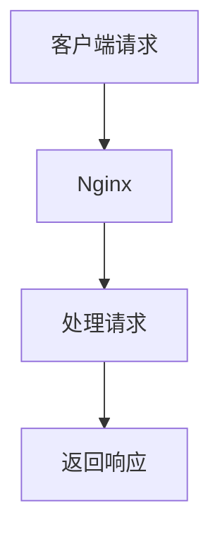
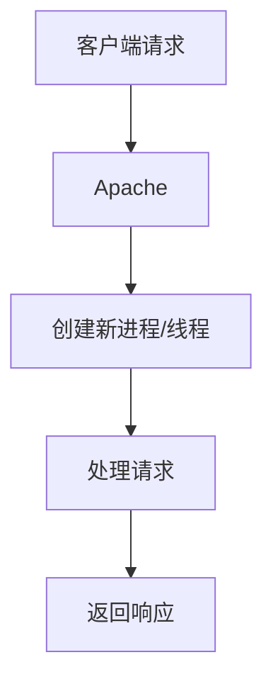

## 介绍

在Web服务器领域，Nginx和Apache是两个最受欢迎的选择。它们各自有着独特的优势和适用场景。本文将从性能、配置、模块化、社区支持等方面对Nginx和Apache进行全面对比，帮助你更好地理解它们的差异，并为你的项目选择合适的Web服务器。

## 1. 性能对比

### Nginx
Nginx以其高性能和低资源消耗著称。它采用事件驱动的异步架构，能够高效处理大量并发连接。这使得Nginx特别适合高流量的网站和反向代理场景。



### Apache
Apache采用多进程或多线程模型，每个连接都会创建一个新的进程或线程。虽然这种模型在处理少量并发连接时表现良好，但在高并发场景下，资源消耗较大，性能可能不如Nginx。



:::tip
如果你需要处理大量并发连接，Nginx可能是更好的选择。而对于需要复杂动态内容处理的场景，Apache可能更合适。
:::

## 2. 配置对比

### Nginx
Nginx的配置文件简洁明了，通常位于 `/etc/nginx/nginx.conf`。以下是一个简单的Nginx配置示例：

```nginx
server {
    listen 80;
    server_name example.com;

    location / {
        root /var/www/html;
        index index.html;
    }
}
```

### Apache
Apache的配置文件通常位于 `/etc/apache2/apache2.conf` 或 `/etc/httpd/httpd.conf`。以下是一个简单的Apache配置示例：

```apache
<VirtualHost *:80>
    ServerName example.com
    DocumentRoot /var/www/html

    <Directory /var/www/html>
        Options Indexes FollowSymLinks
        AllowOverride None
        Require all granted
    </Directory>
</VirtualHost>
```

:::note
Nginx的配置文件通常更简洁，而Apache的配置文件则更为灵活，支持更多的模块和功能。
:::

## 3. 模块化对比

### Nginx
Nginx的模块化设计允许用户根据需要加载不同的模块。Nginx的模块通常需要在编译时加载，这使得它的核心非常轻量。

### Apache
Apache的模块化设计更为灵活，支持动态加载模块。这意味着你可以在运行时启用或禁用模块，而不需要重新编译服务器。

:::caution
虽然Apache的模块化设计更为灵活，但这也可能导致配置复杂化，尤其是在处理大量模块时。
:::

## 4. 社区支持与生态系统

### Nginx
Nginx拥有一个活跃的社区和丰富的第三方模块生态系统。Nginx Plus还提供了商业支持，适合企业级应用。

### Apache
Apache拥有更长的历史和更广泛的用户基础，社区支持非常强大。Apache的模块生态系统也非常丰富，几乎可以满足任何需求。

:::tip
如果你需要商业支持或企业级功能，Nginx Plus可能是一个不错的选择。而对于需要广泛社区支持和模块生态系统的场景，Apache可能更合适。
:::

## 5. 实际应用场景

### Nginx
- **高并发网站**：Nginx适合处理大量并发连接，常用于高流量网站和反向代理。
- **静态内容服务**：Nginx在服务静态内容时表现出色，响应速度快。

### Apache
- **动态内容处理**：Apache在处理动态内容（如PHP、Python）时表现良好，适合需要复杂动态内容处理的场景。
- **模块化需求**：Apache的模块化设计使其在需要灵活配置和动态加载模块的场景中更具优势。

## 总结

Nginx和Apache各有优劣，选择哪个Web服务器取决于你的具体需求。如果你需要处理大量并发连接或服务静态内容，Nginx可能是更好的选择。而如果你需要处理复杂的动态内容或需要灵活的模块化配置，Apache可能更适合你。

## 附加资源与练习

- **练习**：尝试在本地环境中安装并配置Nginx和Apache，分别搭建一个简单的静态网站，并比较它们的性能。
- **资源**：
  - [Nginx官方文档](https://nginx.org/en/docs/)
  - [Apache官方文档](https://httpd.apache.org/docs/)

:::warning
在配置Web服务器时，请确保遵循最佳安全实践，避免暴露敏感信息或开放不必要的端口。
:::