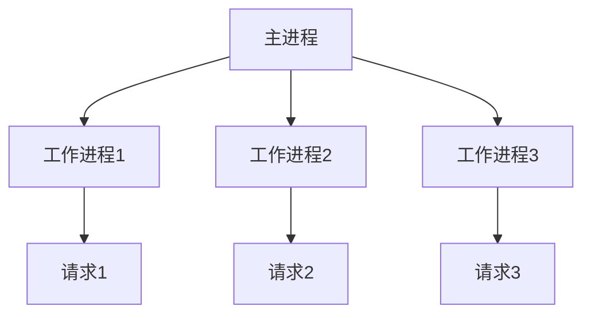

## 介绍

Nginx 是一个高性能的 Web 服务器和反向代理服务器，广泛用于处理高并发请求。它的设计目标是提供高并发、低延迟的服务，同时保持低资源消耗。Nginx 的性能特点使其成为现代 Web 架构中的重要组成部分，尤其是在需要处理大量并发连接的场景中。

## 高并发处理能力

Nginx 采用事件驱动架构，能够高效地处理大量并发连接。与传统的多线程或多进程模型不同，Nginx 使用异步非阻塞的方式处理请求，这使得它能够在单台服务器上同时处理成千上万的并发连接。

### 事件驱动架构

Nginx 的事件驱动架构是其高性能的核心。它使用一个主进程和多个工作进程来处理请求。主进程负责管理配置和启动工作进程，而工作进程则负责处理实际的请求。



### 异步非阻塞 I/O

Nginx 使用异步非阻塞 I/O 模型来处理请求。这意味着当一个请求需要等待 I/O 操作（如读取文件或与数据库通信）时，Nginx 不会阻塞整个进程，而是继续处理其他请求。这种方式大大提高了服务器的并发处理能力。

:::tip
异步非阻塞 I/O 是 Nginx 能够高效处理高并发请求的关键。
:::

## 低资源消耗

Nginx 的设计目标之一是保持低资源消耗。它通过以下方式实现这一点：

- **轻量级进程模型**：Nginx 使用少量工作进程来处理请求，而不是为每个连接创建一个新的线程或进程。
- **高效的内存管理**：Nginx 使用高效的内存分配策略，减少了内存碎片和内存泄漏的风险。

### 实际案例

假设你有一个需要处理 10,000 个并发连接的 Web 应用。使用传统的 Apache 服务器，可能需要数百个线程或进程来处理这些连接，而使用 Nginx，只需要几个工作进程即可完成相同的任务。

```bash
# Nginx 配置文件示例
worker_processes 4;  # 使用 4 个工作进程
events {
    worker_connections 1024;  # 每个工作进程处理 1024 个连接
}
```

## 实际应用场景

Nginx 的高性能和低资源消耗使其在以下场景中非常适用：

- **高流量网站**：如新闻网站、社交媒体平台等，需要处理大量并发请求。
- **反向代理**：Nginx 可以作为反向代理服务器，将请求转发到后端服务器，同时提供负载均衡和缓存功能。
- **静态资源服务**：Nginx 非常适合用于提供静态资源（如图片、CSS、JavaScript 文件）的服务。

:::note
Nginx 的反向代理功能可以显著提高后端服务器的性能和可靠性。
:::

## 总结

Nginx 以其高并发处理能力、低资源消耗和事件驱动架构，成为现代 Web 架构中的重要组成部分。无论是处理高流量网站、作为反向代理，还是提供静态资源服务，Nginx 都能提供卓越的性能和稳定性。

## 附加资源

- [Nginx 官方文档](https://nginx.org/en/docs/)
- [Nginx 性能优化指南](https://www.nginx.com/blog/performance-optimization/)
- [Nginx 反向代理配置教程](https://www.digitalocean.com/community/tutorials/how-to-configure-nginx-as-a-reverse-proxy)

## 练习

1. 在你的本地环境中安装 Nginx，并配置一个简单的静态文件服务器。
2. 使用 `ab`（Apache Benchmark）工具测试 Nginx 的并发处理能力。
3. 尝试配置 Nginx 作为反向代理，将请求转发到另一个 Web 服务器。

通过以上练习，你将更深入地理解 Nginx 的性能特点及其在实际应用中的优势。