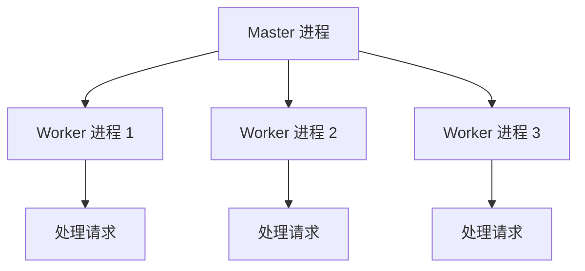
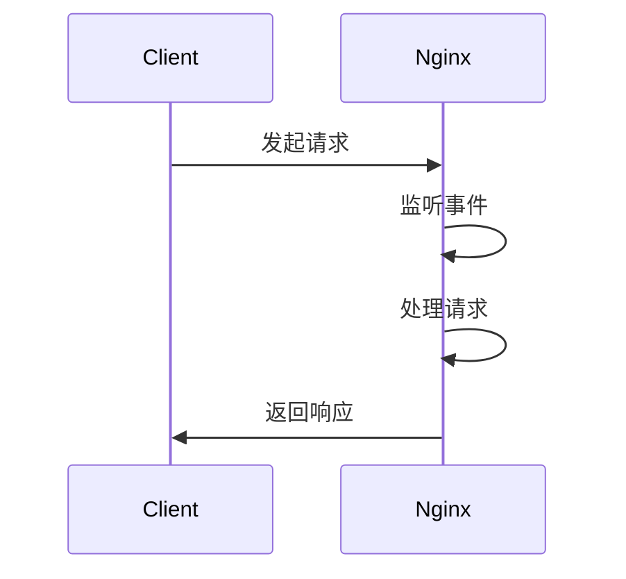

## 介绍

Nginx 是一个高性能的 Web 服务器和反向代理服务器，广泛用于处理高并发请求。它的高效性主要得益于其独特的事件驱动模型和多进程架构。本文将深入探讨 Nginx 的运行原理，帮助你理解其核心工作机制。

## Nginx 的架构

Nginx 采用多进程架构，主要包括以下两种进程：

1. **Master 进程**：负责管理 Worker 进程，读取配置文件，监听端口等。
2. **Worker 进程**：实际处理客户端请求的进程，每个 Worker 进程都是独立的，可以处理多个并发连接。



## 事件驱动模型

Nginx 使用事件驱动模型来处理请求，这意味着它不会为每个连接创建一个新的线程或进程，而是通过事件循环来高效地处理多个并发连接。

### 事件循环

事件循环是 Nginx 高效处理请求的核心。它通过监听文件描述符上的事件（如可读、可写）来决定何时处理请求。



## 请求处理流程

当客户端发起请求时，Nginx 的处理流程如下：

1. **接收请求**：Worker 进程接收到客户端的请求。
2. **解析请求**：解析 HTTP 请求头，确定请求的类型和资源。
3. **处理请求**：根据配置文件中的规则，处理请求（如静态文件服务、反向代理等）。
4. **返回响应**：将处理结果返回给客户端。

:::note
Nginx 的配置文件通常位于 `/etc/nginx/nginx.conf`，你可以通过修改该文件来定制 Nginx 的行为。
:::

## 实际案例

假设你有一个简单的 Nginx 配置文件，用于将请求代理到后端服务器：

```nginx
server {
    listen 80;
    server_name example.com;

    location / {
        proxy_pass http://backend_server;
    }
}
```

在这个配置中，Nginx 监听 `example.com` 的 80 端口，并将所有请求转发到 `backend_server`。

### 输入与输出

- **输入**：客户端访问 `http://example.com`
- **输出**：Nginx 将请求转发到 `backend_server`，并将响应返回给客户端

## 总结

Nginx 的高效性主要得益于其事件驱动模型和多进程架构。通过理解这些核心原理，你可以更好地配置和优化 Nginx，以应对高并发的场景。

## 附加资源与练习

- **练习**：尝试配置一个简单的 Nginx 反向代理服务器，将请求转发到本地的一个应用服务器。
- **资源**：
  - [Nginx 官方文档](https://nginx.org/en/docs/)
  - [Nginx 配置指南](https://www.nginx.com/resources/wiki/start/)

:::tip
深入学习 Nginx 的最佳方式是通过实践。尝试在不同的场景下配置 Nginx，并观察其行为。
:::