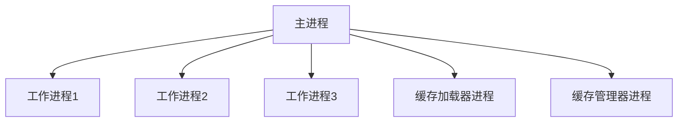

# Nginx 进程模型

Nginx是一个高性能的Web服务器和反向代理服务器，其高效的性能很大程度上得益于其独特的进程模型。本文将详细介绍Nginx的进程模型，帮助你理解其工作原理以及如何在实际中应用。

## 介绍

Nginx采用多进程模型来处理并发请求。与传统的单线程或多线程模型不同，Nginx使用一个主进程（Master Process）和多个工作进程（Worker Processes）来高效地处理请求。这种设计使得Nginx能够充分利用多核CPU的性能，同时保持较低的资源消耗。

## Nginx 进程模型的基本结构

Nginx的进程模型主要由以下几个部分组成：

1. **主进程（Master Process）**：负责管理所有工作进程，包括启动、停止、重新加载配置文件等操作。
2. **工作进程（Worker Processes）**：实际处理客户端请求的进程。每个工作进程都是独立的，能够处理多个并发连接。
3. **缓存加载器进程（Cache Loader Process）**：在Nginx启动时加载磁盘上的缓存数据。
4. **缓存管理器进程（Cache Manager Process）**：定期清理和更新缓存数据。



## 主进程（Master Process）

主进程是Nginx的核心，它负责管理所有的工作进程。主进程的主要职责包括：

- 读取和验证配置文件。
- 启动、停止和重新加载工作进程。
- 监听信号并做出相应的处理。

主进程通常以root权限运行，以便能够绑定到特权端口（如80和443）。

## 工作进程（Worker Processes）

工作进程是实际处理客户端请求的进程。每个工作进程都是独立的，能够处理多个并发连接。Nginx通过事件驱动模型（Event-Driven Model）来实现高效的并发处理。

工作进程的主要特点包括：

- 每个工作进程都是单线程的，但能够处理多个并发连接。
- 工作进程之间是相互独立的，一个进程的崩溃不会影响其他进程。
- 工作进程的数量可以通过配置文件中的 `worker_processes` 指令进行调整。

```nginx
worker_processes 4;  # 启动4个工作进程
```

## 缓存加载器进程和缓存管理器进程

缓存加载器进程和缓存管理器进程是Nginx中用于管理缓存的两个特殊进程。

- **缓存加载器进程**：在Nginx启动时，负责从磁盘加载缓存数据到内存中。
- **缓存管理器进程**：定期清理和更新缓存数据，确保缓存的有效性和一致性。

## 实际应用场景

Nginx的进程模型在实际应用中具有广泛的用途，特别是在高并发场景下。以下是一些常见的应用场景：

1. **Web服务器**：Nginx可以作为静态内容的Web服务器，处理大量的并发请求。
2. **反向代理**：Nginx可以作为反向代理服务器，将请求转发到后端服务器，并实现负载均衡。
3. **负载均衡**：Nginx可以通过配置多个后端服务器，实现请求的负载均衡。
4. **缓存服务器**：Nginx可以作为缓存服务器，加速静态内容的访问速度。

## 总结

Nginx的进程模型是其高性能的关键所在。通过主进程和工作进程的分离，Nginx能够高效地处理大量的并发请求，同时保持较低的资源消耗。理解Nginx的进程模型对于优化和配置Nginx服务器至关重要。

## 附加资源

- [Nginx官方文档](https://nginx.org/en/docs/)
- [Nginx配置指南](https://www.nginx.com/resources/wiki/start/topics/examples/full/)
- [Nginx性能优化](https://www.nginx.com/blog/tuning-nginx/)

## 练习

1. 尝试配置Nginx，使其启动多个工作进程，并观察其对性能的影响。
2. 使用Nginx作为反向代理服务器，配置负载均衡，并测试其效果。
3. 研究Nginx的缓存机制，并尝试配置缓存服务器以加速静态内容的访问。

通过以上内容的学习和实践，你将能够更好地理解Nginx的进程模型，并在实际项目中应用这些知识。