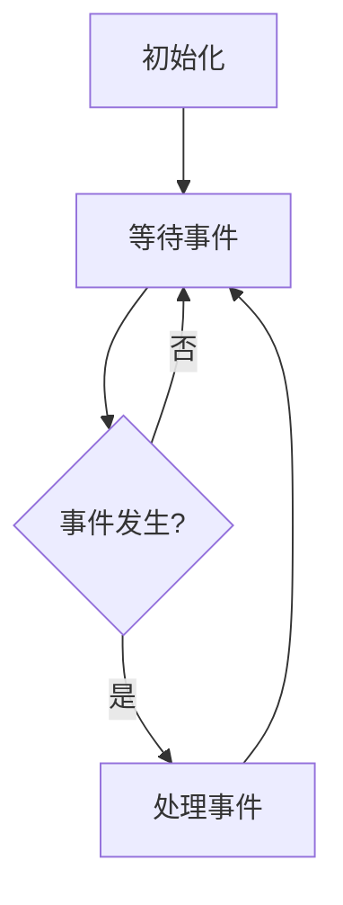

## 介绍

Nginx 是一个高性能的 Web 服务器和反向代理服务器，它的核心设计理念之一就是事件驱动模型。事件驱动模型使得 Nginx 能够高效地处理大量并发连接，而不会消耗过多的系统资源。对于初学者来说，理解事件驱动模型是掌握 Nginx 工作原理的关键。

### 什么是事件驱动模型？

事件驱动模型是一种编程范式，它基于事件的发生来触发相应的处理逻辑。在 Nginx 中，事件驱动模型意味着服务器会监听各种事件（如新的连接请求、数据到达等），并在事件发生时调用相应的处理函数。

与传统的多线程或多进程模型不同，事件驱动模型通常使用单线程或少量线程来处理大量并发连接。这使得 Nginx 能够在高并发场景下保持高性能和低资源消耗。

## Nginx 事件驱动的工作原理

Nginx 的事件驱动模型主要依赖于操作系统提供的 I/O 多路复用机制，如 `epoll`（Linux）、`kqueue`（BSD）和 `select`（跨平台）。这些机制允许 Nginx 同时监听多个文件描述符（如套接字），并在这些文件描述符上发生事件时通知 Nginx。

### 事件循环

Nginx 的核心是一个事件循环，它会不断地检查是否有新的事件发生。事件循环的基本流程如下：

1. **初始化**：Nginx 启动时，会初始化事件驱动模块，并设置好需要监听的文件描述符。
2. **等待事件**：Nginx 进入事件循环，等待操作系统通知有事件发生。
3. **处理事件**：当事件发生时，Nginx 会调用相应的事件处理函数来处理该事件。
4. **返回等待**：处理完事件后，Nginx 会再次进入等待状态，直到下一个事件发生。



### 事件类型

在 Nginx 中，常见的事件类型包括：

- **连接事件**：当有新的客户端连接请求时触发。
- **读事件**：当客户端发送数据到服务器时触发。
- **写事件**：当服务器需要向客户端发送数据时触发。
- **定时器事件**：当定时器到期时触发。

## 实际案例

假设我们有一个简单的 Nginx 配置，用于处理 HTTP 请求：

```nginx
events {
    worker_connections 1024;
}

http {
    server {
        listen 80;
        location / {
            return 200 "Hello, World!";
        }
    }
}
```

在这个配置中，Nginx 会监听 80 端口上的 HTTP 请求。当有新的连接请求时，Nginx 会触发连接事件，并调用相应的处理函数来返回 "Hello, World!"。

### 代码示例

以下是一个简单的 Python 示例，模拟了事件驱动模型的基本工作原理：

```python
import select
import socket

server_socket = socket.socket(socket.AF_INET, socket.SOCK_STREAM)
server_socket.bind(('localhost', 8080))
server_socket.listen(5)

inputs = [server_socket]

while True:
    readable, _, _ = select.select(inputs, [], [])
    for s in readable:
        if s is server_socket:
            client_socket, addr = server_socket.accept()
            print(f"Connection from {addr}")
            inputs.append(client_socket)
        else:
            data = s.recv(1024)
            if data:
                print(f"Received: {data}")
                s.send(b"Hello, World!")
            else:
                inputs.remove(s)
                s.close()
```

在这个示例中，我们使用 `select` 来监听多个套接字上的事件。当有新的连接请求时，我们会接受连接并将其添加到监听列表中。当有数据到达时，我们会读取数据并发送响应。

## 总结

Nginx 的事件驱动模型是其高性能的关键所在。通过使用事件驱动模型，Nginx 能够高效地处理大量并发连接，而不会消耗过多的系统资源。理解事件驱动模型的工作原理，对于掌握 Nginx 的配置和优化至关重要。

### 附加资源

- [Nginx 官方文档](https://nginx.org/en/docs/)
- [Understanding Nginx Architecture](https://www.nginx.com/resources/glossary/nginx-architecture/)
- [Event-Driven Programming in Python](https://realpython.com/async-io-python/)

### 练习

1. 修改上面的 Python 示例，使其能够处理多个客户端连接，并在每个连接上发送不同的响应。
2. 尝试在 Nginx 配置中添加一个新的 `location` 块，使其能够处理不同的 URL 路径并返回不同的响应。

通过完成这些练习，你将更深入地理解事件驱动模型及其在 Nginx 中的应用。