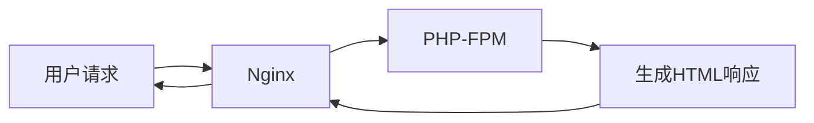

## 介绍

Nginx 是一个高性能的 HTTP 服务器和反向代理服务器，而 PHP 是一种广泛使用的服务器端脚本语言。将 Nginx 与 PHP 集成，可以让你构建动态网站，并充分利用 Nginx 的高性能和 PHP 的灵活性。

在本文中，我们将学习如何在 Nginx 中配置 PHP 处理，并通过 FastCGI 协议与 PHP-FPM（PHP FastCGI Process Manager）进行通信。我们将从基础配置开始，逐步深入，最终实现一个完整的 Nginx 与 PHP 集成的示例。

## Nginx 与 PHP 的基本工作原理

当用户请求一个 PHP 文件时，Nginx 会将请求转发给 PHP-FPM 进行处理。PHP-FPM 是一个 PHP 的 FastCGI 管理器，它负责解析 PHP 代码并生成 HTML 响应。Nginx 和 PHP-FPM 之间的通信通过 FastCGI 协议完成。



## 安装 Nginx 和 PHP-FPM

在开始配置之前，我们需要确保系统中已经安装了 Nginx 和 PHP-FPM。以下是在 Ubuntu 系统上安装它们的命令：

```bash
sudo apt update
sudo apt install nginx php-fpm
```

安装完成后，确保 Nginx 和 PHP-FPM 服务已经启动：

```bash
sudo systemctl start nginx
sudo systemctl start php-fpm
```

## 配置 Nginx 以处理 PHP 文件

接下来，我们需要配置 Nginx 以处理 PHP 文件。通常，Nginx 的配置文件位于 `/etc/nginx/sites-available/default`。我们可以编辑这个文件，添加 PHP 处理的相关配置。

```nginx
server {
    listen 80;
    server_name example.com;

    root /var/www/html;
    index index.php index.html index.htm;

    location / {
        try_files $uri $uri/ =404;
    }

    location ~ \.php$ {
        include snippets/fastcgi-php.conf;
        fastcgi_pass unix:/var/run/php/php7.4-fpm.sock;
    }

    location ~ /\.ht {
        deny all;
    }
}
```

### 配置解析

- `root /var/www/html;`：指定网站的根目录。
- `index index.php index.html index.htm;`：指定默认的索引文件。
- `location ~ \.php$ { ... }`：匹配所有以 `.php` 结尾的请求，并将它们转发给 PHP-FPM 处理。
- `fastcgi_pass unix:/var/run/php/php7.4-fpm.sock;`：指定 PHP-FPM 的 Unix 套接字路径。

:::note
确保 `fastcgi_pass` 中的 PHP-FPM 套接字路径与系统中实际路径一致。你可以通过以下命令找到 PHP-FPM 的套接字路径：

```bash
sudo find / -name "*.sock"
```
:::

## 测试配置

在完成配置后，我们需要测试 Nginx 配置是否正确，并重新加载 Nginx 服务。

```bash
sudo nginx -t
sudo systemctl reload nginx
```

如果配置正确，Nginx 将成功重新加载。

## 创建一个 PHP 文件进行测试

在网站的根目录 `/var/www/html` 中创建一个名为 `index.php` 的文件，内容如下：

```php
<?php
phpinfo();
?>
```

然后，在浏览器中访问 `http://example.com/index.php`，你应该会看到 PHP 的信息页面。这表明 Nginx 已经成功与 PHP 集成。

## 实际应用场景

假设你正在开发一个简单的博客系统，用户可以通过浏览器访问博客文章。每篇文章的内容存储在数据库中，PHP 负责从数据库中获取数据并生成 HTML 页面，而 Nginx 负责将这些页面快速传递给用户。

```php
<?php
// 连接到数据库
$pdo = new PDO('mysql:host=localhost;dbname=blog', 'username', 'password');

// 获取文章ID
$postId = $_GET['id'];

// 查询数据库
$stmt = $pdo->prepare('SELECT * FROM posts WHERE id = ?');
$stmt->execute([$postId]);
$post = $stmt->fetch();

// 显示文章内容
echo "<h1>{$post['title']}</h1>";
echo "<p>{$post['content']}</p>";
?>
```

在这个例子中，Nginx 负责处理用户的 HTTP 请求，并将请求转发给 PHP-FPM。PHP-FPM 执行 PHP 代码，从数据库中获取文章内容，并生成 HTML 页面。最后，Nginx 将生成的 HTML 页面返回给用户。

## 总结

通过本文，我们学习了如何将 Nginx 与 PHP 集成，以构建高性能的动态网站。我们从基础配置开始，逐步深入，最终实现了一个完整的 Nginx 与 PHP 集成的示例。我们还探讨了一个实际应用场景，展示了如何在真实的项目中应用这些知识。

## 附加资源与练习

- **练习**：尝试在 Nginx 中配置多个 PHP 站点，并使用不同的域名访问它们。
- **资源**：
  - [Nginx 官方文档](https://nginx.org/en/docs/)
  - [PHP-FPM 官方文档](https://www.php.net/manual/en/install.fpm.php)
  - [FastCGI 协议详解](https://en.wikipedia.org/wiki/FastCGI)

:::tip
如果你在配置过程中遇到问题，可以查看 Nginx 和 PHP-FPM 的日志文件，通常位于 `/var/log/nginx/error.log` 和 `/var/log/php7.4-fpm.log`。
:::