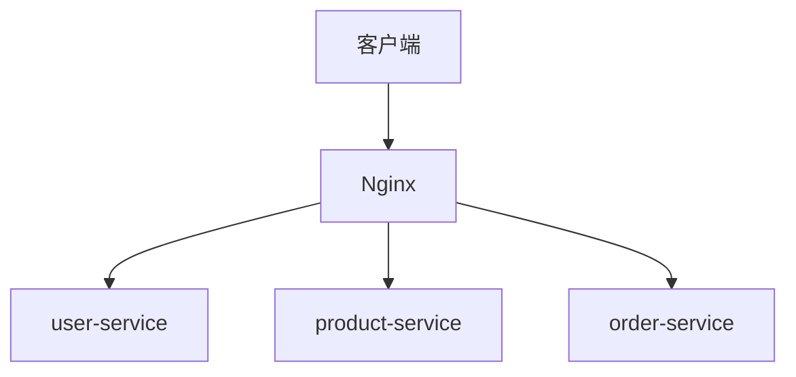

# Nginx 与微服务

在现代应用开发中，微服务架构已经成为一种流行的设计模式。微服务将应用程序拆分为多个小型、独立的服务，每个服务负责特定的功能。然而，随着服务数量的增加，管理和路由请求变得复杂。这时，Nginx作为一个高性能的反向代理和负载均衡器，可以帮助我们简化这一过程。

## 什么是Nginx？

Nginx是一个开源的高性能HTTP服务器和反向代理服务器。它以其高效、稳定和低资源消耗而闻名，广泛用于负载均衡、反向代理和静态资源服务等场景。

## 为什么在微服务中使用Nginx？

在微服务架构中，Nginx可以扮演以下角色：

1. **反向代理**：将客户端请求路由到适当的微服务。
2. **负载均衡**：在多个微服务实例之间分配请求，以提高系统的可扩展性和容错性。
3. **SSL终止**：处理HTTPS请求，减轻微服务的负担。
4. **缓存**：缓存静态资源或API响应，提高性能。

## Nginx 与微服务的集成

### 1. 配置Nginx作为反向代理

假设我们有两个微服务：`user-service`和`product-service`，分别运行在`localhost:3001`和`localhost:3002`。我们可以通过Nginx将请求路由到这些服务。

```nginx
http {
    upstream user_service {
        server localhost:3001;
    }

    upstream product_service {
        server localhost:3002;
    }

    server {
        listen 80;

        location /users/ {
            proxy_pass http://user_service/;
        }

        location /products/ {
            proxy_pass http://product_service/;
        }
    }
}
```

在这个配置中，Nginx会将`/users/`路径的请求转发到`user-service`，将`/products/`路径的请求转发到`product-service`。

### 2. 负载均衡

如果`user-service`有多个实例运行在不同的端口上，我们可以使用Nginx的负载均衡功能来分配请求。

```nginx
http {
    upstream user_service {
        server localhost:3001;
        server localhost:3002;
        server localhost:3003;
    }

    server {
        listen 80;

        location /users/ {
            proxy_pass http://user_service/;
        }
    }
}
```

Nginx会自动在这些实例之间分配请求，确保每个实例的负载均衡。

### 3. SSL终止

为了确保通信安全，我们可以配置Nginx来处理HTTPS请求。

```nginx
server {
    listen 443 ssl;
    server_name example.com;

    ssl_certificate /path/to/certificate.crt;
    ssl_certificate_key /path/to/private.key;

    location /users/ {
        proxy_pass http://user_service/;
    }

    location /products/ {
        proxy_pass http://product_service/;
    }
}
```

Nginx会处理SSL握手，并将解密后的请求转发给后端微服务。

## 实际案例

假设我们有一个电商平台，包含以下微服务：

- `user-service`：处理用户认证和资料管理。
- `product-service`：处理商品信息。
- `order-service`：处理订单管理。

我们可以使用Nginx来路由请求：



在这个架构中，Nginx作为入口点，将请求路由到适当的微服务，同时提供负载均衡和SSL终止功能。

## 总结

Nginx在微服务架构中扮演着至关重要的角色。它不仅可以作为反向代理和负载均衡器，还能处理SSL终止和缓存，从而提升系统的性能和可扩展性。通过合理的配置，Nginx可以帮助我们更好地管理和路由微服务请求。

## 附加资源

- [Nginx官方文档](https://nginx.org/en/docs/)
- [微服务架构设计模式](https://microservices.io/)
- [Nginx与Docker集成](https://docs.nginx.com/nginx/admin-guide/containers/nginx-microservices/)

## 练习

1. 配置Nginx将请求路由到三个不同的微服务实例。
2. 使用Nginx实现负载均衡，并在多个实例之间分配请求。
3. 配置Nginx处理HTTPS请求，并确保SSL终止正常工作。

通过完成这些练习，你将更好地理解Nginx在微服务架构中的应用。