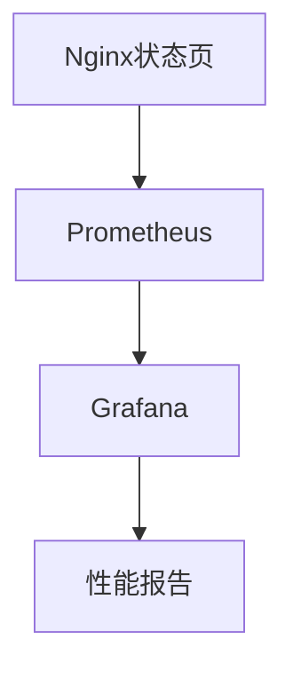

# Nginx 状态页

Nginx是一个高性能的Web服务器和反向代理服务器，广泛用于现代Web应用程序中。为了确保服务器的稳定性和性能，监控Nginx的运行状态至关重要。Nginx提供了一个内置的状态页功能，允许管理员实时查看服务器的关键指标，如活动连接数、请求处理速率等。

## 什么是Nginx状态页？

Nginx状态页是一个内置的监控工具，通过一个简单的HTTP接口提供服务器的实时状态信息。它可以帮助管理员快速了解服务器的运行状况，识别潜在的性能瓶颈或问题。

:::note
Nginx状态页默认是关闭的，需要手动配置才能启用。
:::

## 如何启用Nginx状态页

要启用Nginx状态页，您需要在Nginx配置文件中添加一个特定的`location`块。以下是一个简单的配置示例：

```nginx
server {
    listen 80;
    server_name example.com;

    location /nginx_status {
        stub_status on;
        allow 127.0.0.1;  # 只允许本地访问
        deny all;         # 拒绝其他所有IP访问
    }
}
```

在这个配置中，`stub_status on;`指令启用了状态页功能。`allow`和`deny`指令用于限制访问权限，确保只有特定的IP地址可以访问状态页。

:::caution
出于安全考虑，建议仅允许受信任的IP地址访问Nginx状态页。
:::

## 访问Nginx状态页

配置完成后，您可以通过浏览器或命令行工具访问Nginx状态页。假设您的服务器IP是`192.168.1.100`，您可以在浏览器中访问`http://192.168.1.100/nginx_status`，或者在命令行中使用`curl`命令：

```bash
curl http://192.168.1.100/nginx_status
```

访问后，您将看到类似以下的输出：

```
Active connections: 3 
server accepts handled requests
 10 10 20 
Reading: 0 Writing: 1 Waiting: 2 
```

### 输出解释

- **Active connections**: 当前活动的客户端连接数。
- **server accepts handled requests**: 分别表示服务器接受的连接数、处理的连接数和处理的请求数。
- **Reading**: 当前正在读取请求头的连接数。
- **Writing**: 当前正在写入响应的连接数。
- **Waiting**: 当前处于空闲状态（等待客户端请求）的连接数。

## 实际应用场景

### 监控服务器性能

通过定期检查Nginx状态页，您可以监控服务器的性能指标，如活动连接数和请求处理速率。这有助于识别潜在的性能瓶颈，并采取相应的优化措施。

### 自动化监控

您可以将Nginx状态页集成到自动化监控系统中，如Prometheus或Zabbix。通过定期抓取状态页数据，您可以生成详细的性能报告和警报。



## 总结

Nginx状态页是一个强大的工具，可以帮助您实时监控服务器的性能和运行状态。通过简单的配置，您可以启用状态页并访问关键的性能指标。为了确保安全性，建议限制访问权限，并定期检查状态页数据以优化服务器性能。

## 附加资源

- [Nginx官方文档](https://nginx.org/en/docs/)
- [Prometheus监控Nginx](https://prometheus.io/docs/guides/nginx/)
- [Grafana可视化Nginx数据](https://grafana.com/docs/grafana/latest/datasources/prometheus/)

## 练习

1. 在您的Nginx服务器上启用状态页，并访问它以查看输出。
2. 尝试将Nginx状态页集成到Prometheus中，并在Grafana中创建一个仪表板来可视化数据。
