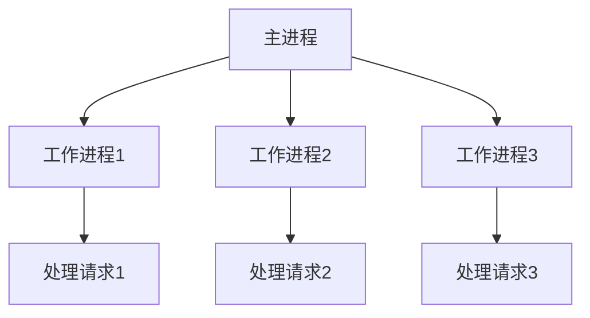

## 介绍

Nginx 是一个高性能的 HTTP 服务器和反向代理服务器，广泛用于处理高并发请求。理解 Nginx 的性能基础是优化其配置和提升网站响应速度的关键。本文将介绍 Nginx 的工作原理、常见的性能瓶颈以及如何通过配置优化来提升性能。

## Nginx 工作原理

Nginx 采用事件驱动的架构，能够高效地处理大量并发连接。它通过一个主进程和多个工作进程来管理请求。主进程负责读取配置文件和管理工作进程，而工作进程则处理实际的请求。



## 性能瓶颈

Nginx 的性能瓶颈通常出现在以下几个方面：

1. **CPU 瓶颈**：当 Nginx 处理大量请求时，CPU 可能会成为瓶颈。
2. **内存瓶颈**：如果 Nginx 需要处理大量并发连接，内存使用量可能会急剧增加。
3. **磁盘 I/O 瓶颈**：当 Nginx 需要频繁读取静态文件时，磁盘 I/O 可能会成为瓶颈。
4. **网络瓶颈**：网络带宽不足或网络延迟高也会影响 Nginx 的性能。

## 配置优化

### 1. 调整工作进程数

Nginx 默认使用一个工作进程，可以通过调整 `worker_processes` 参数来增加工作进程数，以充分利用多核 CPU 的性能。

```nginx
worker_processes auto;
```

### 2. 调整每个工作进程的最大连接数

`worker_connections` 参数用于设置每个工作进程可以处理的最大连接数。根据服务器的内存和 CPU 资源，可以适当增加该值。

```nginx
events {
    worker_connections 1024;
}
```

### 3. 启用 Gzip 压缩

启用 Gzip 压缩可以减少传输的数据量，从而提升性能。

```nginx
gzip on;
gzip_types text/plain text/css application/json application/javascript text/xml application/xml application/xml+rss text/javascript;
```

### 4. 使用缓存

通过配置缓存，可以减少对后端服务器的请求，从而提升性能。

```nginx
proxy_cache_path /data/nginx/cache levels=1:2 keys_zone=my_cache:10m max_size=10g inactive=60m use_temp_path=off;

server {
    location / {
        proxy_cache my_cache;
        proxy_pass http://backend;
    }
}
```

## 实际案例

假设你有一个高流量的网站，用户经常访问静态资源（如图片、CSS 和 JavaScript 文件）。通过以下配置优化，可以显著提升性能：

1. 增加工作进程数以充分利用多核 CPU。
2. 启用 Gzip 压缩以减少传输的数据量。
3. 配置缓存以减少对后端服务器的请求。

```nginx
worker_processes auto;

events {
    worker_connections 1024;
}

http {
    gzip on;
    gzip_types text/plain text/css application/json application/javascript text/xml application/xml application/xml+rss text/javascript;

    proxy_cache_path /data/nginx/cache levels=1:2 keys_zone=my_cache:10m max_size=10g inactive=60m use_temp_path=off;

    server {
        location / {
            proxy_cache my_cache;
            proxy_pass http://backend;
        }
    }
}
```

## 总结

通过理解 Nginx 的工作原理和常见的性能瓶颈，你可以通过调整配置来显著提升 Nginx 的性能。本文介绍了如何调整工作进程数、最大连接数、启用 Gzip 压缩以及使用缓存来优化 Nginx 的性能。

## 附加资源

- [Nginx 官方文档](https://nginx.org/en/docs/)
- [Nginx 性能优化指南](https://www.nginx.com/resources/wiki/start/topics/tutorials/config_pitfalls/)
- [Nginx 缓存配置指南](https://www.nginx.com/blog/nginx-caching-guide/)

## 练习

1. 在你的服务器上安装 Nginx，并尝试调整 `worker_processes` 和 `worker_connections` 参数，观察性能变化。
2. 启用 Gzip 压缩，并使用工具（如 `curl`）测试压缩效果。
3. 配置 Nginx 缓存，并使用工具（如 `ab`）测试缓存效果。
