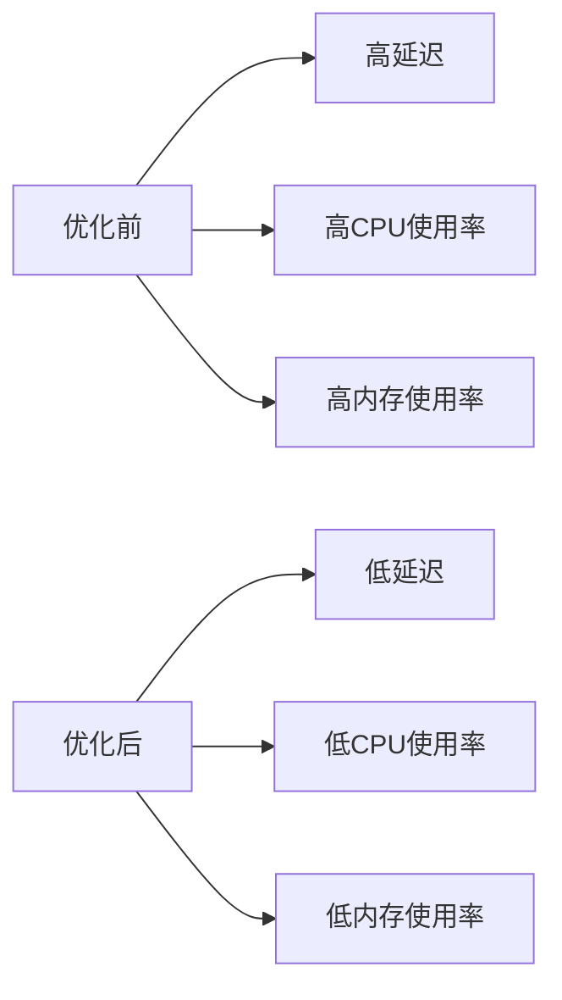

## 介绍

Nginx 是一个高性能的 HTTP 服务器和反向代理服务器，广泛应用于现代 Web 架构中。为了充分发挥 Nginx 的性能潜力，除了优化其配置文件外，还可以通过调整操作系统内核参数来进一步提升性能。本文将介绍如何通过优化 Linux 内核参数来提升 Nginx 的性能。

## 为什么需要内核优化？

Nginx 的性能不仅取决于其自身的配置，还受到操作系统内核的限制。通过调整内核参数，可以优化网络连接、文件描述符、内存管理等关键性能指标，从而提升 Nginx 的整体性能。

## 关键内核参数优化

### 1. 文件描述符限制

Nginx 处理大量并发连接时，需要足够的文件描述符。默认情况下，Linux 系统的文件描述符限制可能不足以支持高并发场景。

#### 查看当前限制

```bash
ulimit -n
```

#### 修改限制

编辑 `/etc/security/limits.conf` 文件，添加以下内容：

```bash
* soft nofile 65535
* hard nofile 65535
```

然后编辑 `/etc/pam.d/common-session` 和 `/etc/pam.d/common-session-noninteractive` 文件，添加以下内容：

```bash
session required pam_limits.so
```

### 2. 网络连接优化

Nginx 作为反向代理服务器，需要处理大量的网络连接。通过调整内核参数，可以优化网络连接的处理能力。

#### 修改 `/etc/sysctl.conf` 文件

```bash
net.core.somaxconn = 65535
net.core.netdev_max_backlog = 65535
net.ipv4.tcp_max_syn_backlog = 65535
net.ipv4.tcp_tw_reuse = 1
net.ipv4.tcp_tw_recycle = 1
net.ipv4.tcp_fin_timeout = 30
```

#### 应用配置

```bash
sysctl -p
```

### 3. 内存管理优化

Nginx 在处理大量请求时，会消耗大量内存。通过调整内核参数，可以优化内存管理，减少内存碎片。

#### 修改 `/etc/sysctl.conf` 文件

```bash
vm.swappiness = 10
vm.overcommit_memory = 1
vm.dirty_ratio = 60
vm.dirty_background_ratio = 5
```

#### 应用配置

```bash
sysctl -p
```

## 实际案例

假设你正在运行一个高流量的电子商务网站，Nginx 作为反向代理服务器，处理大量的并发请求。通过上述内核优化，你可以显著提升服务器的性能，减少请求延迟，提高用户体验。

### 优化前后对比



## 总结

通过优化 Linux 内核参数，可以显著提升 Nginx 的性能，特别是在高并发场景下。本文介绍了如何通过调整文件描述符限制、网络连接参数和内存管理参数来优化 Nginx 的性能。希望这些优化技巧能帮助你在实际应用中提升服务器的性能。

## 附加资源

- [Nginx 官方文档](https://nginx.org/en/docs/)
- [Linux 内核参数优化指南](https://www.kernel.org/doc/html/latest/admin-guide/sysctl/index.html)
- [Nginx 性能优化实战](https://www.nginx.com/resources/wiki/start/topics/examples/full/)

## 练习

1. 在你的服务器上应用上述内核优化，并测试 Nginx 的性能变化。
2. 尝试调整其他内核参数，观察对 Nginx 性能的影响。
3. 阅读 Nginx 官方文档，了解更多性能优化技巧。