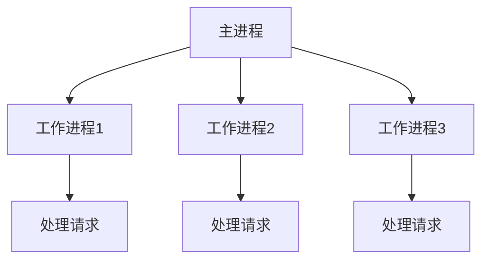

## 介绍

Nginx 是一个高性能的 Web 服务器和反向代理服务器，广泛用于处理高并发请求。Nginx 的性能优势很大程度上归功于其独特的工作进程模型。理解 Nginx 的工作进程是优化其性能的关键。

Nginx 使用多进程模型来处理请求。每个工作进程都是独立的，能够处理多个并发连接。这种设计使得 Nginx 能够高效地利用多核 CPU，同时保持较低的资源消耗。

## Nginx 工作进程模型

Nginx 的工作进程模型基于主进程（Master Process）和工作进程（Worker Process）。主进程负责管理配置、启动和停止工作进程，而工作进程则负责处理实际的客户端请求。



### 主进程

主进程的主要职责包括：

- 读取和验证配置文件。
- 启动、停止和重新加载工作进程。
- 管理日志文件。

### 工作进程

工作进程是实际处理请求的进程。每个工作进程都是独立的，能够处理多个并发连接。Nginx 使用事件驱动模型和非阻塞 I/O 来高效地处理请求。

## 配置工作进程

在 Nginx 配置文件中，可以通过 `worker_processes` 指令来配置工作进程的数量。通常，建议将工作进程的数量设置为与 CPU 核心数相同。

```nginx
worker_processes auto;
```

`auto` 参数会自动根据 CPU 核心数设置工作进程的数量。你也可以手动指定一个数字：

```nginx
worker_processes 4;
```

:::tip
在大多数情况下，将 `worker_processes` 设置为 `auto` 是一个不错的选择，因为它会根据系统的 CPU 核心数自动调整。
:::

## 工作进程的实际应用

假设你有一个高流量的网站，每天需要处理数百万的请求。为了提高性能，你可以通过增加工作进程的数量来充分利用多核 CPU 的优势。

### 示例配置

```nginx
worker_processes 8;
events {
    worker_connections 1024;
}
```

在这个配置中，Nginx 将启动 8 个工作进程，每个进程可以处理最多 1024 个并发连接。这意味着理论上，Nginx 可以同时处理 8192 个并发连接。

:::caution
虽然增加工作进程的数量可以提高并发处理能力，但过多的进程可能会导致系统资源耗尽。因此，需要根据实际硬件资源进行合理配置。
:::

## 总结

Nginx 的工作进程模型是其高性能的关键。通过合理配置工作进程的数量，可以充分利用多核 CPU 的优势，提高服务器的并发处理能力。理解并优化 Nginx 的工作进程是提升 Web 服务器性能的重要步骤。

## 附加资源

- [Nginx 官方文档](https://nginx.org/en/docs/)
- [Nginx 性能优化指南](https://www.nginx.com/resources/wiki/start/topics/tutorials/config_pitfalls/)
- [Nginx 工作进程模型详解](https://www.digitalocean.com/community/tutorials/understanding-nginx-http-proxying-load-balancing-buffering-and-caching)

## 练习

1. 在你的 Nginx 配置文件中，尝试将 `worker_processes` 设置为 `auto`，并观察系统 CPU 核心数是否被正确识别。
2. 尝试增加 `worker_connections` 的值，观察对系统性能的影响。
3. 使用 `top` 或 `htop` 命令监控 Nginx 工作进程的 CPU 和内存使用情况。

通过以上练习，你将更深入地理解 Nginx 工作进程的工作原理及其在性能优化中的应用。