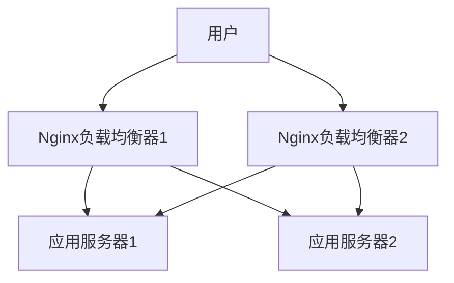

# Nginx 高可用基础

在现代Web应用中，高可用性（High Availability, HA）是确保服务持续运行的关键。Nginx作为一款高性能的Web服务器和反向代理服务器，广泛应用于构建高可用架构。本文将介绍Nginx高可用的基本概念、实现方式以及实际应用场景。

## 什么是高可用性？

高可用性是指系统能够在预定的时间内持续提供服务的能力。对于Web服务器来说，高可用性意味着即使某个服务器节点出现故障，用户仍然可以访问服务，而不会遇到中断。

Nginx高可用架构的核心目标是通过冗余和故障转移机制，确保服务的连续性和稳定性。

## Nginx 高可用的实现方式

Nginx高可用架构通常通过以下两种方式实现：

1. **主从架构（Active-Standby）**：一个主节点处理所有请求，备用节点在主节点故障时接管服务。
2. **负载均衡架构（Active-Active）**：多个节点同时处理请求，通过负载均衡器分配流量。

### 主从架构

在主从架构中，通常使用Keepalived或Pacemaker等工具来实现故障转移。以下是一个简单的Keepalived配置示例：

```nginx
vrrp_instance VI_1 {
    state MASTER
    interface eth0
    virtual_router_id 51
    priority 100
    advert_int 1
    authentication {
        auth_type PASS
        auth_pass 1234
    }
    virtual_ipaddress {
        192.168.1.100
    }
}
```

在这个配置中，`state MASTER`表示当前节点为主节点，`virtual_ipaddress`是虚拟IP地址，客户端通过该IP访问服务。当主节点故障时，备用节点会接管虚拟IP并继续提供服务。

### 负载均衡架构

在负载均衡架构中，Nginx本身可以作为负载均衡器，将请求分发到多个后端服务器。以下是一个简单的Nginx负载均衡配置示例：

```nginx
http {
    upstream backend {
        server 192.168.1.101;
        server 192.168.1.102;
    }

    server {
        listen 80;
        location / {
            proxy_pass http://backend;
        }
    }
}
```

在这个配置中，`upstream`定义了后端服务器组，Nginx会将请求均匀分发到这些服务器上。如果某个后端服务器故障，Nginx会自动将流量转移到其他健康的服务器。

## 实际应用场景

### 场景1：电商网站的高可用架构

假设你正在为一个电商网站设计高可用架构。你可以使用Nginx作为负载均衡器，将流量分发到多个应用服务器。同时，使用Keepalived实现Nginx负载均衡器的高可用，确保即使某个负载均衡器故障，服务仍然可用。



### 场景2：API服务的高可用架构

对于API服务，你可以使用Nginx作为反向代理，将请求分发到多个API服务器。通过配置健康检查，Nginx可以自动剔除故障的API服务器，确保服务的连续性。

```nginx
http {
    upstream api {
        server 192.168.1.201;
        server 192.168.1.202;
        check interval=3000 rise=2 fall=5 timeout=1000 type=http;
        check_http_send "HEAD /health HTTP/1.0\r\n\r\n";
        check_http_expect_alive http_2xx http_3xx;
    }

    server {
        listen 80;
        location / {
            proxy_pass http://api;
        }
    }
}
```

在这个配置中，`check`指令用于配置健康检查，Nginx会定期检查后端服务器的健康状态，并根据结果调整流量分配。

## 总结

Nginx高可用架构通过冗余和故障转移机制，确保服务的连续性和稳定性。无论是主从架构还是负载均衡架构，Nginx都提供了灵活的配置选项，适用于各种应用场景。

:::tip
在实际生产环境中，建议结合监控和告警系统，实时监控Nginx和后端服务器的状态，及时发现和处理故障。
:::

## 附加资源

- [Nginx官方文档](https://nginx.org/en/docs/)
- [Keepalived官方文档](https://www.keepalived.org/documentation.html)
- [负载均衡与高可用性设计](https://www.nginx.com/resources/glossary/load-balancing/)

## 练习

1. 配置一个简单的Nginx负载均衡器，将请求分发到两个后端服务器。
2. 使用Keepalived实现Nginx负载均衡器的高可用，测试故障转移功能。
3. 在Nginx配置中添加健康检查，观察后端服务器故障时的流量分配情况。

通过以上练习，你将更深入地理解Nginx高可用架构的实现和应用。