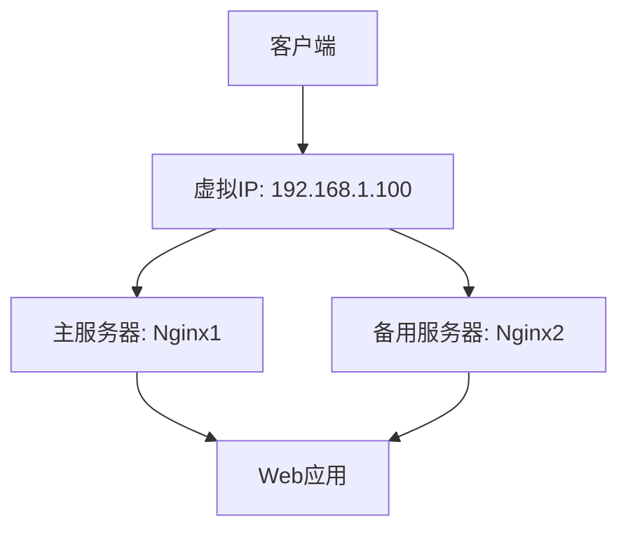

# Nginx VRRP协议

在现代Web架构中，高可用性（High Availability, HA）是一个关键的设计目标。Nginx作为一款高性能的Web服务器和反向代理服务器，通常被用于处理大量的并发请求。为了确保Nginx服务的高可用性，我们可以使用VRRP（Virtual Router Redundancy Protocol，虚拟路由器冗余协议）来实现故障转移和负载均衡。

## 什么是VRRP协议？

VRRP是一种网络协议，用于在多个路由器之间提供冗余。它允许多个路由器共享一个虚拟IP地址（VIP），并在主路由器故障时自动切换到备用路由器。这种机制可以确保网络的高可用性，避免单点故障。

在Nginx的高可用架构中，VRRP协议可以用于实现Nginx服务器的故障转移。通过配置VRRP，我们可以确保即使某个Nginx服务器宕机，流量也会自动切换到备用服务器，从而保证服务的连续性。

## VRRP协议的工作原理

VRRP协议通过选举机制来确定哪个路由器是主路由器（Master），哪个是备用路由器（Backup）。主路由器负责处理所有的流量，而备用路由器则处于待命状态。当主路由器发生故障时，备用路由器会接管虚拟IP地址，并开始处理流量。

VRRP协议使用多播地址`224.0.0.18`进行通信，路由器之间通过发送VRRP通告（Advertisement）来交换状态信息。每个VRRP组都有一个唯一的虚拟路由器ID（VRID），用于区分不同的VRRP组。

## 配置Nginx与VRRP协议

为了实现Nginx的高可用性，我们需要在多个Nginx服务器上配置VRRP协议。以下是一个简单的配置示例：

### 1. 安装Keepalived

Keepalived是一个开源的软件，用于实现VRRP协议。我们可以使用它来配置Nginx服务器的高可用性。

```bash
sudo apt-get install keepalived
```

### 2. 配置Keepalived

在Nginx服务器上，我们需要编辑Keepalived的配置文件`/etc/keepalived/keepalived.conf`。以下是一个示例配置：

```bash
vrrp_instance VI_1 {
    state MASTER
    interface eth0
    virtual_router_id 51
    priority 100
    advert_int 1

    authentication {
        auth_type PASS
        auth_pass 1234
    }

    virtual_ipaddress {
        192.168.1.100
    }
}
```

在这个配置中：

- `state`：指定当前服务器的角色，`MASTER`表示主服务器，`BACKUP`表示备用服务器。
- `interface`：指定用于VRRP通信的网络接口。
- `virtual_router_id`：指定VRRP组的ID，必须在同一组中唯一。
- `priority`：指定优先级，优先级高的服务器将成为主服务器。
- `advert_int`：指定VRRP通告的发送间隔。
- `authentication`：配置VRRP组的认证信息。
- `virtual_ipaddress`：指定虚拟IP地址。

### 3. 启动Keepalived

配置完成后，启动Keepalived服务：

```bash
sudo systemctl start keepalived
sudo systemctl enable keepalived
```

### 4. 验证配置

我们可以使用`ip addr`命令来验证虚拟IP地址是否已经绑定到主服务器的网络接口上：

```bash
ip addr show eth0
```

如果配置正确，你应该能够看到虚拟IP地址`192.168.1.100`绑定在主服务器的`eth0`接口上。

## 实际应用场景

假设我们有一个Web应用，部署在两台Nginx服务器上。我们希望确保即使其中一台服务器宕机，Web应用仍然可以正常访问。通过配置VRRP协议，我们可以实现以下高可用架构：

1. **主服务器**：处理所有的流量，绑定虚拟IP地址。
2. **备用服务器**：处于待命状态，当主服务器故障时接管虚拟IP地址。



在这个架构中，客户端通过虚拟IP地址访问Web应用。如果主服务器`Nginx1`发生故障，备用服务器`Nginx2`会自动接管虚拟IP地址，并继续处理客户端的请求。

## 总结

通过使用VRRP协议，我们可以轻松实现Nginx服务器的高可用性。VRRP协议通过选举机制和虚拟IP地址的自动切换，确保了服务的连续性和故障转移。在实际应用中，VRRP协议可以与其他高可用性技术（如负载均衡、健康检查等）结合使用，以构建更加健壮的系统。

## 附加资源

- [Keepalived官方文档](https://www.keepalived.org/manpage.html)
- [VRRP协议RFC文档](https://tools.ietf.org/html/rfc5798)
- [Nginx高可用性配置指南](https://nginx.org/en/docs/http/load_balancing.html)

## 练习

1. 在两台服务器上配置Keepalived，并实现Nginx的高可用性。
2. 模拟主服务器故障，观察备用服务器是否能够自动接管虚拟IP地址。
3. 尝试调整VRRP的优先级，观察主备服务器的切换行为。

通过以上练习，你将更深入地理解VRRP协议的工作原理，并掌握如何在实际项目中应用它。