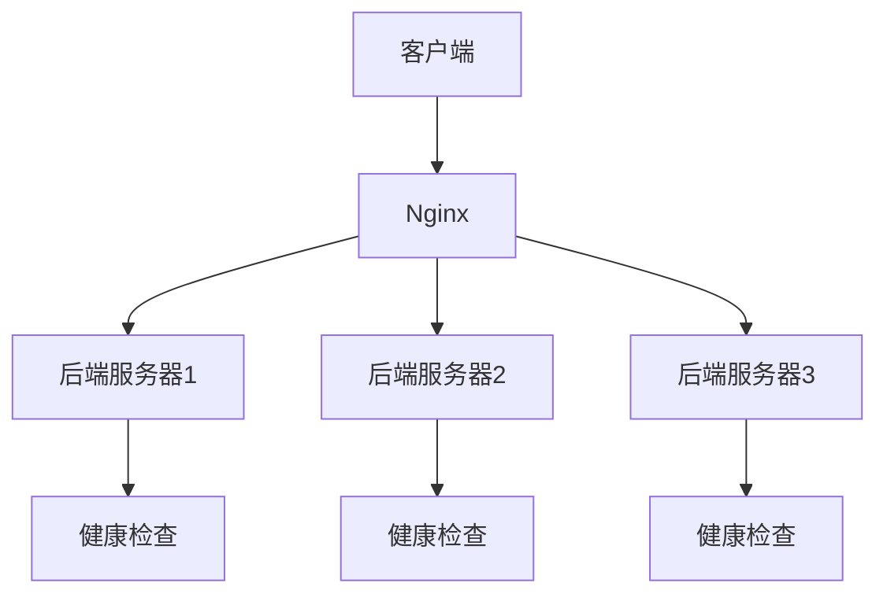
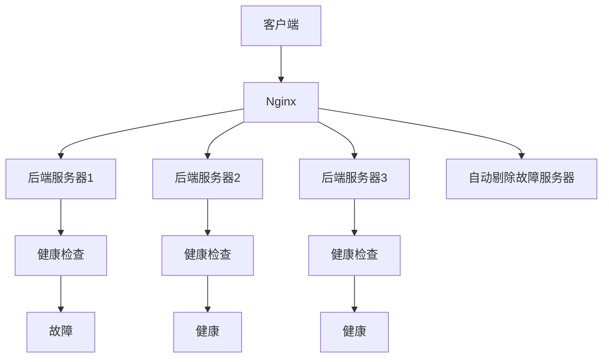

# Nginx 健康检查

在现代高可用架构中，确保服务的稳定性和可靠性至关重要。Nginx作为一款高性能的Web服务器和反向代理服务器，提供了健康检查功能，用于监控后端服务器的状态。本文将详细介绍Nginx健康检查的概念、配置方法以及实际应用场景。

## 什么是Nginx健康检查？

Nginx健康检查是一种机制，用于定期检查后端服务器的可用性。通过健康检查，Nginx可以自动将流量路由到健康的服务器，避免将请求发送到不可用的服务器，从而提高系统的整体可用性。

## 为什么需要健康检查？

在高可用架构中，后端服务器可能会因为各种原因（如硬件故障、网络问题、软件崩溃等）变得不可用。如果没有健康检查机制，Nginx可能会继续将请求发送到这些不可用的服务器，导致请求失败或延迟。通过健康检查，Nginx可以及时发现并剔除不健康的服务器，确保流量只被路由到健康的服务器。

## Nginx 健康检查的配置

Nginx的健康检查功能可以通过`ngx_http_upstream_module`模块来实现。以下是一个简单的配置示例：

```nginx
http {
    upstream backend {
        server 192.168.1.101:80;
        server 192.168.1.102:80;
        server 192.168.1.103:80;

        # 健康检查配置
        health_check interval=5s fails=3 passes=2 uri=/health;
    }

    server {
        listen 80;

        location / {
            proxy_pass http://backend;
        }
    }
}
```

### 配置解析

- `interval=5s`：每隔5秒进行一次健康检查。
- `fails=3`：如果连续3次健康检查失败，则认为服务器不可用。
- `passes=2`：如果连续2次健康检查成功，则认为服务器恢复健康。
- `uri=/health`：健康检查的URI路径。

### 健康检查的响应

健康检查的响应通常是一个HTTP状态码。如果服务器返回`200 OK`，则认为服务器健康；如果返回其他状态码，则认为服务器不健康。

## 实际应用场景

### 场景1：负载均衡

在一个负载均衡的架构中，Nginx作为反向代理服务器，将请求分发到多个后端服务器。通过健康检查，Nginx可以确保只有健康的服务器接收请求，从而提高系统的可用性。



### 场景2：高可用性

在一个高可用性架构中，Nginx可以通过健康检查自动剔除故障服务器，并将流量路由到其他健康的服务器。这确保了即使某些服务器出现故障，系统仍然可以正常运行。



## 总结

Nginx健康检查是确保高可用架构稳定性的重要机制。通过定期检查后端服务器的状态，Nginx可以自动将流量路由到健康的服务器，避免将请求发送到不可用的服务器。本文介绍了Nginx健康检查的概念、配置方法以及实际应用场景，希望能帮助你更好地理解和应用这一功能。

## 附加资源

- [Nginx官方文档](https://nginx.org/en/docs/)
- [Nginx健康检查配置指南](https://nginx.org/en/docs/http/ngx_http_upstream_module.html#health_check)

## 练习

1. 在你的Nginx配置中添加健康检查功能，并测试其效果。
2. 模拟后端服务器故障，观察Nginx如何自动剔除故障服务器。
3. 尝试调整健康检查的间隔时间和失败次数，观察其对系统的影响。
