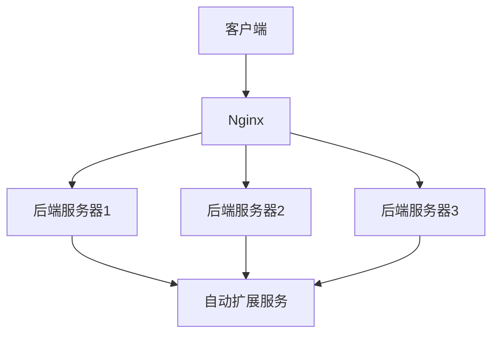

# Nginx 云环境概述

Nginx 是一个高性能的 HTTP 和反向代理服务器，广泛用于负载均衡、缓存加速和静态资源服务。在云环境中，Nginx 的部署和管理变得更加灵活和高效。本文将介绍 Nginx 在云环境中的基本概念、配置方法以及实际应用场景。

## 什么是Nginx云环境？

Nginx 云环境是指将 Nginx 部署在云平台上，利用云计算的弹性、可扩展性和高可用性来优化 Web 服务的性能和稳定性。通过云平台，Nginx 可以轻松地实现自动扩展、负载均衡和故障恢复。

## Nginx 云环境的核心概念

### 1. 反向代理

Nginx 作为反向代理服务器，可以将客户端的请求转发到后端服务器，并将后端服务器的响应返回给客户端。这种方式可以隐藏后端服务器的真实 IP 地址，提高安全性。

```nginx
server {
    listen 80;
    server_name example.com;

    location / {
        proxy_pass http://backend_server;
        proxy_set_header Host $host;
        proxy_set_header X-Real-IP $remote_addr;
        proxy_set_header X-Forwarded-For $proxy_add_x_forwarded_for;
    }
}
```

### 2. 负载均衡

Nginx 可以通过负载均衡将流量分发到多个后端服务器，从而提高系统的吞吐量和可靠性。

```nginx
upstream backend {
    server backend1.example.com;
    server backend2.example.com;
    server backend3.example.com;
}

server {
    listen 80;
    server_name example.com;

    location / {
        proxy_pass http://backend;
    }
}
```

### 3. 自动扩展

在云环境中，Nginx 可以与自动扩展服务（如 AWS Auto Scaling）结合使用，根据流量动态调整后端服务器的数量。



## Nginx 云环境的实际应用场景

### 1. 高流量网站

对于高流量的网站，Nginx 可以通过负载均衡和缓存加速来应对大量的并发请求，确保网站的稳定性和响应速度。

### 2. 微服务架构

在微服务架构中，Nginx 可以作为 API 网关，将请求路由到不同的微服务，并提供统一的入口和安全性控制。

### 3. 静态资源服务

Nginx 可以高效地提供静态资源服务，如图片、CSS 和 JavaScript 文件，减少后端服务器的负载。

## 总结

Nginx 在云环境中的部署和应用可以显著提高 Web 服务的性能和可靠性。通过反向代理、负载均衡和自动扩展等功能，Nginx 能够有效地应对高流量和复杂的应用场景。

## 附加资源

- [Nginx 官方文档](https://nginx.org/en/docs/)
- [AWS Auto Scaling 文档](https://aws.amazon.com/autoscaling/)
- [微服务架构指南](https://microservices.io/)

## 练习

1. 在本地环境中配置一个 Nginx 反向代理服务器，将请求转发到两个不同的后端服务器。
2. 使用 Nginx 实现一个简单的负载均衡器，将流量分发到三个后端服务器。
3. 研究如何在云平台上配置 Nginx 的自动扩展功能，并测试其效果。

:::tip
在配置 Nginx 时，建议使用 `nginx -t` 命令测试配置文件是否正确，避免因配置错误导致服务中断。
:::