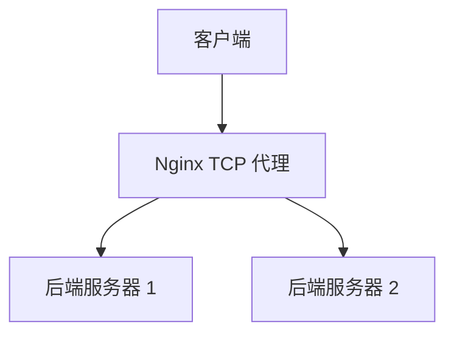

## 介绍

Nginx 是一个高性能的 HTTP 服务器和反向代理服务器，但它也可以作为 TCP 代理服务器使用。TCP 代理允许 Nginx 在传输层（TCP）上转发流量，适用于需要处理非 HTTP 协议的场景，如数据库连接、邮件服务器等。

在本教程中，我们将逐步介绍如何配置 Nginx 作为 TCP 代理，并通过实际案例展示其应用场景。

## 什么是 TCP 代理？

TCP 代理是一种网络服务，它在客户端和服务器之间转发 TCP 流量。与 HTTP 代理不同，TCP 代理不解析应用层协议，而是直接转发原始数据包。这使得它适用于各种基于 TCP 的协议，如 MySQL、Redis、SMTP 等。

## 配置 Nginx 作为 TCP 代理

要配置 Nginx 作为 TCP 代理，首先需要确保 Nginx 安装了 `ngx_stream_core_module` 模块。这个模块是 Nginx 的流模块，专门用于处理 TCP 和 UDP 流量。

### 1. 安装 Nginx 并启用流模块

在大多数 Linux 发行版中，Nginx 默认不启用流模块。你可以通过以下命令检查是否已安装流模块：

```bash
nginx -V 2>&1 | grep -- '--with-stream'
```

如果没有输出，说明流模块未启用。你需要重新编译 Nginx 并启用流模块：

```bash
./configure --with-stream
make
sudo make install
```

### 2. 配置 TCP 代理

在 Nginx 配置文件中，使用 `stream` 块来定义 TCP 代理。以下是一个简单的配置示例：

```nginx
stream {
    upstream backend {
        server 192.168.1.101:3306;
        server 192.168.1.102:3306;
    }

    server {
        listen 3306;
        proxy_pass backend;
    }
}
```

在这个配置中：

- `upstream backend` 定义了一个后端服务器组，包含两个 MySQL 服务器。
- `server` 块监听 3306 端口，并将流量转发到 `backend` 服务器组。

### 3. 重启 Nginx

配置完成后，重启 Nginx 以应用更改：

```bash
sudo systemctl restart nginx
```

## 实际案例

### 案例 1：MySQL 负载均衡

假设你有一个高流量的 MySQL 数据库集群，你希望使用 Nginx 作为 TCP 代理来实现负载均衡。通过上述配置，Nginx 可以将客户端请求分发到多个 MySQL 服务器，从而提高系统的可用性和性能。

### 案例 2：Redis 代理

如果你有多个 Redis 实例，并且希望客户端通过一个统一的入口访问这些实例，你可以使用 Nginx 作为 TCP 代理。以下是一个 Redis 代理的配置示例：

```nginx
stream {
    upstream redis_backend {
        server 192.168.1.103:6379;
        server 192.168.1.104:6379;
    }

    server {
        listen 6379;
        proxy_pass redis_backend;
    }
}
```

在这个配置中，Nginx 监听 6379 端口，并将 Redis 请求转发到后端的 Redis 实例。

## 总结

Nginx 不仅是一个强大的 HTTP 服务器和反向代理，还可以作为 TCP 代理来处理各种基于 TCP 的协议。通过配置 `stream` 块，你可以轻松实现 TCP 流量的转发和负载均衡。

## 附加资源

- [Nginx 官方文档](https://nginx.org/en/docs/)
- [Nginx Stream 模块文档](https://nginx.org/en/docs/stream/ngx_stream_core_module.html)

## 练习

1. 尝试配置 Nginx 作为 SMTP 代理，将邮件流量转发到多个邮件服务器。
2. 使用 `mermaid` 绘制一个 Nginx TCP 代理的架构图。



通过完成这些练习，你将更深入地理解 Nginx TCP 代理的工作原理和应用场景。