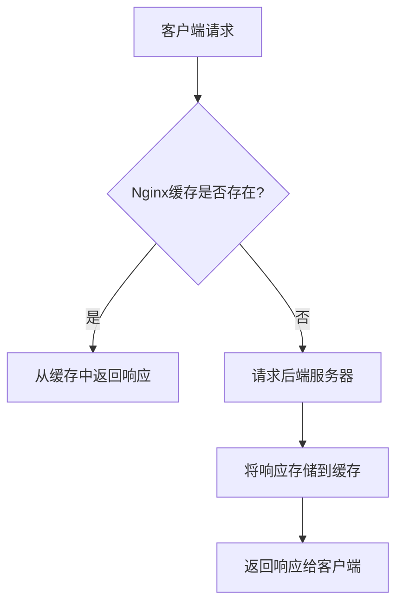

# Nginx 代理缓存

Nginx是一个高性能的Web服务器和反向代理服务器，广泛用于加速Web服务的响应速度。其中，**代理缓存**是Nginx的一个重要功能，它可以帮助减少后端服务器的负载，并显著提升用户的访问体验。本文将详细介绍Nginx代理缓存的概念、配置方法以及实际应用场景。

---

## 什么是Nginx代理缓存？

Nginx代理缓存是指Nginx将后端服务器返回的响应内容存储在本地磁盘或内存中。当用户再次请求相同的资源时，Nginx可以直接从缓存中返回响应，而无需再次访问后端服务器。这种方式可以显著减少后端服务器的负载，并加快响应速度。

:::tip
代理缓存特别适用于静态资源（如图片、CSS、JavaScript文件）或变化频率较低的内容（如API响应）。
:::

---

## 如何配置Nginx代理缓存？

### 1. 定义缓存路径和缓存区域

首先，需要在Nginx配置文件中定义一个缓存路径和缓存区域。以下是一个基本的配置示例：

```nginx
http {
    # 定义缓存路径和缓存区域
    proxy_cache_path /var/cache/nginx levels=1:2 keys_zone=my_cache:10m max_size=1g inactive=60m use_temp_path=off;

    server {
        listen 80;
        server_name example.com;

        location / {
            proxy_cache my_cache;  # 使用定义的缓存区域
            proxy_pass http://backend_server;  # 后端服务器地址
            proxy_cache_valid 200 302 10m;  # 缓存200和302状态码的响应10分钟
            proxy_cache_valid 404 1m;  # 缓存404状态码的响应1分钟
            proxy_cache_use_stale error timeout updating http_500 http_502 http_503 http_504;  # 在错误时使用过期的缓存
        }
    }
}
```

#### 配置说明：
- `proxy_cache_path`：定义缓存存储路径、缓存区域名称、缓存大小等。
- `proxy_cache`：指定使用的缓存区域。
- `proxy_cache_valid`：设置不同状态码的缓存时间。
- `proxy_cache_use_stale`：在后端服务器不可用时，允许使用过期的缓存。

### 2. 启用缓存

配置完成后，重新加载Nginx以启用缓存：

```bash
sudo nginx -s reload
```

---

## 实际应用场景

### 场景1：加速静态资源访问

假设你的网站有许多静态资源（如图片、CSS文件），这些资源不经常变化。通过Nginx代理缓存，可以将这些资源缓存到本地，从而减少后端服务器的请求压力。

```nginx
location /static/ {
    proxy_cache my_cache;
    proxy_pass http://backend_server;
    proxy_cache_valid 200 1h;  # 缓存静态资源1小时
}
```

### 场景2：缓存API响应

如果你的网站提供API服务，且某些API响应变化频率较低（如每日更新的数据），可以通过缓存这些响应来减少数据库查询。

```nginx
location /api/ {
    proxy_cache my_cache;
    proxy_pass http://backend_server;
    proxy_cache_valid 200 10m;  # 缓存API响应10分钟
}
```

---

## 缓存的工作原理

为了更好地理解Nginx代理缓存的工作原理，我们可以通过以下流程图来说明：



1. 客户端发起请求。
2. Nginx检查请求的资源是否已缓存。
3. 如果缓存存在，则直接返回缓存内容。
4. 如果缓存不存在，则请求后端服务器，并将响应存储到缓存中。
5. 最后，将响应返回给客户端。

---

## 总结

Nginx代理缓存是一种强大的工具，可以显著提升Web服务的性能，减少后端服务器的负载。通过合理配置缓存路径、缓存区域和缓存时间，你可以为不同类型的资源（如静态文件、API响应）提供高效的缓存策略。

:::caution
需要注意的是，缓存可能会导致用户看到过期的内容。因此，在配置缓存时，务必根据业务需求设置合理的缓存时间。
:::

---

## 附加资源与练习

### 附加资源
- [Nginx官方文档 - 代理缓存](https://nginx.org/en/docs/http/ngx_http_proxy_module.html#proxy_cache)
- [Nginx缓存配置指南](https://www.digitalocean.com/community/tutorials/understanding-nginx-http-proxying-load-balancing-buffering-and-caching)

### 练习
1. 在你的Nginx服务器上配置一个缓存区域，并测试静态资源的缓存效果。
2. 尝试为API响应设置不同的缓存时间，观察缓存对性能的影响。
3. 使用`curl`或浏览器开发者工具，验证缓存是否生效。

通过实践，你将更深入地理解Nginx代理缓存的工作原理和应用场景。祝你学习愉快！