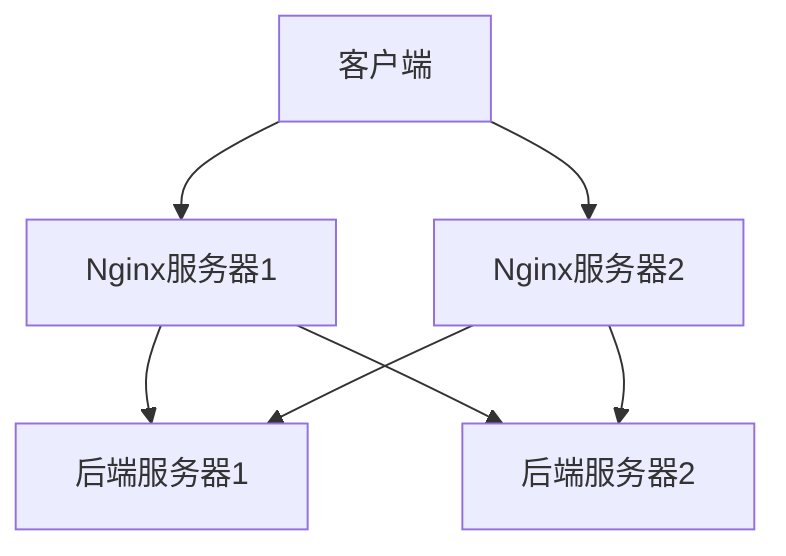

## 介绍

在现代Web应用中，高可用性（High Availability, HA）是一个关键的设计目标。高可用性意味着系统能够在出现故障时继续正常运行，从而确保服务的连续性和可靠性。Nginx作为一款高性能的Web服务器和反向代理服务器，广泛用于负载均衡和高可用性方案中。

本文将介绍如何通过Nginx实现高可用性，包括基本概念、配置方法以及实际应用场景。

## 什么是Nginx高可用性？

Nginx高可用性是指通过配置多个Nginx服务器，确保在某个服务器出现故障时，其他服务器能够接管其工作，从而保证服务的连续性。通常，高可用性方案会结合负载均衡、健康检查、故障转移等技术来实现。

## 实现Nginx高可用性的基本方法

### 1. 使用Nginx进行负载均衡

Nginx可以通过配置多个后端服务器来实现负载均衡。当某个后端服务器出现故障时，Nginx会自动将流量转发到其他健康的服务器。

```nginx
http {
    upstream backend {
        server backend1.example.com;
        server backend2.example.com;
        server backend3.example.com;
    }

    server {
        listen 80;

        location / {
            proxy_pass http://backend;
        }
    }
}
```

在上面的配置中，Nginx会将请求分发到`backend1.example.com`、`backend2.example.com`和`backend3.example.com`三个后端服务器。如果其中一个服务器宕机，Nginx会自动将流量转发到其他服务器。

### 2. 健康检查

Nginx可以通过健康检查机制来监控后端服务器的状态。如果某个服务器无法响应健康检查请求，Nginx会将其标记为不可用，并停止向其转发流量。

```nginx
http {
    upstream backend {
        server backend1.example.com;
        server backend2.example.com;
        server backend3.example.com;

        check interval=3000 rise=2 fall=3 timeout=1000 type=http;
        check_http_send "HEAD /health HTTP/1.0\r\n\r\n";
        check_http_expect_alive http_2xx http_3xx;
    }

    server {
        listen 80;

        location / {
            proxy_pass http://backend;
        }
    }
}
```

在这个配置中，Nginx会每隔3秒向每个后端服务器发送一个HTTP HEAD请求来检查其健康状态。如果服务器在3次检查中失败，Nginx会将其标记为不可用。

### 3. 故障转移

为了实现高可用性，通常需要配置多个Nginx服务器，并使用故障转移机制来确保在某个Nginx服务器出现故障时，其他服务器能够接管其工作。常见的故障转移方案包括使用Keepalived或HAProxy。



在这个图中，客户端可以通过Nginx服务器1或Nginx服务器2访问后端服务器。如果Nginx服务器1出现故障，客户端可以自动切换到Nginx服务器2。

## 实际应用场景

### 场景1：电商网站的高可用性

假设你正在运营一个电商网站，流量非常大。为了确保网站在高峰期和服务器故障时仍然能够正常运行，你可以使用Nginx高可用性方案。

1. 配置多个Nginx服务器，并使用Keepalived实现故障转移。
2. 配置多个后端服务器，并使用Nginx的负载均衡和健康检查功能。
3. 当某个Nginx服务器或后端服务器出现故障时，系统会自动切换到其他服务器，确保网站的正常运行。

### 场景2：微服务架构中的高可用性

在微服务架构中，通常会有多个服务实例运行在不同的服务器上。为了确保服务的高可用性，你可以使用Nginx作为API网关，并配置负载均衡和健康检查。

1. 配置Nginx作为API网关，并将请求分发到多个服务实例。
2. 使用健康检查机制监控服务实例的状态。
3. 当某个服务实例出现故障时，Nginx会自动将流量转发到其他健康的实例。

## 总结

Nginx高可用性方案是确保Web应用连续性和可靠性的重要手段。通过负载均衡、健康检查和故障转移等技术，可以构建一个高可用的Nginx系统，从而应对服务器故障和流量高峰。

## 附加资源

- [Nginx官方文档](https://nginx.org/en/docs/)
- [Keepalived官方文档](https://www.keepalived.org/documentation.html)
- [HAProxy官方文档](https://www.haproxy.org/)

## 练习

1. 配置一个简单的Nginx负载均衡系统，并使用健康检查功能监控后端服务器的状态。
2. 使用Keepalived实现Nginx服务器的故障转移，并测试故障转移的效果。
3. 在一个微服务架构中，配置Nginx作为API网关，并实现负载均衡和健康检查。

:::tip
在配置Nginx高可用性方案时，建议先在测试环境中进行验证，确保配置正确后再部署到生产环境。
:::