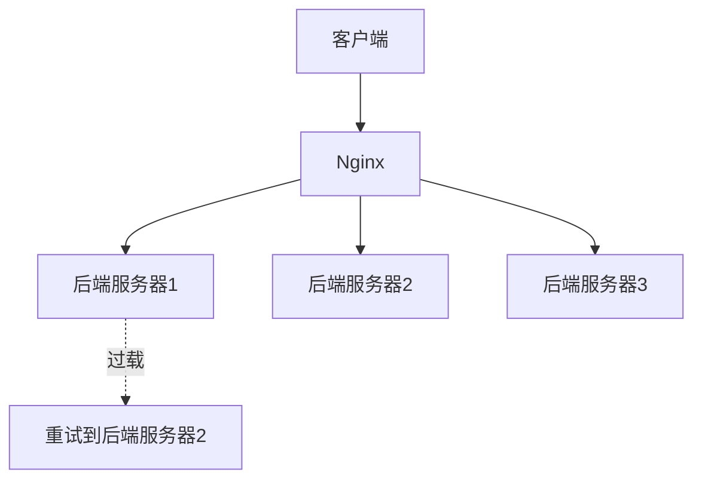

# Nginx 失败重试

在构建高可用性的Web服务时，负载均衡是一个关键组件。Nginx作为一款高性能的Web服务器和反向代理服务器，提供了强大的负载均衡功能。然而，在实际应用中，后端服务器可能会因为各种原因（如网络故障、服务器过载等）而无法响应请求。为了应对这种情况，Nginx提供了**失败重试**机制，能够在请求失败时自动重试其他可用的后端服务器。

本文将详细介绍Nginx的失败重试机制，包括其工作原理、配置方法以及实际应用场景。

## 什么是Nginx失败重试？

Nginx的失败重试机制是指在负载均衡过程中，当Nginx向后端服务器发送请求时，如果请求失败（例如超时或返回错误状态码），Nginx会自动尝试将请求转发到其他可用的后端服务器。这种机制能够有效提高系统的可靠性和容错能力，确保用户请求能够被成功处理。

## 如何配置Nginx失败重试？

Nginx的失败重试机制主要通过`proxy_next_upstream`指令来配置。该指令定义了在什么情况下Nginx会将请求转发到下一个后端服务器。

### 基本配置

以下是一个简单的Nginx配置示例，展示了如何启用失败重试机制：

```nginx
http {
    upstream backend {
        server backend1.example.com;
        server backend2.example.com;
        server backend3.example.com;
    }

    server {
        listen 80;

        location / {
            proxy_pass http://backend;
            proxy_next_upstream error timeout http_500 http_502 http_503 http_504;
        }
    }
}
```

在这个配置中：

- `upstream`块定义了后端服务器的列表。
- `proxy_pass`指令将请求转发到`backend`上游服务器组。
- `proxy_next_upstream`指令定义了在哪些情况下Nginx会尝试将请求转发到下一个后端服务器。在这个例子中，Nginx会在以下情况下重试请求：
  - 后端服务器返回错误（`error`）。
  - 请求超时（`timeout`）。
  - 后端服务器返回500、502、503或504状态码。

### 配置参数详解

`proxy_next_upstream`指令支持以下参数：

- `error`：与后端服务器建立连接、发送请求或读取响应时发生错误。
- `timeout`：与后端服务器建立连接、发送请求或读取响应时超时。
- `invalid_header`：后端服务器返回的响应头无效。
- `http_500`：后端服务器返回500状态码。
- `http_502`：后端服务器返回502状态码。
- `http_503`：后端服务器返回503状态码。
- `http_504`：后端服务器返回504状态码。
- `http_403`：后端服务器返回403状态码。
- `http_404`：后端服务器返回404状态码。
- `non_idempotent`：允许对非幂等请求（如POST请求）进行重试（默认情况下，Nginx不会对非幂等请求进行重试）。

:::caution
**注意**：默认情况下，Nginx不会对非幂等请求（如POST请求）进行重试，因为这可能导致数据不一致。如果需要启用对非幂等请求的重试，可以添加`non_idempotent`参数。
:::

## 实际应用场景

### 场景1：后端服务器故障

假设你有一个由三台后端服务器组成的集群。如果其中一台服务器发生故障，Nginx会自动将请求转发到其他可用的服务器，从而避免服务中断。


### 场景2：后端服务器过载

在高流量情况下，某些后端服务器可能会因为过载而无法及时响应请求。Nginx的失败重试机制可以确保请求被转发到负载较轻的服务器，从而提高系统的整体性能。



## 总结

Nginx的失败重试机制是构建高可用性Web服务的重要工具。通过合理配置`proxy_next_upstream`指令，你可以确保在请求失败时，Nginx能够自动将请求转发到其他可用的后端服务器，从而提高系统的可靠性和容错能力。

在实际应用中，建议根据具体的业务需求和后端服务器的特性来调整失败重试的配置，以确保系统的最佳性能和稳定性。

## 附加资源

- [Nginx官方文档](https://nginx.org/en/docs/)
- [Nginx负载均衡配置指南](https://nginx.org/en/docs/http/load_balancing.html)
- [Nginx反向代理配置指南](https://nginx.org/en/docs/http/ngx_http_proxy_module.html)

## 练习

1. 在你的Nginx配置中启用失败重试机制，并测试当后端服务器返回500状态码时，Nginx是否会重试请求。
2. 尝试配置Nginx以允许对非幂等请求（如POST请求）进行重试，并观察其行为。
