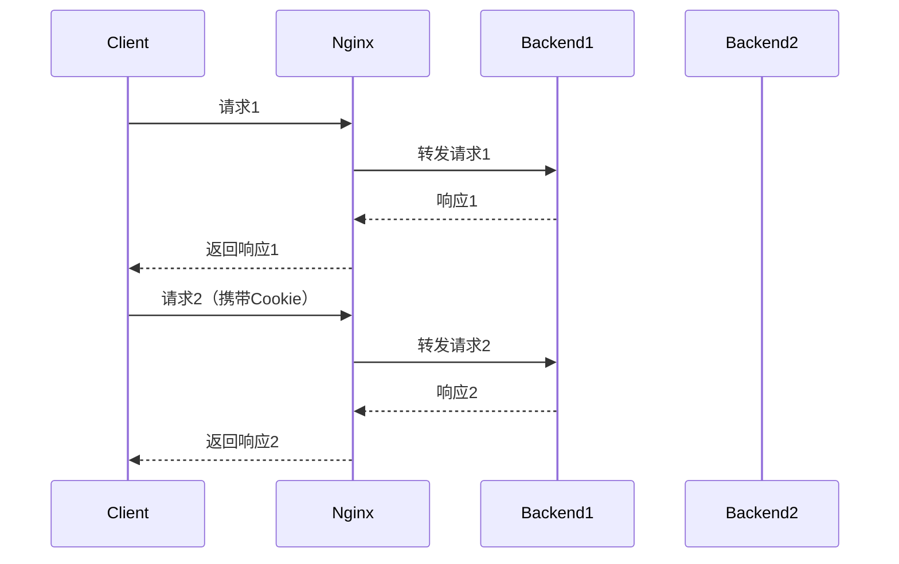

## 介绍

在负载均衡环境中，Nginx通常用于将客户端请求分发到多个后端服务器。然而，某些应用程序（如电子商务网站或用户登录系统）需要确保用户的会话数据在多次请求中被发送到同一台后端服务器。这种机制称为**会话保持**（Session Persistence）或**粘性会话**（Sticky Session）。

本文将详细介绍Nginx如何实现会话保持，并通过代码示例和实际案例帮助初学者理解其工作原理。

## 什么是会话保持？

会话保持是一种负载均衡策略，确保来自同一客户端的请求始终被转发到同一台后端服务器。这对于需要维护会话状态的应用程序至关重要，例如：

- 用户登录系统
- 购物车功能
- 个性化内容展示

如果没有会话保持，用户的请求可能会被分发到不同的服务器，导致会话数据丢失或用户体验不一致。

## Nginx 实现会话保持的方式

Nginx提供了多种方式来实现会话保持，以下是两种常见的方法：

### 1. 基于IP的会话保持

Nginx可以通过客户端的IP地址来决定将请求转发到哪台后端服务器。这种方法简单易用，但可能不适用于某些场景（例如客户端使用代理或动态IP）。

```nginx
http {
    upstream backend {
        ip_hash;
        server backend1.example.com;
        server backend2.example.com;
    }

    server {
        listen 80;

        location / {
            proxy_pass http://backend;
        }
    }
}
```

在上面的配置中，`ip_hash`指令会根据客户端的IP地址计算哈希值，并将请求固定到某一台后端服务器。

:::note
**注意**：`ip_hash`方法适用于大多数场景，但如果客户端使用代理或动态IP，可能会导致会话保持失效。
:::

### 2. 基于Cookie的会话保持

另一种更灵活的方式是使用Cookie来实现会话保持。Nginx可以通过生成或读取特定的Cookie来确保请求被转发到同一台后端服务器。

```nginx
http {
    upstream backend {
        server backend1.example.com;
        server backend2.example.com;
    }

    server {
        listen 80;

        location / {
            proxy_pass http://backend;
            proxy_set_header Host $host;
            proxy_set_header X-Real-IP $remote_addr;
            proxy_set_header X-Forwarded-For $proxy_add_x_forwarded_for;

            # 生成会话Cookie
            add_header Set-Cookie "backendid=$upstream_addr; Path=/; HttpOnly";
        }
    }
}
```

在这个示例中，Nginx会生成一个名为`backendid`的Cookie，其值为后端服务器的地址。后续请求中，Nginx会读取该Cookie并将请求转发到相应的服务器。

:::tip
**提示**：基于Cookie的会话保持更灵活，适用于客户端IP不固定的场景。
:::

## 实际案例

假设你正在运营一个电子商务网站，用户可以将商品添加到购物车中。为了确保购物车数据的一致性，你需要使用会话保持。

### 场景描述

- 用户A访问网站并将商品添加到购物车。
- 用户A的请求被Nginx转发到`backend1`服务器。
- 如果后续请求被转发到`backend2`服务器，购物车数据将丢失。

### 解决方案

通过配置Nginx的会话保持（例如基于Cookie的方式），可以确保用户A的所有请求都被转发到`backend1`服务器，从而避免数据丢失。



## 总结

Nginx会话保持是负载均衡中的重要功能，尤其适用于需要维护会话状态的应用程序。本文介绍了两种常见的实现方式：基于IP的会话保持和基于Cookie的会话保持，并通过实际案例展示了其应用场景。

:::caution
**注意**：选择会话保持方式时，需根据实际需求和环境进行评估。例如，基于IP的方式适用于客户端IP固定的场景，而基于Cookie的方式则更灵活。
:::

## 附加资源与练习

- **练习1**：在本地环境中配置Nginx，尝试使用`ip_hash`实现会话保持。
- **练习2**：修改Nginx配置，使用基于Cookie的方式实现会话保持，并测试其效果。
- **参考文档**：
  - [Nginx官方文档](https://nginx.org/en/docs/)
  - [Nginx负载均衡配置指南](https://nginx.org/en/docs/http/load_balancing.html)

通过本文的学习，你应该能够理解Nginx会话保持的基本概念，并能够在实际项目中应用这一技术。