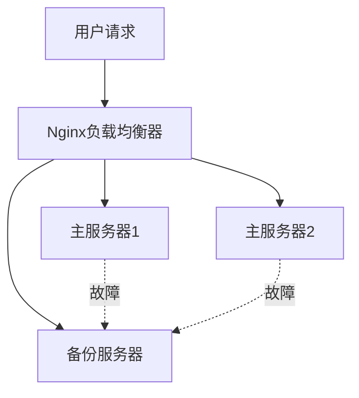

# Nginx 备份服务器

在现代Web应用中，高可用性和故障恢复能力是至关重要的。Nginx作为一款高性能的Web服务器和反向代理服务器，提供了强大的负载均衡功能。其中，**备份服务器**是负载均衡配置中的一个重要概念，它可以在主服务器不可用时自动接管流量，确保服务的连续性。

## 什么是Nginx备份服务器？

Nginx备份服务器是指在负载均衡配置中，当所有主服务器都不可用时，Nginx会将流量转发到备份服务器。备份服务器通常用于处理紧急情况，确保在主服务器宕机时，用户仍然可以访问服务。

### 为什么需要备份服务器？

1. **高可用性**：在主服务器故障时，备份服务器可以接管流量，避免服务中断。
2. **故障恢复**：在主服务器恢复期间，备份服务器可以继续提供服务，直到主服务器恢复正常。
3. **负载分担**：在某些情况下，备份服务器也可以分担部分流量，减轻主服务器的压力。

## 如何配置Nginx备份服务器？

在Nginx中，配置备份服务器非常简单。你只需要在`upstream`块中使用`backup`关键字来标记备份服务器。

### 示例配置

以下是一个简单的Nginx负载均衡配置，其中包含一个主服务器和一个备份服务器：

```nginx
http {
    upstream backend {
        server 192.168.1.101;  # 主服务器
        server 192.168.1.102;  # 主服务器
        server 192.168.1.103 backup;  # 备份服务器
    }

    server {
        listen 80;

        location / {
            proxy_pass http://backend;
        }
    }
}
```

### 解释

- `upstream backend`：定义了一个名为`backend`的服务器组。
- `server 192.168.1.101` 和 `server 192.168.1.102`：这两个是主服务器，Nginx会将流量分发到这两个服务器。
- `server 192.168.1.103 backup`：这是备份服务器，只有在所有主服务器不可用时，Nginx才会将流量转发到该服务器。

## 实际应用场景

假设你有一个电商网站，使用了三台服务器来处理用户请求。其中两台是主服务器，另一台是备份服务器。当主服务器由于某种原因（如硬件故障、网络问题等）不可用时，Nginx会自动将流量切换到备份服务器，确保用户仍然可以访问网站。

### 场景示例



在这个场景中，如果主服务器1和主服务器2都不可用，Nginx会将流量转发到备份服务器，确保服务不中断。

## 总结

Nginx备份服务器是确保高可用性和故障恢复能力的重要工具。通过简单的配置，你可以在主服务器不可用时，自动将流量切换到备份服务器，确保服务的连续性。对于初学者来说，理解并掌握这一概念是非常有价值的。

:::tip 提示
在实际生产环境中，建议定期测试备份服务器的可用性，确保在主服务器故障时，备份服务器能够正常接管流量。
:::

## 附加资源

- [Nginx官方文档](https://nginx.org/en/docs/)
- [Nginx负载均衡配置指南](https://nginx.org/en/docs/http/load_balancing.html)

## 练习

1. 尝试在你的本地环境中配置一个Nginx负载均衡器，并添加一个备份服务器。
2. 模拟主服务器故障，观察Nginx是否会自动将流量切换到备份服务器。

通过以上练习，你将更深入地理解Nginx备份服务器的工作原理和实际应用。