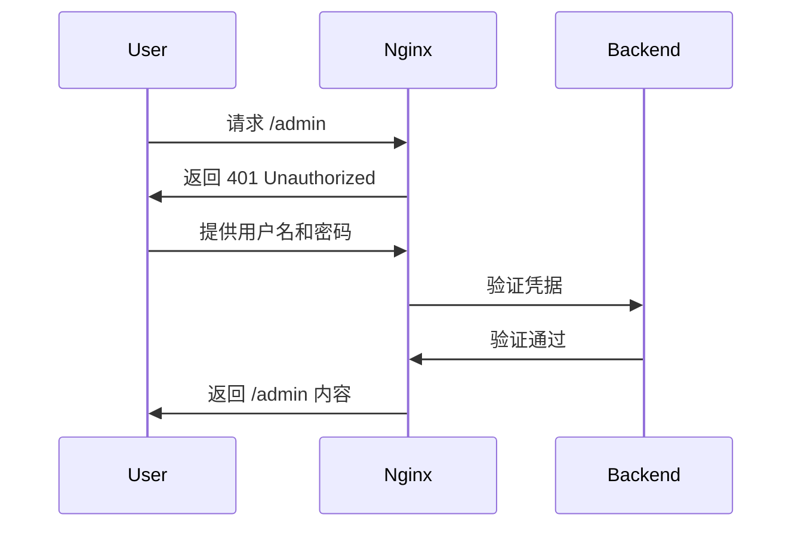

# Nginx 基本认证

Nginx基本认证是一种简单而有效的方式，用于保护你的Web应用免受未授权访问。通过基本认证，你可以要求用户在访问特定资源之前输入用户名和密码。本文将详细介绍如何在Nginx中配置基本认证，并提供实际案例帮助你理解其应用场景。

## 什么是Nginx基本认证？

Nginx基本认证是一种基于HTTP协议的认证机制。它通过在HTTP请求头中添加`Authorization`字段来传递用户名和密码。服务器在接收到请求后，会验证这些凭据，如果验证通过，则允许访问；否则，返回`401 Unauthorized`状态码。

:::note
基本认证的凭据是以Base64编码的形式传输的，因此它并不适合用于高度敏感的数据保护。建议在HTTPS环境下使用基本认证，以防止凭据被窃取。
:::

## 配置Nginx基本认证

### 1. 创建密码文件

首先，你需要创建一个密码文件来存储用户名和密码。可以使用`htpasswd`工具来生成这个文件。

```bash
htpasswd -c /etc/nginx/.htpasswd username
```

执行上述命令后，系统会提示你输入密码。生成的`.htpasswd`文件将包含用户名和加密后的密码。

:::caution
`-c`选项用于创建新的密码文件。如果文件已经存在，请不要使用`-c`选项，否则会覆盖现有文件。
:::

### 2. 配置Nginx

接下来，你需要在Nginx配置文件中启用基本认证。假设你希望保护`/admin`路径下的资源，可以在Nginx配置文件中添加以下内容：

```nginx
server {
    listen 80;
    server_name example.com;

    location /admin {
        auth_basic "Restricted Access";
        auth_basic_user_file /etc/nginx/.htpasswd;

        # 其他配置
    }
}
```

- `auth_basic "Restricted Access";`：启用基本认证，并设置提示信息。
- `auth_basic_user_file /etc/nginx/.htpasswd;`：指定密码文件的路径。

### 3. 重启Nginx

完成配置后，重启Nginx以使更改生效：

```bash
sudo systemctl restart nginx
```

## 实际案例

假设你有一个内部管理面板，位于`https://example.com/admin`。你希望只有授权的管理员才能访问这个面板。通过配置Nginx基本认证，你可以轻松实现这一目标。

### 访问流程



1. 用户访问`/admin`路径。
2. Nginx返回`401 Unauthorized`状态码，并要求用户提供用户名和密码。
3. 用户输入用户名和密码。
4. Nginx验证凭据，如果验证通过，则允许访问`/admin`内容。

## 总结

Nginx基本认证是一种简单而有效的方式，用于保护Web应用中的敏感资源。通过创建密码文件并配置Nginx，你可以轻松实现基本认证。然而，需要注意的是，基本认证的凭据是以Base64编码的形式传输的，因此在生产环境中建议使用HTTPS来加密传输。

## 附加资源

- [Nginx官方文档](https://nginx.org/en/docs/)
- [htpasswd工具手册](https://httpd.apache.org/docs/2.4/programs/htpasswd.html)

## 练习

1. 在你的Nginx服务器上配置基本认证，保护一个特定的路径。
2. 尝试使用不同的用户名和密码组合，验证基本认证的效果。
3. 研究如何在Nginx中配置多个密码文件，并为不同的路径设置不同的认证规则。

通过以上步骤和练习，你将能够熟练掌握Nginx基本认证的配置和使用。